# RAFlow 桌面语音交互系统详细设计文档

## 文档版本信息

- **版本**: v1.0
- **创建日期**: 2026-02-19
- **基于规格**: specs/w3/raflow/0001-spec.md
- **目标平台**: Windows 11, macOS 13+, Linux (Ubuntu 22.04+)

## 1. 系统架构概览

### 1.1 整体架构图

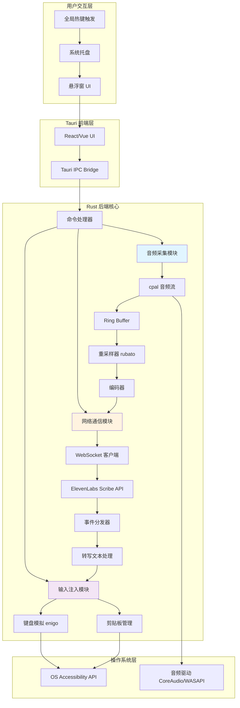

### 1.2 技术栈清单

| 层级 | 技术选型 | 版本 | 用途说明 |
|------|---------|------|---------|
| **应用框架** | Tauri | 2.1.x | 跨平台桌面应用框架 |
| **后端语言** | Rust | 2024 Edition | 系统级编程，高性能低延迟 |
| **前端框架** | React/Vue | 18.x/3.x | UI 渲染（可选） |
| **异步运行时** | Tokio | 1.x | 异步 I/O 和任务调度 |
| **音频采集** | cpal | 0.15.x | 跨平台音频 I/O |
| **音频重采样** | rubato | 0.15.x | 高质量 FFT 重采样 |
| **WebSocket** | tokio-tungstenite | 0.23.x | 异步 WebSocket 客户端 |
| **键盘模拟** | enigo | 0.2.x | 跨平台输入模拟 |
| **序列化** | serde + serde_json | 1.x | JSON 序列化/反序列化 |
| **Ring Buffer** | rtrb | 0.3.x | 实时安全的无锁环形缓冲 |

### 1.3 系统状态机

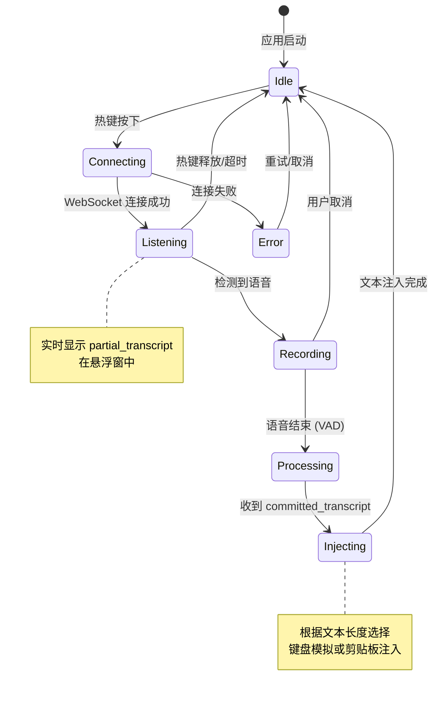

## 2. 核心模块详细设计

### 2.1 音频采集模块 (Audio Capture Module)

#### 2.1.1 模块职责

- 枚举和选择音频输入设备
- 配置音频流参数（采样率、通道数、缓冲区大小）
- 实时采集麦克风音频数据
- 将音频数据传递到处理管道

#### 2.1.2 数据结构设计

```rust
/// 音频配置
#[derive(Debug, Clone)]
pub struct AudioConfig {
    /// 输入设备采样率（通常为 44100 或 48000 Hz）
    pub input_sample_rate: u32,
    /// 目标采样率（Scribe v2 要求 16000 Hz）
    pub target_sample_rate: u32,
    /// 声道数（1 = 单声道）
    pub channels: u16,
    /// 缓冲区大小（帧数）
    pub buffer_size: u32,
    /// 发送块的持续时间（毫秒）
    pub chunk_duration_ms: u32,
}

impl Default for AudioConfig {
    fn default() -> Self {
        Self {
            input_sample_rate: 48000,
            target_sample_rate: 16000,
            channels: 1,
            buffer_size: 480,  // 10ms @ 48kHz
            chunk_duration_ms: 100,
        }
    }
}

/// 音频采集器
pub struct AudioCapturer {
    config: AudioConfig,
    stream: Option<cpal::Stream>,
    sender: Arc<rtrb::Producer<Vec<f32>>>,
}
```

#### 2.1.3 音频流初始化流程

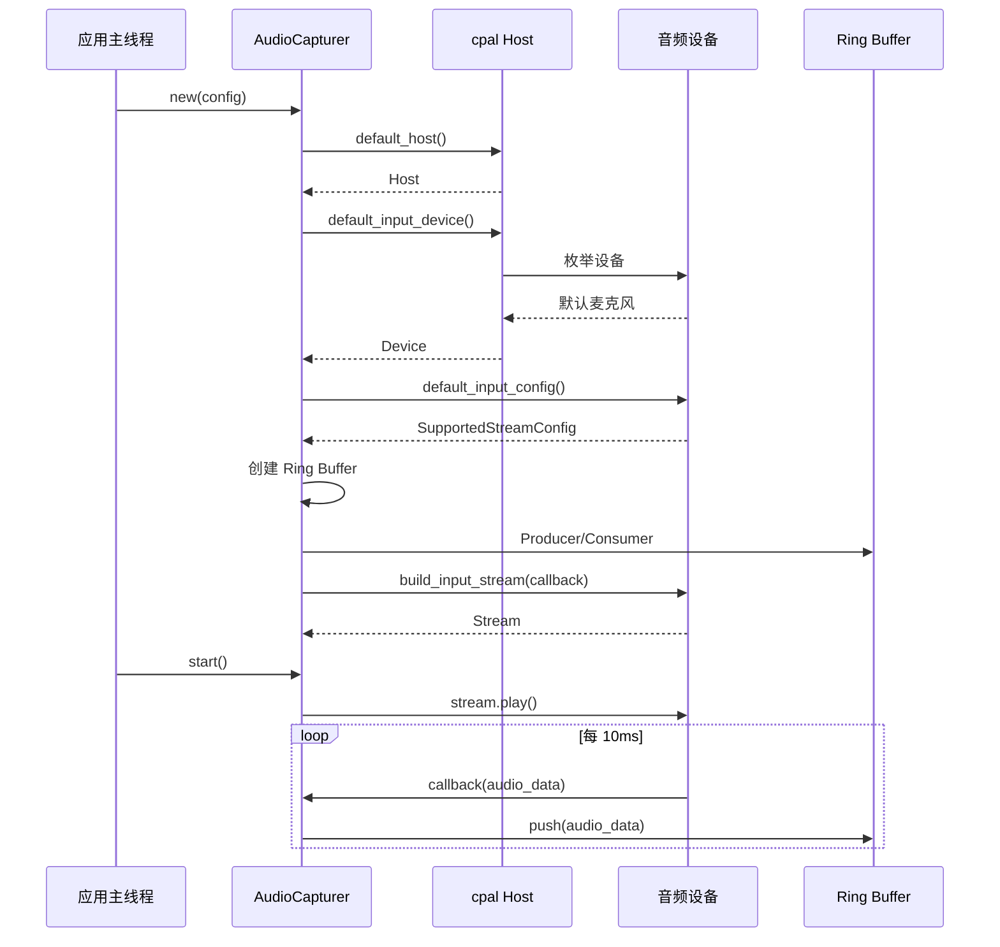

#### 2.1.4 核心实现代码

```rust
use cpal::traits::{DeviceTrait, HostTrait, StreamTrait};
use rtrb::RingBuffer;
use std::sync::Arc;

impl AudioCapturer {
    pub fn new(config: AudioConfig) -> Result<Self, AudioError> {
        let host = cpal::default_host();
        let device = host
            .default_input_device()
            .ok_or(AudioError::NoInputDevice)?;

        let supported_config = device.default_input_config()?;
        let stream_config: cpal::StreamConfig = supported_config.into();

        // 创建 Ring Buffer (容量为 1 秒的音频数据)
        let buffer_capacity = config.input_sample_rate as usize;
        let (producer, consumer) = RingBuffer::<Vec<f32>>::new(buffer_capacity);
        let producer = Arc::new(producer);
        let producer_clone = Arc::clone(&producer);

        // 构建音频流
        let stream = device.build_input_stream(
            &stream_config,
            move |data: &[f32], _: &cpal::InputCallbackInfo| {
                // 关键：在音频回调中只做最小化操作
                if let Err(e) = producer_clone.push(data.to_vec()) {
                    eprintln!("Ring buffer full, dropping audio chunk");
                }
            },
            |err| eprintln!("Audio stream error: {}", err),
            None,
        )?;

        Ok(Self {
            config,
            stream: Some(stream),
            sender: producer,
        })
    }

    pub fn start(&self) -> Result<(), AudioError> {
        if let Some(stream) = &self.stream {
            stream.play()?;
            Ok(())
        } else {
            Err(AudioError::StreamNotInitialized)
        }
    }

    pub fn stop(&self) -> Result<(), AudioError> {
        if let Some(stream) = &self.stream {
            stream.pause()?;
            Ok(())
        } else {
            Err(AudioError::StreamNotInitialized)
        }
    }
}
```

### 2.2 音频处理模块 (Audio Processing Module)

#### 2.2.1 重采样器设计

```rust
use rubato::{
    Resampler, SincFixedIn, SincInterpolationParameters,
    SincInterpolationType, WindowFunction
};

pub struct AudioResampler {
    resampler: SincFixedIn<f32>,
    input_buffer: Vec<Vec<f32>>,
    output_buffer: Vec<Vec<f32>>,
    input_frames_needed: usize,
}

impl AudioResampler {
    pub fn new(from_rate: u32, to_rate: u32, channels: usize) -> Result<Self, AudioError> {
        // 配置 Sinc 插值参数
        let params = SincInterpolationParameters {
            sinc_len: 256,
            f_cutoff: 0.95,
            interpolation: SincInterpolationType::Linear,
            oversampling_factor: 256,
            window: WindowFunction::BlackmanHarris2,
        };

        // 计算重采样比率
        let resample_ratio = to_rate as f64 / from_rate as f64;

        // 输入块大小：100ms @ 48kHz = 4800 帧
        let chunk_size = (from_rate as f64 * 0.1) as usize;

        let resampler = SincFixedIn::<f32>::new(
            resample_ratio,
            2.0,  // 最大比率变化
            params,
            chunk_size,
            channels,
        )?;

        let input_frames_needed = resampler.input_frames_next();

        Ok(Self {
            resampler,
            input_buffer: vec![Vec::with_capacity(chunk_size); channels],
            output_buffer: vec![Vec::with_capacity(chunk_size); channels],
            input_frames_needed,
        })
    }

    /// 处理音频块
    /// 输入: 48kHz f32 样本
    /// 输出: 16kHz f32 样本
    pub fn process(&mut self, input: &[f32]) -> Result<Vec<i16>, AudioError> {
        // 将交错音频转换为平面格式
        self.input_buffer[0].extend_from_slice(input);

        // 检查是否有足够的输入数据
        if self.input_buffer[0].len() < self.input_frames_needed {
            return Ok(Vec::new());  // 需要更多数据
        }

        // 执行重采样
        let (input_frames_used, output_frames) = self.resampler
            .process_into_buffer(&self.input_buffer, &mut self.output_buffer, None)?;

        // 移除已处理的输入数据
        self.input_buffer[0].drain(..input_frames_used);

        // 转换 f32 -> i16
        let output_i16: Vec<i16> = self.output_buffer[0]
            .iter()
            .map(|&sample| (sample.clamp(-1.0, 1.0) * 32767.0) as i16)
            .collect();

        // 清空输出缓冲区
        self.output_buffer[0].clear();

        Ok(output_i16)
    }
}
```


#### 2.2.2 音频处理管道

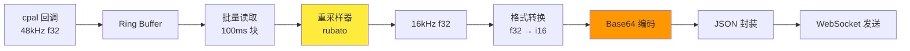

#### 2.2.3 音频处理工作线程

```rust
use tokio::sync::mpsc;

pub async fn audio_processing_task(
    mut consumer: rtrb::Consumer<Vec<f32>>,
    tx: mpsc::Sender<Vec<i16>>,
    config: AudioConfig,
) {
    let mut resampler = AudioResampler::new(
        config.input_sample_rate,
        config.target_sample_rate,
        config.channels as usize,
    ).expect("Failed to create resampler");

    let mut accumulator = Vec::new();
    let target_samples = (config.input_sample_rate as f64 * 0.1) as usize; // 100ms

    loop {
        // 从 Ring Buffer 读取数据
        while let Ok(chunk) = consumer.pop() {
            accumulator.extend_from_slice(&chunk);

            // 当积累足够数据时进行处理
            if accumulator.len() >= target_samples {
                let to_process = accumulator.drain(..target_samples).collect::<Vec<_>>();

                match resampler.process(&to_process) {
                    Ok(resampled) if !resampled.is_empty() => {
                        if tx.send(resampled).await.is_err() {
                            eprintln!("Receiver dropped, stopping audio processing");
                            return;
                        }
                    }
                    Ok(_) => {}, // 需要更多数据
                    Err(e) => eprintln!("Resampling error: {}", e),
                }
            }
        }

        // 避免忙等待
        tokio::time::sleep(tokio::time::Duration::from_millis(10)).await;
    }
}
```


### 2.3 网络通信模块 (Network Communication Module)

#### 2.3.1 WebSocket 客户端设计

```rust
use tokio_tungstenite::{connect_async, tungstenite::Message};
use futures_util::{SinkExt, StreamExt};

pub struct ScribeClient {
    api_key: String,
    model_id: String,
    language_code: String,
    ws_url: String,
}

impl ScribeClient {
    pub fn new(api_key: String) -> Self {
        Self {
            api_key,
            model_id: "scribe_v2_realtime".to_string(),
            language_code: "en".to_string(),
            ws_url: "wss://api.elevenlabs.io/v1/speech-to-text/realtime".to_string(),
        }
    }

    pub async fn connect(&self) -> Result<WebSocketConnection, NetworkError> {
        let url = format!(
            "{}?model_id={}&language_code={}&encoding=pcm_16000",
            self.ws_url, self.model_id, self.language_code
        );

        let mut request = url.into_client_request()?;
        request.headers_mut().insert(
            "xi-api-key",
            self.api_key.parse().unwrap(),
        );

        let (ws_stream, _) = connect_async(request).await?;
        let (write, read) = ws_stream.split();

        Ok(WebSocketConnection { write, read })
    }
}
```

#### 2.3.2 消息协议定义

```rust
use serde::{Deserialize, Serialize};

#[derive(Debug, Serialize)]
pub struct InputAudioChunk {
    pub message_type: String,
    pub audio_base_64: String,
}

#[derive(Debug, Deserialize)]
#[serde(tag = "message_type")]
pub enum ScribeEvent {
    #[serde(rename = "session_started")]
    SessionStarted {
        session_id: String,
        config: serde_json::Value,
    },

    #[serde(rename = "partial_transcript")]
    PartialTranscript {
        text: String,
        created_at_ms: u64,
    },

    #[serde(rename = "committed_transcript")]
    CommittedTranscript {
        text: String,
        confidence: f32,
        created_at_ms: u64,
    },

    #[serde(rename = "input_error")]
    InputError {
        error_message: String,
    },
}
```

#### 2.3.3 双向通信流程

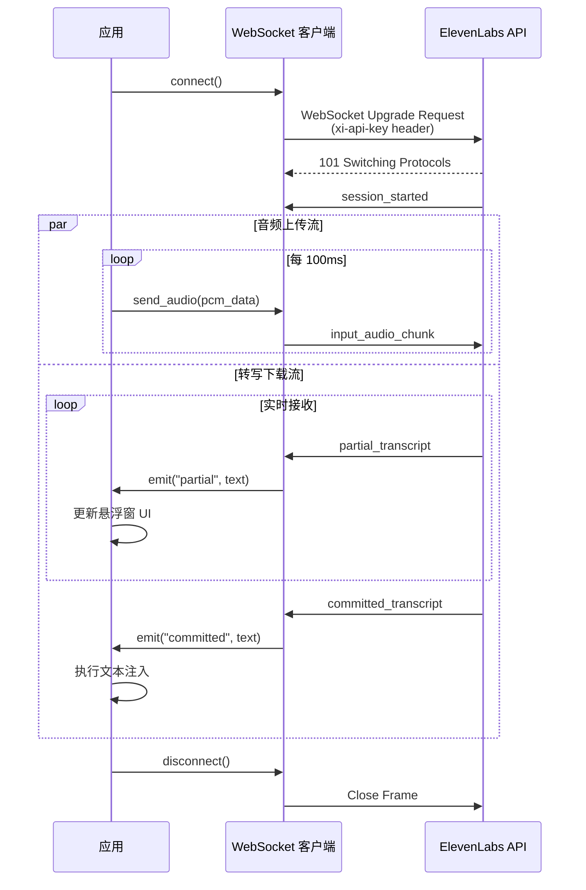


### 2.4 输入注入模块 (Input Injection Module)

#### 2.4.1 注入策略决策树

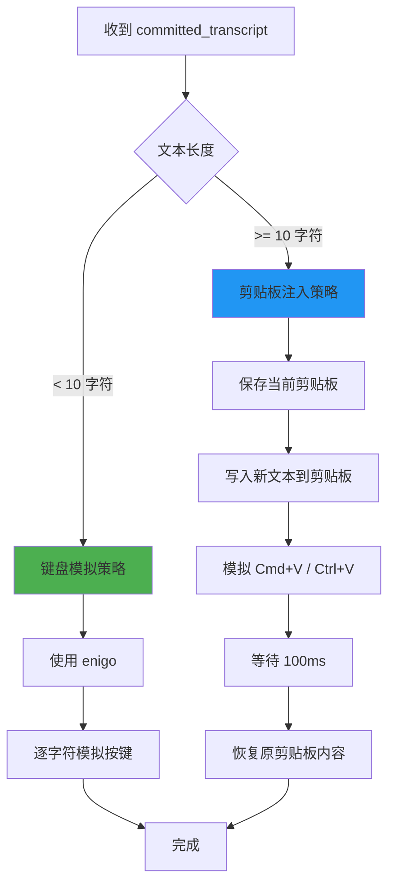

#### 2.4.2 输入注入器实现

```rust
use enigo::{Enigo, Key, KeyboardControllable};
use tauri_plugin_clipboard_manager::ClipboardExt;

pub struct InputInjector {
    enigo: Enigo,
    threshold: usize,
}

impl InputInjector {
    pub fn new() -> Self {
        Self {
            enigo: Enigo::new(),
            threshold: 10,
        }
    }

    pub async fn inject_text(
        &mut self,
        text: &str,
        app_handle: &AppHandle,
    ) -> Result<(), InputError> {
        if text.len() < self.threshold {
            self.inject_via_keyboard(text)?;
        } else {
            self.inject_via_clipboard(text, app_handle).await?;
        }
        Ok(())
    }

    fn inject_via_keyboard(&mut self, text: &str) -> Result<(), InputError> {
        for ch in text.chars() {
            self.enigo.key_sequence(&ch.to_string());
            std::thread::sleep(std::time::Duration::from_millis(5));
        }
        Ok(())
    }

    async fn inject_via_clipboard(
        &mut self,
        text: &str,
        app_handle: &AppHandle,
    ) -> Result<(), InputError> {
        let old_clipboard = app_handle.clipboard().read_text().ok();
        app_handle.clipboard().write_text(text)?;

        #[cfg(target_os = "macos")]
        {
            self.enigo.key_down(Key::Meta);
            self.enigo.key_click(Key::Layout('v'));
            self.enigo.key_up(Key::Meta);
        }

        #[cfg(not(target_os = "macos"))]
        {
            self.enigo.key_down(Key::Control);
            self.enigo.key_click(Key::Layout('v'));
            self.enigo.key_up(Key::Control);
        }

        tokio::time::sleep(tokio::time::Duration::from_millis(100)).await;

        if let Some(old_text) = old_clipboard {
            app_handle.clipboard().write_text(old_text)?;
        }

        Ok(())
    }
}
```

## 3. Tauri 应用集成

### 3.1 项目结构

```
raflow/
├── src/                    # 前端代码
│   ├── App.tsx
│   ├── components/
│   │   ├── OverlayWindow.tsx
│   │   └── SettingsPanel.tsx
│   └── main.tsx
├── src-tauri/              # Rust 后端
│   ├── src/
│   │   ├── main.rs
│   │   ├── lib.rs
│   │   ├── audio/
│   │   │   ├── mod.rs
│   │   │   ├── capturer.rs
│   │   │   └── resampler.rs
│   │   ├── network/
│   │   │   ├── mod.rs
│   │   │   └── scribe_client.rs
│   │   ├── input/
│   │   │   ├── mod.rs
│   │   │   └── injector.rs
│   │   └── commands.rs
│   ├── Cargo.toml
│   ├── tauri.conf.json
│   └── capabilities/
│       └── default.json
└── package.json
```

### 3.2 Cargo.toml 依赖配置

```toml
[package]
name = "raflow"
version = "0.1.0"
edition = "2024"

[dependencies]
tauri = { version = "2.1", features = ["protocol-asset"] }
tauri-plugin-global-shortcut = "2.0"
tauri-plugin-clipboard-manager = "2.0"
tauri-plugin-dialog = "2.0"
tauri-plugin-fs = "2.0"

tokio = { version = "1", features = ["full"] }
tokio-tungstenite = { version = "0.23", features = ["rustls-tls-native-roots"] }
futures-util = "0.3"

cpal = "0.15"
rubato = "0.15"
rtrb = "0.3"

enigo = "0.2"
active-win-pos-rs = "0.9"

serde = { version = "1", features = ["derive"] }
serde_json = "1"
base64 = "0.22"
anyhow = "1"
thiserror = "1"

[build-dependencies]
tauri-build = { version = "2.1", features = [] }

[target.'cfg(target_os = "macos")'.dependencies]
objc = "0.2"
cocoa = "0.25"
```

### 3.3 权限配置 (capabilities/default.json)

```json
{
  "$schema": "../gen/schemas/desktop-schema.json",
  "identifier": "default",
  "description": "RAFlow 默认权限",
  "windows": ["main", "overlay"],
  "permissions": [
    "core:default",
    "core:window:allow-show",
    "core:window:allow-hide",
    "core:window:allow-set-position",
    "global-shortcut:allow-register",
    "global-shortcut:allow-unregister",
    "global-shortcut:allow-is-registered",
    "clipboard-manager:allow-write-text",
    "clipboard-manager:allow-read-text",
    "dialog:allow-message",
    "fs:allow-read-text-file",
    "fs:allow-write-text-file"
  ]
}
```


### 3.4 tauri.conf.json 配置

```json
{
  "productName": "RAFlow",
  "version": "0.1.0",
  "identifier": "com.raflow.app",
  "build": {
    "beforeDevCommand": "npm run dev",
    "beforeBuildCommand": "npm run build",
    "devUrl": "http://localhost:5173",
    "frontendDist": "../dist"
  },
  "app": {
    "windows": [
      {
        "label": "main",
        "title": "RAFlow Settings",
        "width": 600,
        "height": 400,
        "visible": false,
        "center": true,
        "resizable": true
      },
      {
        "label": "overlay",
        "title": "RAFlow Overlay",
        "width": 400,
        "height": 100,
        "decorations": false,
        "transparent": true,
        "alwaysOnTop": true,
        "skipTaskbar": true,
        "visible": false,
        "center": true,
        "focusable": false
      }
    ],
    "security": {
      "csp": "default-src 'self'; connect-src wss://api.elevenlabs.io"
    },
    "trayIcon": {
      "iconPath": "icons/icon.png",
      "iconAsTemplate": true
    },
    "macOSPrivateApi": true
  }
}
```

### 3.5 主程序入口 (lib.rs)

```rust
use tauri::{
    AppHandle, Manager, RunEvent, SystemTray, SystemTrayEvent,
    SystemTrayMenu, SystemTrayMenuItem, WindowEvent,
};
use tauri_plugin_global_shortcut::{GlobalShortcutExt, Shortcut};

mod audio;
mod network;
mod input;
mod commands;

use std::sync::Arc;
use tokio::sync::Mutex;

pub struct AppState {
    audio_capturer: Arc<Mutex<Option<audio::AudioCapturer>>>,
    scribe_client: Arc<Mutex<Option<network::ScribeClient>>>,
    input_injector: Arc<Mutex<input::InputInjector>>,
    is_recording: Arc<Mutex<bool>>,
}

#[cfg_attr(mobile, tauri::mobile_entry_point)]
pub fn run() {
    let tray_menu = SystemTrayMenu::new()
        .add_item(SystemTrayMenuItem::new("设置", "settings"))
        .add_native_item(SystemTrayMenuItem::Separator)
        .add_item(SystemTrayMenuItem::new("退出", "quit"));

    let system_tray = SystemTray::new().with_menu(tray_menu);

    tauri::Builder::default()
        .plugin(tauri_plugin_global_shortcut::Builder::new().build())
        .plugin(tauri_plugin_clipboard_manager::init())
        .plugin(tauri_plugin_dialog::init())
        .plugin(tauri_plugin_fs::init())
        .system_tray(system_tray)
        .on_system_tray_event(|app, event| {
            if let SystemTrayEvent::MenuItemClick { id, .. } = event {
                match id.as_str() {
                    "settings" => {
                        if let Some(window) = app.get_window("main") {
                            window.show().unwrap();
                            window.set_focus().unwrap();
                        }
                    }
                    "quit" => {
                        app.exit(0);
                    }
                    _ => {}
                }
            }
        })
        .setup(|app| {
            // 初始化应用状态
            let state = AppState {
                audio_capturer: Arc::new(Mutex::new(None)),
                scribe_client: Arc::new(Mutex::new(None)),
                input_injector: Arc::new(Mutex::new(input::InputInjector::new())),
                is_recording: Arc::new(Mutex::new(false)),
            };
            app.manage(state);

            // 注册全局快捷键
            let app_handle = app.handle();
            app.global_shortcut().on_shortcut("CmdOrCtrl+Shift+Space", move |_app, _shortcut, event| {
                if event.state == tauri_plugin_global_shortcut::ShortcutState::Pressed {
                    let app_handle = app_handle.clone();
                    tauri::async_runtime::spawn(async move {
                        commands::toggle_recording(app_handle).await;
                    });
                }
            })?;

            app.global_shortcut().register("CmdOrCtrl+Shift+Space")?;

            Ok(())
        })
        .invoke_handler(tauri::generate_handler![
            commands::start_recording,
            commands::stop_recording,
            commands::save_api_key,
            commands::get_api_key,
        ])
        .build(tauri::generate_context!())
        .expect("error while building tauri application")
        .run(|app_handle, event| {
            match event {
                RunEvent::ExitRequested { api, .. } => {
                    api.prevent_exit();
                }
                RunEvent::WindowEvent {
                    label,
                    event: WindowEvent::CloseRequested { api, .. },
                    ..
                } => {
                    if label == "main" {
                        api.prevent_close();
                        if let Some(window) = app_handle.get_window("main") {
                            window.hide().unwrap();
                        }
                    }
                }
                _ => {}
            }
        });
}
```

### 3.6 Tauri 命令 (commands.rs)

```rust
use tauri::{AppHandle, State};
use crate::AppState;

#[tauri::command]
pub async fn start_recording(
    app_handle: AppHandle,
    state: State<'_, AppState>,
) -> Result<(), String> {
    let mut is_recording = state.is_recording.lock().await;
    if *is_recording {
        return Ok(());
    }

    // 显示悬浮窗
    if let Some(overlay) = app_handle.get_window("overlay") {
        overlay.show().map_err(|e| e.to_string())?;
    }

    // 启动音频采集
    let config = crate::audio::AudioConfig::default();
    let capturer = crate::audio::AudioCapturer::new(config)
        .map_err(|e| e.to_string())?;
    capturer.start().map_err(|e| e.to_string())?;

    *state.audio_capturer.lock().await = Some(capturer);
    *is_recording = true;

    // 启动网络连接和处理任务
    tokio::spawn(async move {
        // 实现音频处理和网络传输逻辑
    });

    Ok(())
}

#[tauri::command]
pub async fn stop_recording(
    app_handle: AppHandle,
    state: State<'_, AppState>,
) -> Result<(), String> {
    let mut is_recording = state.is_recording.lock().await;
    if !*is_recording {
        return Ok(());
    }

    // 停止音频采集
    if let Some(capturer) = state.audio_capturer.lock().await.as_ref() {
        capturer.stop().map_err(|e| e.to_string())?;
    }

    // 隐藏悬浮窗
    if let Some(overlay) = app_handle.get_window("overlay") {
        overlay.hide().map_err(|e| e.to_string())?;
    }

    *is_recording = false;
    Ok(())
}

#[tauri::command]
pub async fn save_api_key(
    app_handle: AppHandle,
    api_key: String,
) -> Result<(), String> {
    // 保存到配置文件
    let config_dir = app_handle.path().app_config_dir()
        .map_err(|e| e.to_string())?;
    
    std::fs::create_dir_all(&config_dir).map_err(|e| e.to_string())?;
    
    let config_path = config_dir.join("config.json");
    let config = serde_json::json!({ "api_key": api_key });
    
    std::fs::write(config_path, config.to_string())
        .map_err(|e| e.to_string())?;
    
    Ok(())
}

#[tauri::command]
pub async fn get_api_key(app_handle: AppHandle) -> Result<String, String> {
    let config_dir = app_handle.path().app_config_dir()
        .map_err(|e| e.to_string())?;
    
    let config_path = config_dir.join("config.json");
    
    if !config_path.exists() {
        return Ok(String::new());
    }
    
    let content = std::fs::read_to_string(config_path)
        .map_err(|e| e.to_string())?;
    
    let config: serde_json::Value = serde_json::from_str(&content)
        .map_err(|e| e.to_string())?;
    
    Ok(config["api_key"].as_str().unwrap_or("").to_string())
}

pub async fn toggle_recording(app_handle: AppHandle) {
    let state: State<AppState> = app_handle.state();
    let is_recording = *state.is_recording.lock().await;
    
    if is_recording {
        let _ = stop_recording(app_handle, state).await;
    } else {
        let _ = start_recording(app_handle, state).await;
    }
}
```


## 4. 前端实现

### 4.1 悬浮窗组件 (OverlayWindow.tsx)

```typescript
import { useEffect, useState } from 'react';
import { listen } from '@tauri-apps/api/event';
import './OverlayWindow.css';

interface TranscriptPayload {
  text: string;
  is_final: boolean;
}

export function OverlayWindow() {
  const [transcript, setTranscript] = useState('');
  const [isListening, setIsListening] = useState(false);
  const [audioLevel, setAudioLevel] = useState(0);

  useEffect(() => {
    const unlistenPartial = listen<string>('partial_transcript', (event) => {
      setTranscript(event.payload);
      setIsListening(true);
    });

    const unlistenCommitted = listen<string>('committed_transcript', (event) => {
      setTranscript(event.payload);
      setTimeout(() => {
        setTranscript('');
        setIsListening(false);
      }, 1000);
    });

    const unlistenAudioLevel = listen<number>('audio_level', (event) => {
      setAudioLevel(event.payload);
    });

    return () => {
      unlistenPartial.then(f => f());
      unlistenCommitted.then(f => f());
      unlistenAudioLevel.then(f => f());
    };
  }, []);

  return (
    <div className="overlay-container">
      <div className="waveform">
        {[...Array(20)].map((_, i) => (
          <div
            key={i}
            className="wave-bar"
            style={{
              height: `${Math.random() * audioLevel * 100}%`,
              animationDelay: `${i * 0.05}s`
            }}
          />
        ))}
      </div>
      <div className="transcript-text">
        {transcript || (isListening ? '正在听...' : '按快捷键开始')}
      </div>
    </div>
  );
}
```

### 4.2 设置面板 (SettingsPanel.tsx)

```typescript
import { useState, useEffect } from 'react';
import { invoke } from '@tauri-apps/api/core';

export function SettingsPanel() {
  const [apiKey, setApiKey] = useState('');
  const [saved, setSaved] = useState(false);

  useEffect(() => {
    invoke<string>('get_api_key').then(key => {
      setApiKey(key);
    });
  }, []);

  const handleSave = async () => {
    try {
      await invoke('save_api_key', { apiKey });
      setSaved(true);
      setTimeout(() => setSaved(false), 2000);
    } catch (error) {
      console.error('Failed to save API key:', error);
    }
  };

  return (
    <div className="settings-panel">
      <h2>RAFlow 设置</h2>
      
      <div className="setting-group">
        <label>ElevenLabs API Key</label>
        <input
          type="password"
          value={apiKey}
          onChange={(e) => setApiKey(e.target.value)}
          placeholder="输入你的 API Key"
        />
      </div>

      <div className="setting-group">
        <label>全局快捷键</label>
        <div className="shortcut-display">Cmd/Ctrl + Shift + Space</div>
      </div>

      <button onClick={handleSave} className="save-button">
        {saved ? '已保存 ✓' : '保存设置'}
      </button>

      <div className="info-section">
        <h3>使用说明</h3>
        <ul>
          <li>按下快捷键开始录音</li>
          <li>说话时会实时显示转写结果</li>
          <li>停止说话后自动注入到当前应用</li>
          <li>再次按快捷键可以停止录音</li>
        </ul>
      </div>
    </div>
  );
}
```

## 5. 完整数据流程

### 5.1 启动录音流程

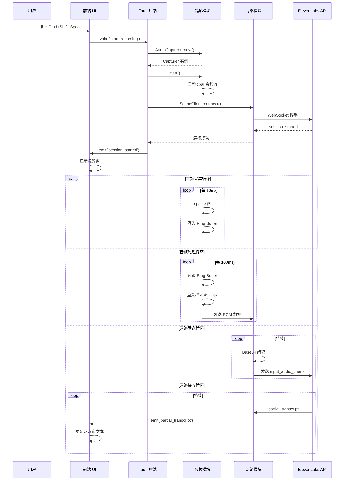

### 5.2 文本注入流程

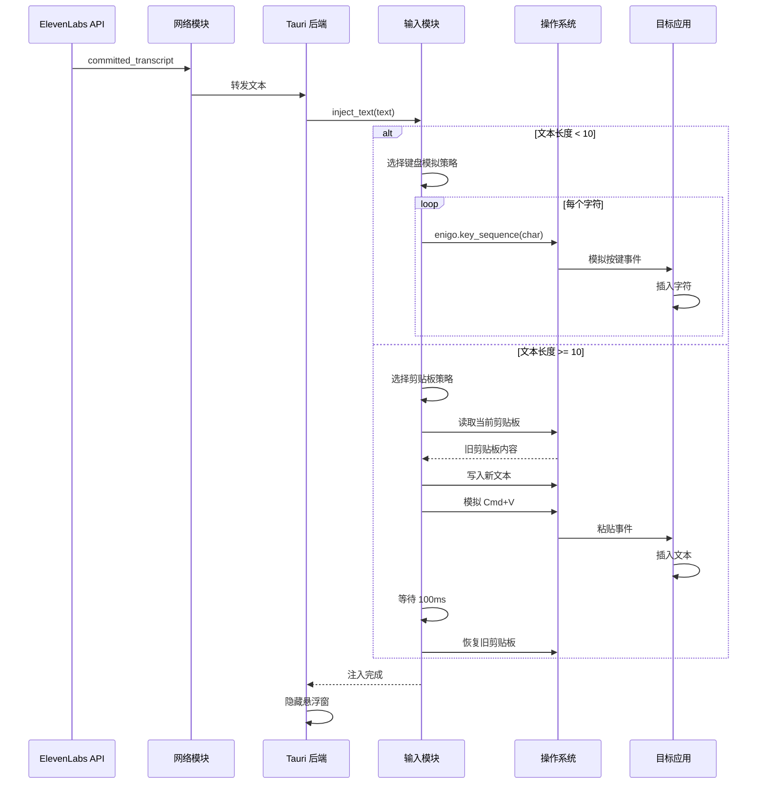

### 5.3 错误处理流程

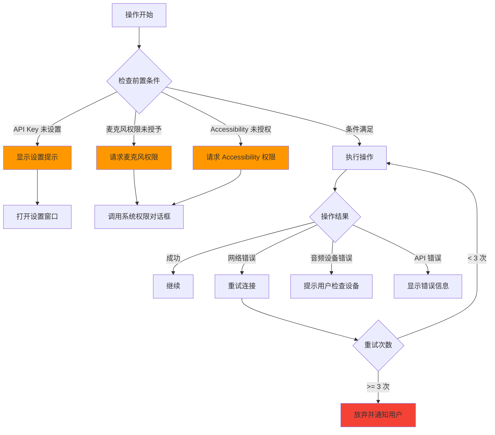

## 6. 性能优化策略

### 6.1 音频处理优化

#### 6.1.1 零拷贝优化

```rust
// 使用 Arc 避免数据拷贝
use std::sync::Arc;
use parking_lot::Mutex;

pub struct SharedAudioBuffer {
    buffer: Arc<Mutex<Vec<f32>>>,
}

impl SharedAudioBuffer {
    pub fn push(&self, data: &[f32]) {
        let mut buf = self.buffer.lock();
        buf.extend_from_slice(data);
    }

    pub fn drain(&self, count: usize) -> Vec<f32> {
        let mut buf = self.buffer.lock();
        buf.drain(..count).collect()
    }
}
```

#### 6.1.2 SIMD 加速

```rust
// 使用 SIMD 加速音频格式转换
#[cfg(target_arch = "x86_64")]
use std::arch::x86_64::*;

pub fn convert_f32_to_i16_simd(input: &[f32], output: &mut [i16]) {
    #[cfg(target_arch = "x86_64")]
    unsafe {
        if is_x86_feature_detected!("avx2") {
            convert_f32_to_i16_avx2(input, output);
            return;
        }
    }

    // Fallback to scalar implementation
    for (i, &sample) in input.iter().enumerate() {
        output[i] = (sample.clamp(-1.0, 1.0) * 32767.0) as i16;
    }
}
```

### 6.2 网络优化

#### 6.2.1 连接池管理

```rust
use std::time::{Duration, Instant};

pub struct ConnectionPool {
    connection: Option<WebSocketConnection>,
    last_used: Instant,
    idle_timeout: Duration,
}

impl ConnectionPool {
    pub fn new() -> Self {
        Self {
            connection: None,
            last_used: Instant::now(),
            idle_timeout: Duration::from_secs(30),
        }
    }

    pub async fn get_or_create(&mut self, client: &ScribeClient)
        -> Result<&mut WebSocketConnection, NetworkError>
    {
        // 检查连接是否过期
        if self.last_used.elapsed() > self.idle_timeout {
            self.connection = None;
        }

        // 如果没有连接，创建新连接
        if self.connection.is_none() {
            self.connection = Some(client.connect().await?);
        }

        self.last_used = Instant::now();
        Ok(self.connection.as_mut().unwrap())
    }
}
```

#### 6.2.2 批量发送优化

```rust
pub struct BatchSender {
    buffer: Vec<Vec<i16>>,
    max_batch_size: usize,
    last_send: Instant,
    max_delay: Duration,
}

impl BatchSender {
    pub async fn add_chunk(&mut self, chunk: Vec<i16>) -> Option<Vec<Vec<i16>>> {
        self.buffer.push(chunk);

        // 达到批量大小或超时，返回批次
        if self.buffer.len() >= self.max_batch_size
            || self.last_send.elapsed() > self.max_delay
        {
            let batch = std::mem::take(&mut self.buffer);
            self.last_send = Instant::now();
            return Some(batch);
        }

        None
    }
}
```

### 6.3 内存优化

#### 6.3.1 对象池

```rust
use std::collections::VecDeque;

pub struct BufferPool {
    pool: VecDeque<Vec<f32>>,
    capacity: usize,
}

impl BufferPool {
    pub fn new(pool_size: usize, buffer_capacity: usize) -> Self {
        let mut pool = VecDeque::with_capacity(pool_size);
        for _ in 0..pool_size {
            pool.push_back(Vec::with_capacity(buffer_capacity));
        }

        Self { pool, capacity: buffer_capacity }
    }

    pub fn acquire(&mut self) -> Vec<f32> {
        self.pool.pop_front()
            .unwrap_or_else(|| Vec::with_capacity(self.capacity))
    }

    pub fn release(&mut self, mut buffer: Vec<f32>) {
        buffer.clear();
        if self.pool.len() < self.pool.capacity() {
            self.pool.push_back(buffer);
        }
    }
}
```

### 6.4 性能指标监控

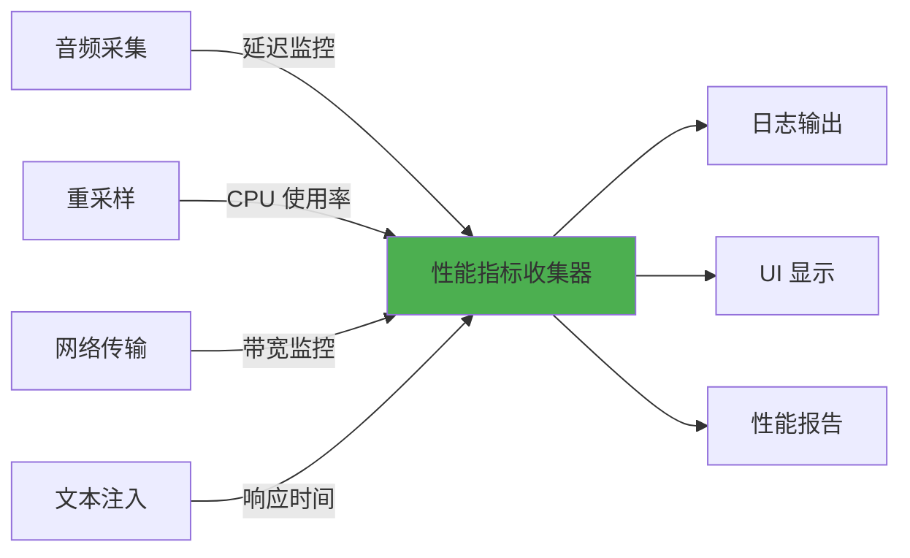

## 7. 安全性考虑

### 7.1 API Key 安全存储

```rust
use keyring::Entry;

pub struct SecureStorage {
    service: String,
    username: String,
}

impl SecureStorage {
    pub fn new() -> Self {
        Self {
            service: "com.raflow.app".to_string(),
            username: "api_key".to_string(),
        }
    }

    pub fn save_api_key(&self, api_key: &str) -> Result<(), String> {
        let entry = Entry::new(&self.service, &self.username)
            .map_err(|e| e.to_string())?;
        entry.set_password(api_key)
            .map_err(|e| e.to_string())?;
        Ok(())
    }

    pub fn get_api_key(&self) -> Result<String, String> {
        let entry = Entry::new(&self.service, &self.username)
            .map_err(|e| e.to_string())?;
        entry.get_password()
            .map_err(|e| e.to_string())
    }
}
```

### 7.2 权限检查

```rust
#[cfg(target_os = "macos")]
pub fn check_permissions() -> PermissionStatus {
    use objc::runtime::Object;
    use objc::{msg_send, sel, sel_impl};

    let mut status = PermissionStatus::default();

    // 检查麦克风权限
    unsafe {
        let av_capture_device: *mut Object = msg_send![
            class!(AVCaptureDevice),
            authorizationStatusForMediaType: "vide"
        ];
        status.microphone = av_capture_device as i32 == 3; // Authorized
    }

    // 检查 Accessibility 权限
    status.accessibility = macos_accessibility_client::accessibility::application_is_trusted();

    status
}

#[derive(Default)]
pub struct PermissionStatus {
    pub microphone: bool,
    pub accessibility: bool,
}
```

### 7.3 输入验证

```rust
pub fn validate_transcript(text: &str) -> Result<String, ValidationError> {
    // 长度限制
    if text.len() > 10000 {
        return Err(ValidationError::TooLong);
    }

    // 过滤控制字符
    let cleaned: String = text.chars()
        .filter(|c| !c.is_control() || c.is_whitespace())
        .collect();

    // 检查是否包含恶意内容
    if contains_malicious_patterns(&cleaned) {
        return Err(ValidationError::MaliciousContent);
    }

    Ok(cleaned)
}

fn contains_malicious_patterns(text: &str) -> bool {
    // 检查是否包含可能的命令注入
    let dangerous_patterns = [
        "$(", "`", ";", "&&", "||", "|", ">", "<"
    ];

    dangerous_patterns.iter().any(|pattern| text.contains(pattern))
}
```

### 7.4 安全架构图

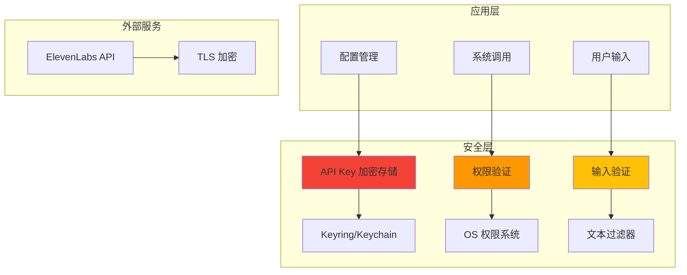

## 8. 平台特定实现

### 8.1 macOS 特定功能

```rust
#[cfg(target_os = "macos")]
pub mod macos {
    use cocoa::appkit::{NSWindow, NSWindowStyleMask};
    use cocoa::base::{id, nil};
    use objc::{msg_send, sel, sel_impl};

    pub fn configure_overlay_window(window: id) {
        unsafe {
            // 设置窗口级别为浮动面板
            let _: () = msg_send![window, setLevel: 25]; // NSFloatingWindowLevel

            // 设置为非激活窗口
            let _: () = msg_send![window, setIgnoresMouseEvents: true];

            // 禁用阴影
            let _: () = msg_send![window, setHasShadow: false];

            // 设置背景透明
            let _: () = msg_send![window, setOpaque: false];
            let _: () = msg_send![window, setBackgroundColor: nil];
        }
    }

    pub fn prevent_app_nap(prevent: bool) {
        unsafe {
            let process_info: id = msg_send![class!(NSProcessInfo), processInfo];

            if prevent {
                let activity: id = msg_send![
                    process_info,
                    beginActivityWithOptions: 0x00FFFFFF
                    reason: "Audio recording in progress"
                ];
                // 保存 activity 以便后续取消
            } else {
                // 取消 activity
            }
        }
    }
}
```

### 8.2 Windows 特定功能

```rust
#[cfg(target_os = "windows")]
pub mod windows {
    use winapi::um::winuser::{
        SetWindowPos, HWND_TOPMOST, SWP_NOMOVE, SWP_NOSIZE
    };

    pub fn set_always_on_top(hwnd: isize, enable: bool) {
        unsafe {
            let z_order = if enable { HWND_TOPMOST } else { HWND_NOTOPMOST };
            SetWindowPos(
                hwnd as *mut _,
                z_order as *mut _,
                0, 0, 0, 0,
                SWP_NOMOVE | SWP_NOSIZE
            );
        }
    }
}
```

### 8.3 Linux 特定功能

```rust
#[cfg(target_os = "linux")]
pub mod linux {
    use x11::xlib::{Display, XOpenDisplay, XCloseDisplay};

    pub fn get_active_window_x11() -> Option<String> {
        unsafe {
            let display = XOpenDisplay(std::ptr::null());
            if display.is_null() {
                return None;
            }

            // 实现 X11 窗口查询逻辑

            XCloseDisplay(display);
        }

        None
    }
}
```

## 9. 测试策略

### 9.1 单元测试

```rust
#[cfg(test)]
mod tests {
    use super::*;

    #[test]
    fn test_audio_resampler() {
        let mut resampler = AudioResampler::new(48000, 16000, 1).unwrap();

        // 生成 100ms 的测试音频 (48kHz)
        let input: Vec<f32> = (0..4800)
            .map(|i| (i as f32 * 0.001).sin())
            .collect();

        let output = resampler.process(&input).unwrap();

        // 验证输出长度约为 1600 (16kHz * 0.1s)
        assert!((output.len() as i32 - 1600).abs() < 10);
    }

    #[test]
    fn test_format_conversion() {
        let input = vec![0.0, 0.5, -0.5, 1.0, -1.0];
        let output: Vec<i16> = input.iter()
            .map(|&x| (x * 32767.0) as i16)
            .collect();

        assert_eq!(output[0], 0);
        assert_eq!(output[1], 16383);
        assert_eq!(output[2], -16383);
        assert_eq!(output[3], 32767);
        assert_eq!(output[4], -32767);
    }

    #[test]
    fn test_input_validation() {
        // 正常文本
        assert!(validate_transcript("Hello world").is_ok());

        // 过长文本
        let long_text = "a".repeat(10001);
        assert!(validate_transcript(&long_text).is_err());

        // 恶意模式
        assert!(validate_transcript("rm -rf /").is_err());
    }
}
```

### 9.2 集成测试

```rust
#[tokio::test]
async fn test_websocket_connection() {
    let client = ScribeClient::new("test_api_key".to_string());

    // 注意：这需要有效的 API key
    match client.connect().await {
        Ok(conn) => {
            // 验证连接成功
            assert!(true);
        }
        Err(e) => {
            // 预期的错误（无效 API key）
            assert!(e.to_string().contains("authentication"));
        }
    }
}

#[tokio::test]
async fn test_audio_pipeline() {
    let config = AudioConfig::default();
    let capturer = AudioCapturer::new(config).unwrap();

    capturer.start().unwrap();

    // 等待一些音频数据
    tokio::time::sleep(tokio::time::Duration::from_millis(500)).await;

    capturer.stop().unwrap();
}
```

### 9.3 端到端测试

```rust
#[tokio::test]
#[ignore] // 需要真实环境
async fn test_full_transcription_flow() {
    // 1. 初始化所有组件
    let audio_config = AudioConfig::default();
    let capturer = AudioCapturer::new(audio_config).unwrap();
    let client = ScribeClient::new(std::env::var("ELEVENLABS_API_KEY").unwrap());

    // 2. 建立连接
    let connection = client.connect().await.unwrap();

    // 3. 启动音频采集
    capturer.start().unwrap();

    // 4. 等待转写结果
    tokio::time::sleep(tokio::time::Duration::from_secs(5)).await;

    // 5. 验证收到了转写事件
    // (需要实现事件收集逻辑)

    // 6. 清理
    capturer.stop().unwrap();
}
```

### 9.4 测试覆盖率目标

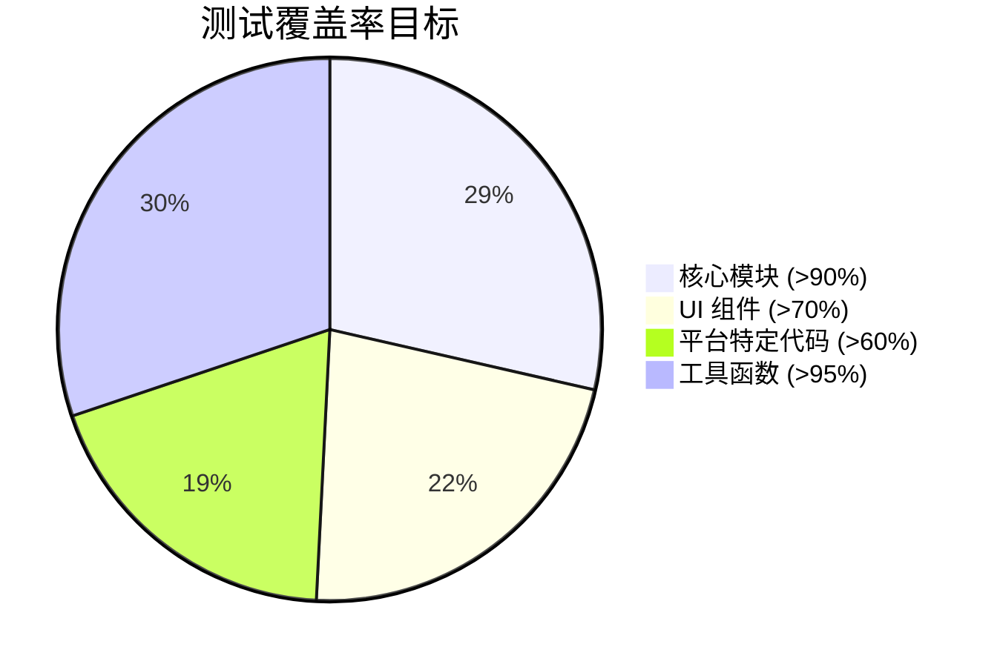

## 10. 部署指南

### 10.1 构建配置

```bash
# 开发构建
npm run tauri dev

# 生产构建
npm run tauri build

# 特定平台构建
npm run tauri build -- --target x86_64-apple-darwin
npm run tauri build -- --target x86_64-pc-windows-msvc
npm run tauri build -- --target x86_64-unknown-linux-gnu
```

### 10.2 代码签名 (macOS)

```bash
# 签名应用
codesign --deep --force --verify --verbose \
  --sign "Developer ID Application: Your Name" \
  --options runtime \
  --entitlements entitlements.plist \
  target/release/bundle/macos/RAFlow.app

# 公证
xcrun notarytool submit target/release/bundle/macos/RAFlow.app.zip \
  --apple-id "your@email.com" \
  --password "app-specific-password" \
  --team-id "TEAM_ID" \
  --wait

# 装订公证票据
xcrun stapler staple target/release/bundle/macos/RAFlow.app
```

#### entitlements.plist

```xml
<?xml version="1.0" encoding="UTF-8"?>
<!DOCTYPE plist PUBLIC "-//Apple//DTD PLIST 1.0//EN" "http://www.apple.com/DTDs/PropertyList-1.0.dtd">
<plist version="1.0">
<dict>
    <key>com.apple.security.cs.allow-jit</key>
    <true/>
    <key>com.apple.security.cs.allow-unsigned-executable-memory</key>
    <true/>
    <key>com.apple.security.cs.disable-library-validation</key>
    <true/>
    <key>com.apple.security.device.audio-input</key>
    <true/>
    <key>com.apple.security.automation.apple-events</key>
    <true/>
</dict>
</plist>
```

### 10.3 Windows 安装程序

```toml
# tauri.conf.json
{
  "bundle": {
    "windows": {
      "certificateThumbprint": null,
      "digestAlgorithm": "sha256",
      "timestampUrl": "",
      "wix": {
        "language": "zh-CN",
        "template": "installer.wxs"
      }
    }
  }
}
```

### 10.4 Linux 打包

```bash
# Debian/Ubuntu
npm run tauri build -- --target x86_64-unknown-linux-gnu

# 生成 .deb 包
dpkg-deb --build target/release/bundle/deb/raflow_0.1.0_amd64

# AppImage
npm run tauri build -- --bundles appimage
```

### 10.5 CI/CD 配置 (GitHub Actions)

```yaml
name: Build and Release

on:
  push:
    tags:
      - 'v*'

jobs:
  build:
    strategy:
      matrix:
        platform: [macos-latest, ubuntu-latest, windows-latest]

    runs-on: ${{ matrix.platform }}

    steps:
      - uses: actions/checkout@v3

      - name: Setup Node.js
        uses: actions/setup-node@v3
        with:
          node-version: 18

      - name: Setup Rust
        uses: actions-rs/toolchain@v1
        with:
          toolchain: stable

      - name: Install dependencies
        run: npm install

      - name: Build
        run: npm run tauri build

      - name: Upload artifacts
        uses: actions/upload-artifact@v3
        with:
          name: ${{ matrix.platform }}-build
          path: src-tauri/target/release/bundle/
```

### 10.6 部署检查清单

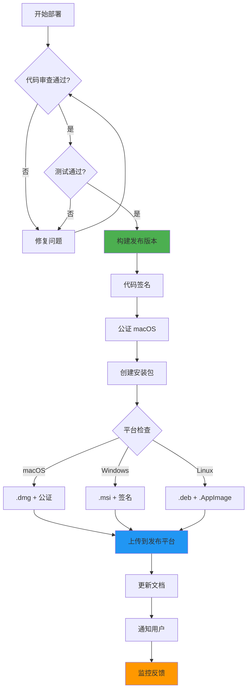

## 11. 监控与维护

### 11.1 日志系统

```rust
use tracing::{info, warn, error, debug};
use tracing_subscriber;

pub fn init_logging() {
    tracing_subscriber::fmt()
        .with_max_level(tracing::Level::DEBUG)
        .with_target(false)
        .with_thread_ids(true)
        .with_file(true)
        .with_line_number(true)
        .init();
}

// 使用示例
info!("Audio capture started");
warn!("Connection timeout, retrying...");
error!("Failed to inject text: {}", error);
debug!("Received partial transcript: {}", text);
```

### 11.2 错误报告

```rust
use sentry;

pub fn init_error_reporting() {
    let _guard = sentry::init((
        "https://your-dsn@sentry.io/project-id",
        sentry::ClientOptions {
            release: sentry::release_name!(),
            ..Default::default()
        },
    ));
}

// 捕获错误
sentry::capture_error(&error);
```

### 11.3 性能监控

```rust
use std::time::Instant;

pub struct PerformanceMonitor {
    metrics: HashMap<String, Vec<Duration>>,
}

impl PerformanceMonitor {
    pub fn record(&mut self, operation: &str, duration: Duration) {
        self.metrics.entry(operation.to_string())
            .or_insert_with(Vec::new)
            .push(duration);
    }

    pub fn report(&self) {
        for (operation, durations) in &self.metrics {
            let avg = durations.iter().sum::<Duration>() / durations.len() as u32;
            info!("{}: avg {}ms", operation, avg.as_millis());
        }
    }
}
```

## 12. 未来优化方向

### 12.1 本地 VAD 集成

```rust
// 集成 silero-vad 进行本地语音活动检测
pub struct LocalVAD {
    model: SileroVAD,
    threshold: f32,
}

impl LocalVAD {
    pub fn detect(&mut self, audio: &[f32]) -> bool {
        let probability = self.model.process(audio);
        probability > self.threshold
    }
}
```

### 12.2 上下文感知 Prompt

```rust
pub struct ContextAwareTranscription {
    window_title: String,
    app_name: String,
}

impl ContextAwareTranscription {
    pub fn build_prompt(&self) -> String {
        format!(
            "Context: User is in {} ({}). Transcribe accurately.",
            self.app_name, self.window_title
        )
    }
}
```

### 12.3 离线模式

```rust
pub enum TranscriptionMode {
    Online(ScribeClient),
    Offline(WhisperModel),
}

impl TranscriptionMode {
    pub async fn transcribe(&mut self, audio: &[i16]) -> Result<String, Error> {
        match self {
            Self::Online(client) => client.send_audio(audio).await,
            Self::Offline(model) => model.transcribe(audio),
        }
    }
}
```

### 12.4 功能路线图

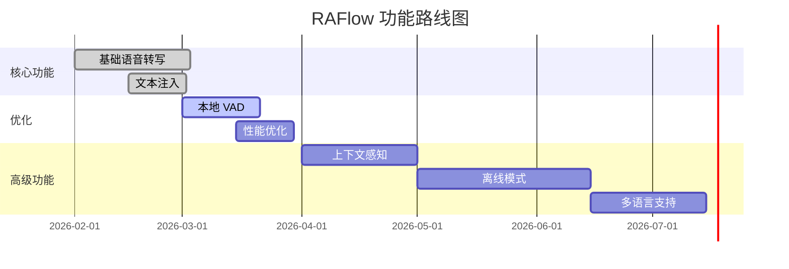

## 13. 总结

本设计文档详细阐述了 RAFlow 桌面语音交互系统的完整技术架构，涵盖了：

1. **系统架构**: 基于 Tauri v2 的跨平台桌面应用框架
2. **核心模块**: 音频采集、处理、网络通信、输入注入
3. **性能优化**: SIMD 加速、零拷贝、连接池管理
4. **安全性**: API Key 加密存储、权限验证、输入过滤
5. **平台适配**: macOS、Windows、Linux 特定实现
6. **测试策略**: 单元测试、集成测试、端到端测试
7. **部署流程**: 构建、签名、打包、发布

### 关键技术亮点

- **低延迟音频管道**: 使用 Ring Buffer 和异步处理实现 <200ms 端到端延迟
- **高质量重采样**: rubato Sinc 插值确保音频质量
- **智能注入策略**: 根据文本长度自动选择键盘模拟或剪贴板注入
- **实时反馈**: partial_transcript 提供即时视觉反馈
- **跨平台支持**: 统一代码库支持三大操作系统

### 技术栈总结

| 类别 | 技术 | 版本 |
|------|------|------|
| 框架 | Tauri | 2.1.x |
| 语言 | Rust | 2024 Edition |
| 异步 | Tokio | 1.x |
| 音频 | cpal + rubato | 0.15.x |
| 网络 | tokio-tungstenite | 0.23.x |
| 输入 | enigo | 0.2.x |

该架构为构建下一代 AI 辅助输入系统奠定了坚实的技术基础。

