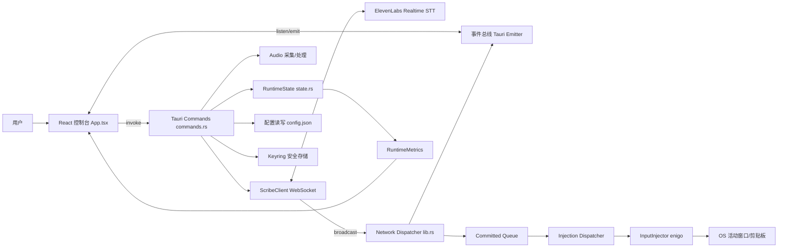
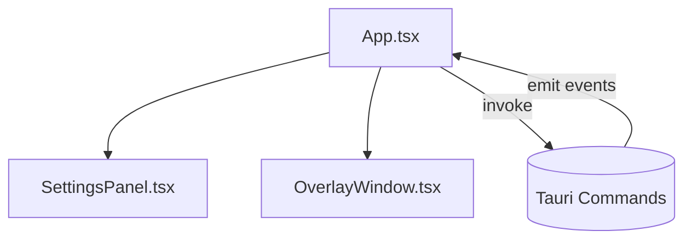
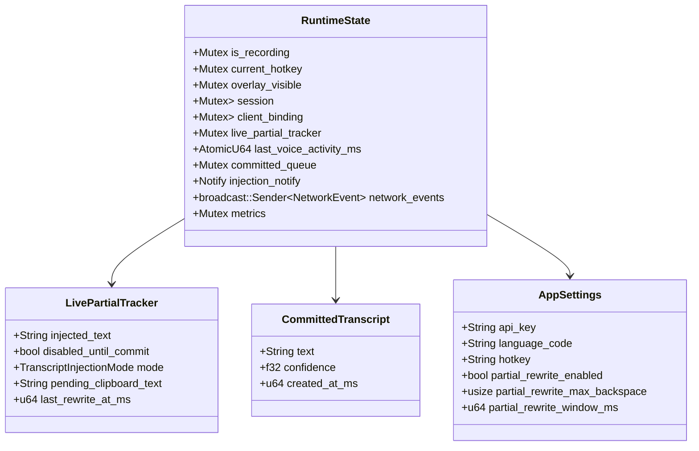
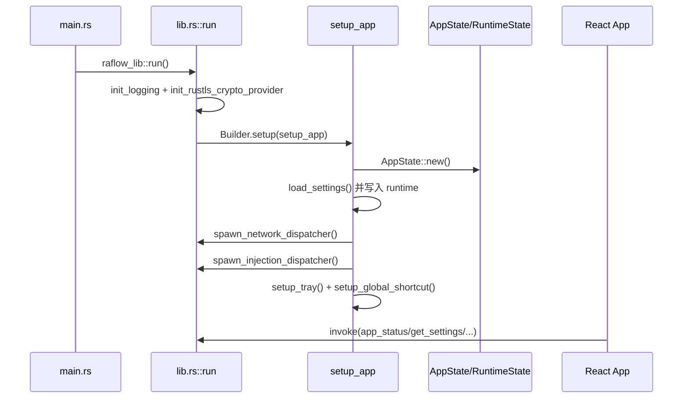
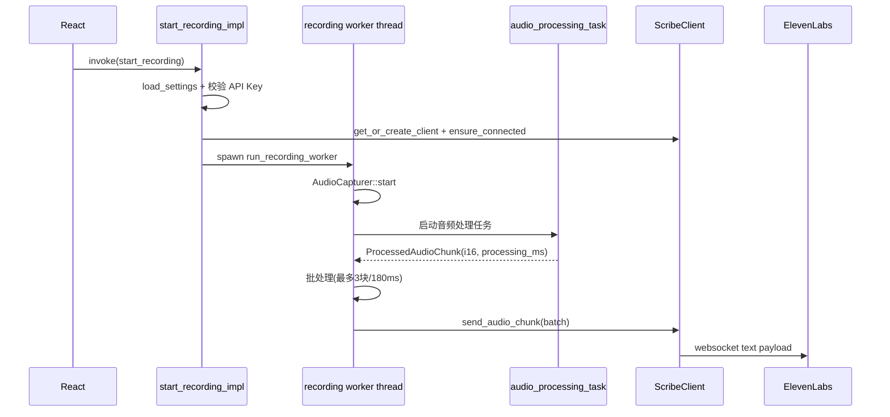
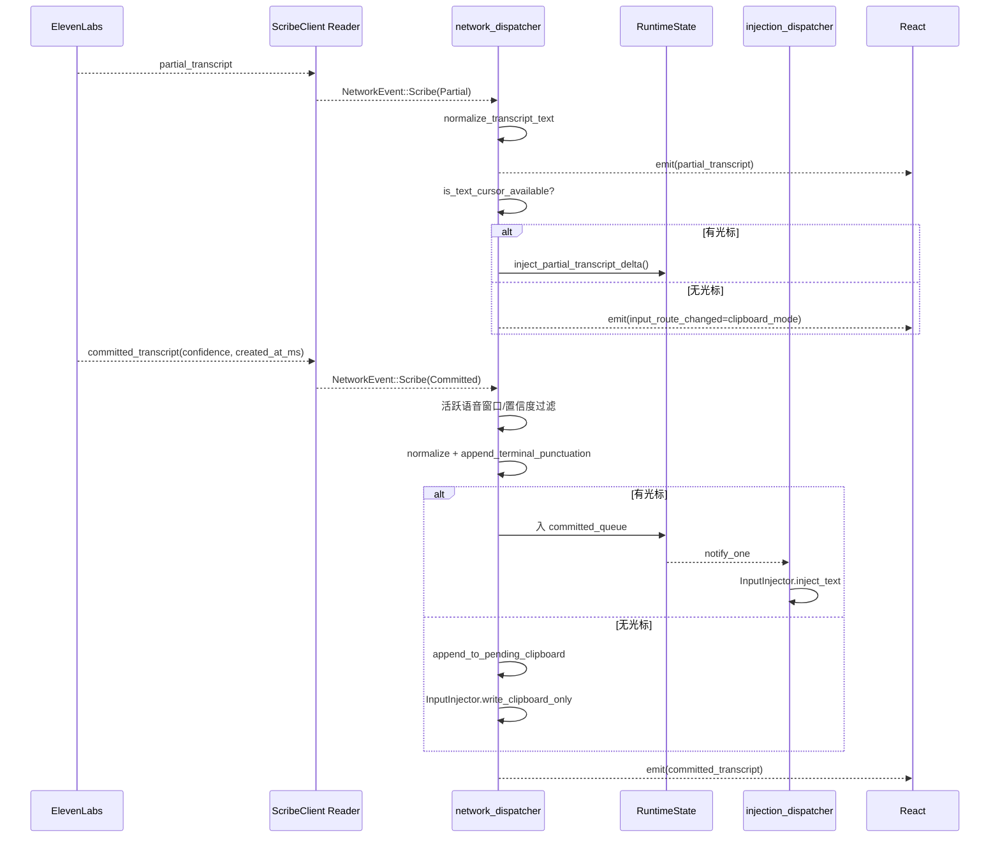
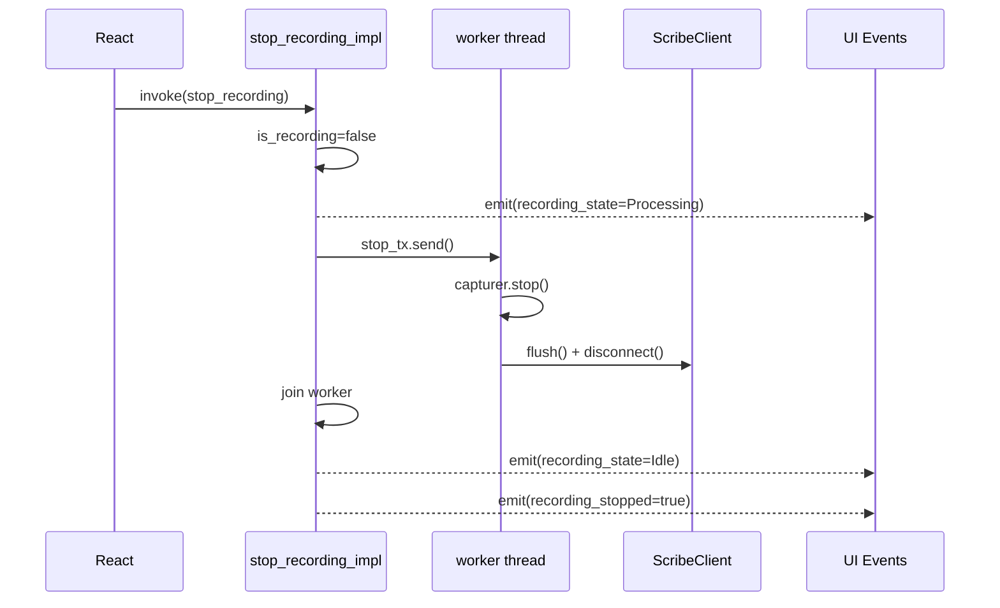
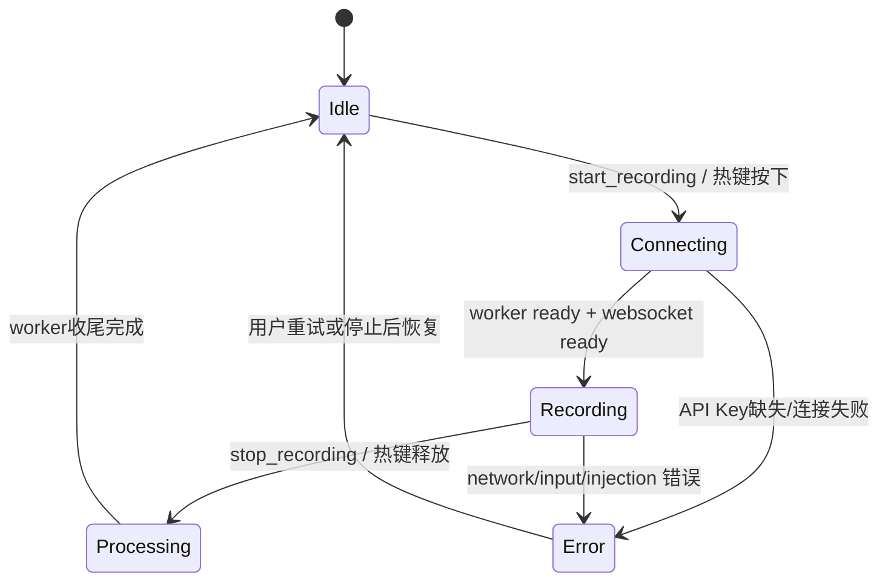
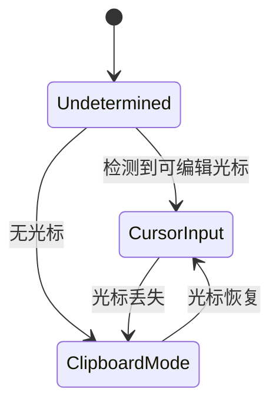
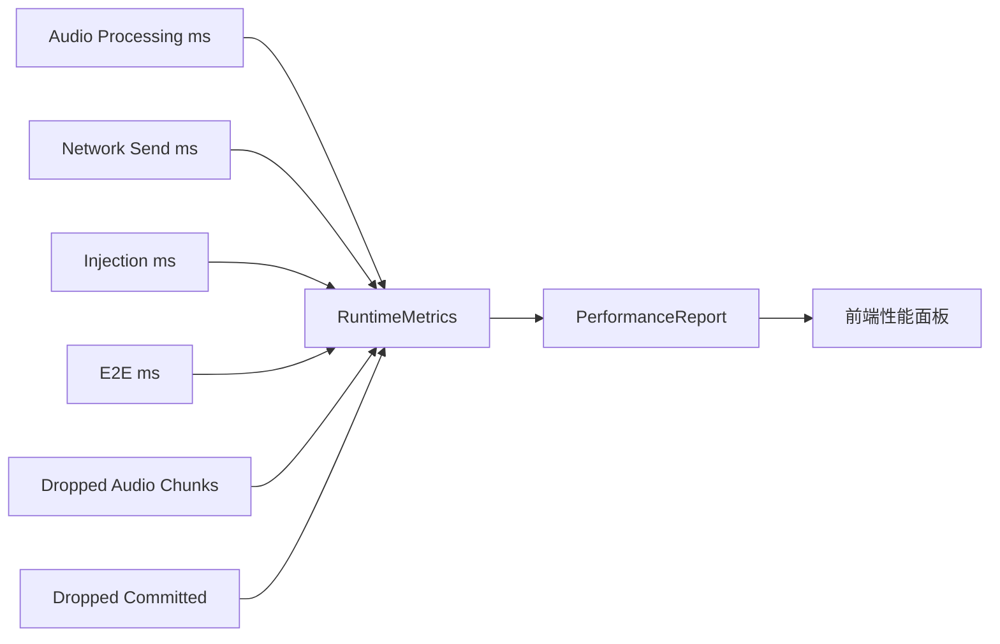

# RAFlow 设计文档（0004，基于当前代码实现）

## 1. 文档目标与范围

本文档基于 `w3/raflow` 当前代码（Tauri + React + Rust）进行逆向梳理，目标是把“实际实现”沉淀为可维护的设计基线，覆盖：

- 系统分层与运行时组件关系
- 前后端命令与事件契约
- 语音采集、网络发送、转写回填、输入注入的关键流程
- 状态机、核心数据结构、性能指标与安全边界
- 当前实现限制与下一步演进建议

不包含内容：

- 产品需求层面的功能取舍讨论
- UI 视觉规范细节（仅涉及交互与数据绑定）

---

## 2. 实现快照

### 2.1 技术栈

- 桌面容器：Tauri v2
- 前端：React 19 + TypeScript 5 + Vite 7
- 后端：Rust 2024
- 音频：`cpal`（采集） + `rubato`（重采样） + `nnnoiseless`（48k 可选降噪）
- 网络：`tokio-tungstenite` 连接 ElevenLabs Realtime STT
- 输入注入：`enigo`
- 安全存储：`keyring`
- 观察指标：自定义 rolling window metrics（P95、平均、最大值）

### 2.2 代码主目录

```text
src/                 # React 前端
src-tauri/src/       # Rust 核心运行时与业务逻辑
src-tauri/capabilities/default.json
```

---

## 3. 总体架构



架构要点：

- 前端只通过 `invoke` 与 `event` 与后端交互，未直接接入音频/网络能力。
- 后端分为两条主路径：
- 路径 1：命令驱动（start/stop/settings/metrics）
- 路径 2：事件驱动（WebSocket 事件 -> 归一化 -> 注入队列 -> UI 事件）
- `RuntimeState` 是系统“共享上下文”，集中承载会话状态、路由状态、队列、指标、客户端连接绑定。

---

## 4. 组件设计

### 4.1 前端组件层



职责拆分：

- `App.tsx`
- 页面主状态容器：录音状态、错误态、权限态、性能态、输入路由态、文案语言态
- 管理命令调用：`app_status`、`check_permissions`、`get_performance_report`、`get_settings`、`save_settings`、`start_recording`、`stop_recording`
- 订阅后端事件：`partial_transcript`、`committed_transcript`、`recording_state`、`recording_error`、`recording_stopped`、`session_started`、`input_route_changed`、`overlay_visibility_changed`

- `SettingsPanel.tsx`
- 仅处理设置输入与数值归一化交互（最大回删字符、改写窗口等）

- `OverlayWindow.tsx`
- 实时展示 partial/committed 文本与运行状态徽标

### 4.2 Rust 后端组件层

```mermaid
flowchart TB
    RUN[lib.rs run()]
    SETUP[setup_app]
    CMD[commands.rs]
    NETDISP[spawn_network_dispatcher]
    INJDISP[spawn_injection_dispatcher]
    STATE[RuntimeState]

    RUN --> SETUP
    SETUP --> STATE
    SETUP --> NETDISP
    SETUP --> INJDISP
    RUN --> CMD
    CMD --> STATE
```

关键职责：

- `lib.rs`
- 应用启动、tray 菜单、全局热键插件、窗口行为（关闭最小化到托盘）
- 注册命令 handler
- 网络事件分发与 committed 注入分发
- partial 实时注入增量/回写策略

- `commands.rs`
- Tauri 命令实现
- 录音会话生命周期（start/stop）
- worker 线程创建、音频处理任务与发送任务调度
- 设置加载/校验/持久化/热键更新

- `network/scribe_client.rs`
- WebSocket 连接池、重连、消息收发、事件解析与转发

- `audio/*`
- 音频采集、降噪、重采样、背压处理

- `input/*`
- 文本安全校验、中文归一化、末尾标点处理、键盘注入、剪贴板写入

---

## 5. 核心数据结构



设计说明：

- `AppSettings` 是“可持久化配置”，但 `api_key` 优先存于 keyring；`config.json` 在 secure storage 可用时会清空密钥字段。
- `LivePartialTracker` 是 partial 增量注入的关键状态机，决定“追加输入”或“受控回删重写”。
- `committed_queue` 只缓存用于最终注入的 committed 文本，超过上限（128）会丢弃最旧项并记指标。

---

## 6. 关键流程设计

### 6.1 启动与初始化流程



### 6.2 录音开始与音频发送流程



关键参数（当前代码常量）：

- 音频发送批次：`MAX_AUDIO_BATCH_CHUNKS = 3`
- 批次最大等待：`MAX_AUDIO_BATCH_DELAY_MS = 180`
- 网络慢发送告警阈值：`SLOW_NETWORK_SEND_MS = 250`
- 音频发送通道容量：`AUDIO_CHANNEL_CAPACITY = 16`

### 6.3 partial 与 committed 处理流程



commit 过滤策略：

- 最近本地语音活动超时：`MAX_COMMIT_INACTIVE_MS = 6000` 则丢弃 committed
- `confidence` 非有限值直接丢弃
- 低置信度阈值：`MIN_COMMITTED_CONFIDENCE = 0.10`
- 特例：`confidence <= 0.0` 视为“未知而非低质量”，不丢弃

### 6.4 停止录音流程



---

## 7. 状态机设计

### 7.1 录音状态机（UI 可观测）



说明：

- 运行时还会出现 `Listening`、`Injecting` 作为细粒度阶段，UI 使用 `recording_state` 事件展示。
- 事件来源不单一：`commands.rs` 和 `lib.rs` 均会发状态事件。

### 7.2 输入路由状态机（调试态）



---

## 8. 前后端契约

### 8.1 Tauri Command（前端 `invoke`）

- `ping() -> String`
- `app_status() -> AppStatus`
- `check_permissions() -> PermissionReport`
- `get_performance_report() -> PerformanceReport`
- `start_recording()`
- `stop_recording()`
- `get_settings() -> AppSettings`
- `save_settings(settings) -> AppSettings`
- `save_api_key(api_key)`
- `get_api_key() -> String`
- `dequeue_committed_transcript() -> Option<CommittedTranscript>`
- `committed_queue_len() -> usize`

### 8.2 Event（后端 `emit` -> 前端 `listen`）

- `partial_transcript: string`
- `committed_transcript: string`
- `recording_state: string`
- `recording_error: string`
- `recording_stopped: boolean`
- `session_started: string`
- `input_route_changed: "undetermined" | "cursor_input" | "clipboard_mode"`
- `overlay_visibility_changed: boolean`

---

## 9. 权限、安全与数据边界

### 9.1 Tauri Capability 边界

`src-tauri/capabilities/default.json` 当前授予：

- `core:default`
- global-shortcut register/unregister/is-registered
- clipboard read/write
- dialog/fs 默认权限

### 9.2 敏感数据处理

- API Key 写入 `keyring`（service: `com.raflow.app`, account: `elevenlabs_api_key`）
- 配置文件在 `app_config_dir()/config.json`
- 若 keyring 可用，持久化时 `config.json` 会清空 `api_key`
- 若 keyring 不可用，回退到 `config.json`（带告警日志）

### 9.3 输入安全

- 文本注入前调用 `validate_transcript`
- 限制最大长度（`MAX_TRANSCRIPT_LENGTH = 10000`）
- 过滤可疑 token（如 `` ` ``, `&&`, `|`, `>`, `<` 等）

---

## 10. 可观测性与性能模型

### 10.1 指标结构



### 10.2 统计策略

- 每类时延使用滚动窗口（容量 `256`）计算 `average/p95/max`
- `E2E P95` 目标：`500ms`，超出则进入 warning
- 丢包与丢 committed 计数进入 warning 文本

---

## 11. 平台差异与实现约束

### 11.1 光标检测

- Windows：通过 `GetGUIThreadInfo` + `hwndCaret` 判断是否有文本光标
- 非 Windows：当前实现直接返回 `true`（即默认走 cursor_input）

影响：

- 跨平台语义不完全一致，macOS/Linux 实际可能误判“有光标”。

### 11.2 并发模型

- `start_recording` 会创建独立 OS 线程，并在线程内创建 current-thread tokio runtime
- 音频处理与发送分别是 tokio task
- committed 注入由全局 dispatcher + 队列异步执行

约束：

- 多处共享状态依赖 `Mutex`，并发高峰下可能出现锁竞争。

### 11.3 文案与编码

- 前端中文文案在当前仓库中出现明显乱码（mojibake）现象，影响中文 UI 可用性。

---

## 12. 已知风险与改进建议

1. 非 Windows 光标探测为固定 `true`，建议实现平台原生探测或增加“强制剪贴板模式”开关。  
2. partial 重写逻辑依赖本地字符差分，复杂输入法场景可能出现回删异常，建议加“输入法兼容模式”。  
3. `commands.rs` 与 `lib.rs` 同时管理状态事件，语义边界可进一步收敛，避免状态抖动。  
4. 目前大量共享状态采用 `Mutex`，可按读多写少场景评估 `ArcSwap` 或更细粒度拆分。  
5. 中文文案编码问题应优先修复，否则中文用户无法正常使用帮助与提示文本。  
6. 当前已有一处 Windows `unsafe` 光标检测逻辑，建议封装并补充更严格测试/审计。  

---

## 13. 测试现状

已存在单元测试覆盖点：

- 音频：重采样输出合理性、输入合法性、降噪结果范围
- 输入：文本校验、标点补全、committed 标点差分
- 网络：事件反序列化、PCM base64 编码、小型错误提取
- 核心：低置信度策略、clipboard 拼接、partial rewrite helper

缺口：

- 缺少端到端集成测试（录音 -> 网络 -> 注入 -> UI 事件闭环）
- 缺少跨平台权限与光标探测行为测试

---

## 14. 后续版本建议（0005+）

1. 抽离统一“领域状态机层”，把 `recording_state` 与 `input_route` 统一建模。  
2. 增加“网络会话管理器”与“注入策略管理器”，降低 `lib.rs` 复杂度。  
3. 引入集成测试桩（mock websocket + mock injector）验证关键时序。  
4. 补齐跨平台光标与权限探测，实现一致的 route 判定语义。  
5. 修复中文资源编码，并将中英文文案拆分到独立 i18n 资源文件。  

