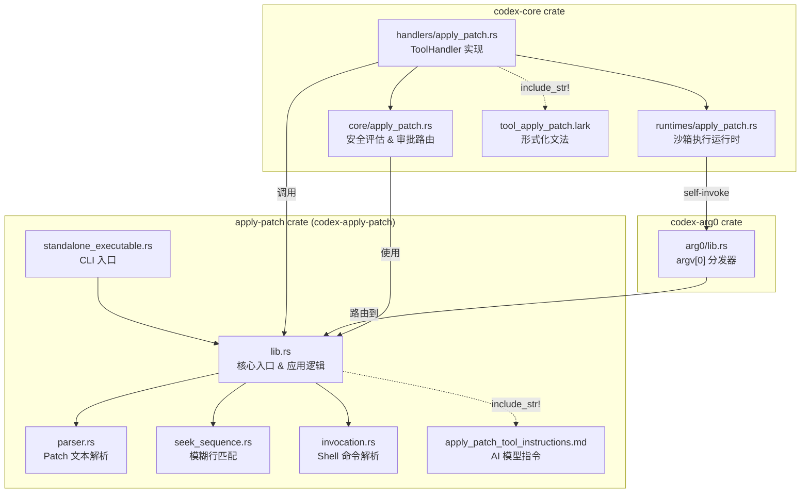
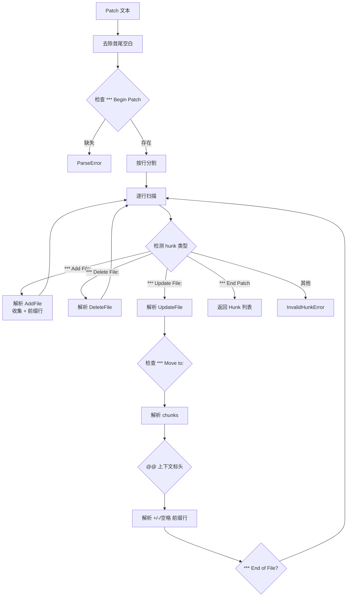
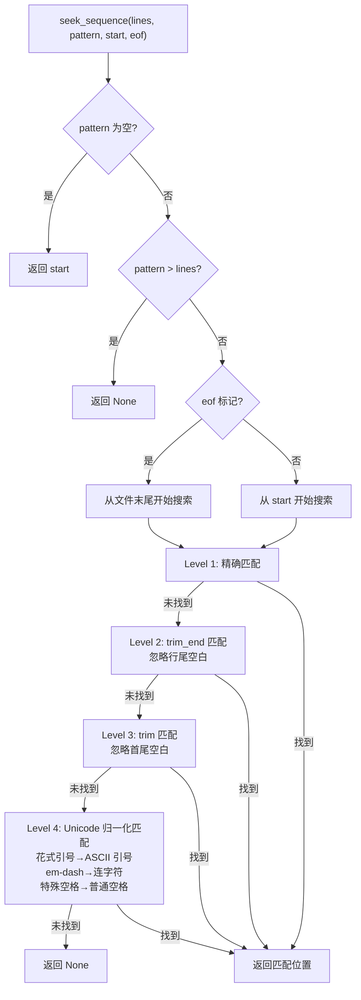
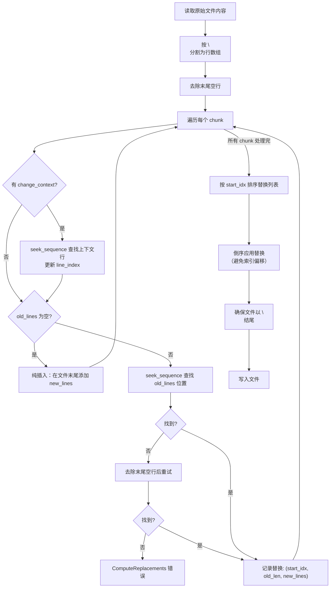
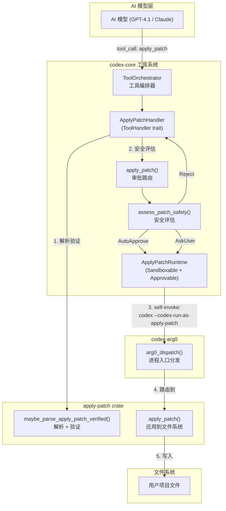
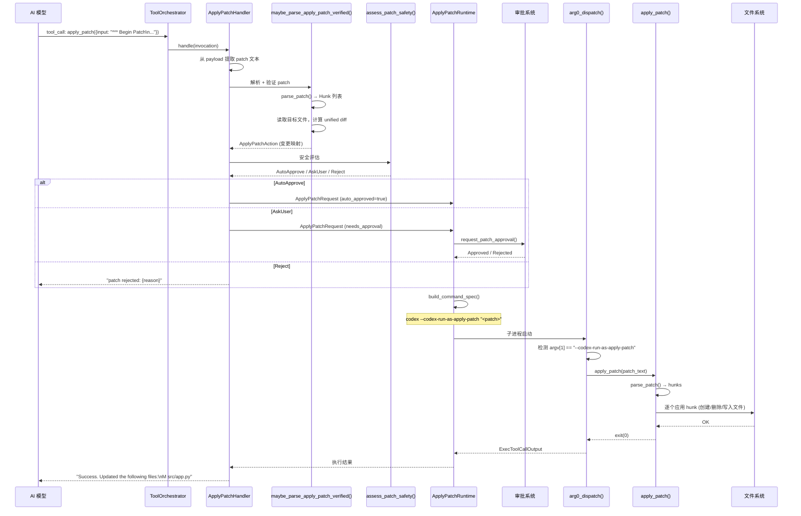
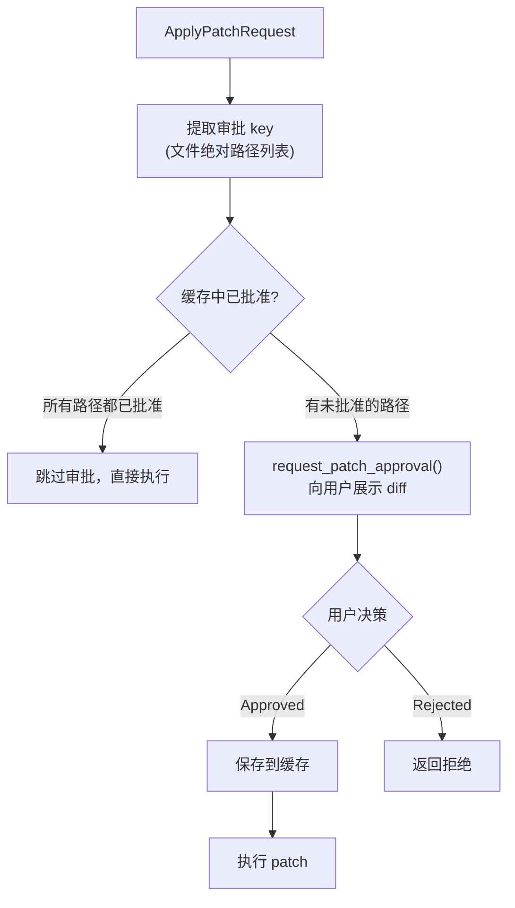
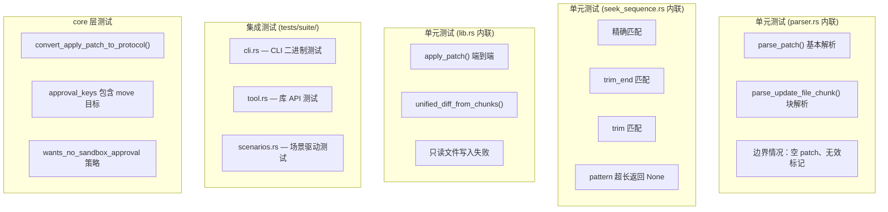

# Codex apply_patch 工具深度解析

> 本文档详细解读 Codex 项目中 `apply_patch` 工具的原理、实现、使用方式、测试策略，以及它如何与 Codex 其他组件集成。

## 目录

1. [概述](#1-概述)
2. [apply_patch 是什么](#2-apply_patch-是什么)
3. [Patch 格式规范](#3-patch-格式规范)
4. [核心架构总览](#4-核心架构总览)
5. [源码模块详解](#5-源码模块详解)
6. [apply_patch_tool_instructions.md 的作用](#6-apply_patch_tool_instructionsmd-的作用)
7. [与 Codex 其他组件的集成](#7-与-codex-其他组件的集成)
8. [执行流程详解](#8-执行流程详解)
9. [测试策略](#9-测试策略)
10. [关键设计决策](#10-关键设计决策)

---

## 1. 概述

`apply_patch` 是 Codex 中专为 AI Agent 设计的文件编辑工具。它定义了一种简化的、面向文件的 diff 格式，让 AI 模型能够以结构化的方式表达对文件系统的修改意图（新增、删除、更新文件），然后由 Codex 运行时安全地将这些修改应用到实际文件系统。

核心设计目标：
- **AI 友好**：格式简单，LLM 容易生成正确的 patch
- **安全可控**：所有文件修改都经过审批和沙箱机制
- **容错性强**：支持模糊匹配，容忍空白字符差异和 Unicode 变体
- **自包含**：作为独立 crate，既可作为库使用，也可作为独立二进制运行

## 2. apply_patch 是什么

`apply_patch` 本质上是一个 **精简版的 `patch` 命令**，但专门为 AI 代码编辑场景优化：

| 特性 | 传统 `patch`/`diff` | `apply_patch` |
|------|---------------------|---------------|
| 格式 | Unified diff | 自定义简化格式 |
| 行号 | 依赖精确行号 | 基于上下文匹配，无行号 |
| 操作 | 仅更新 | 新增 / 删除 / 更新 / 移动 |
| 容错 | 有限 fuzz | 多级模糊匹配（空白、Unicode） |
| 目标用户 | 人类开发者 | AI Agent |

## 3. Patch 格式规范

### 3.1 Lark 形式化文法

`apply_patch` 的格式由一个 Lark 文法精确定义（位于 `core/src/tools/handlers/tool_apply_patch.lark`）：

```lark
start: begin_patch hunk+ end_patch
begin_patch: "*** Begin Patch" LF
end_patch: "*** End Patch" LF?

hunk: add_hunk | delete_hunk | update_hunk
add_hunk: "*** Add File: " filename LF add_line+
delete_hunk: "*** Delete File: " filename LF
update_hunk: "*** Update File: " filename LF change_move? change?

filename: /(.+)/
add_line: "+" /(.*)/ LF -> line

change_move: "*** Move to: " filename LF
change: (change_context | change_line)+ eof_line?
change_context: ("@@" | "@@ " /(.+)/) LF
change_line: ("+" | "-" | " ") /(.*)/ LF
eof_line: "*** End of File" LF
```

### 3.2 三种文件操作

**Add File** — 创建新文件，每行内容以 `+` 前缀：
```
*** Begin Patch
*** Add File: src/hello.txt
+Hello world
+Second line
*** End Patch
```

**Delete File** — 删除已有文件，无需额外内容：
```
*** Begin Patch
*** Delete File: obsolete.txt
*** End Patch
```

**Update File** — 修改已有文件，支持可选的 Move to 重命名：
```
*** Begin Patch
*** Update File: src/app.py
*** Move to: src/main.py
@@ def greet():
 context_line_before
-old_code
+new_code
 context_line_after
*** End Patch
```

### 3.3 上下文匹配机制

Update 操作不依赖行号，而是通过 **上下文行** 定位修改位置：

- 每个 hunk 以 `@@` 开头，可选地跟一个上下文标头（如类名、函数名）
- 空格前缀 ` ` 表示上下文行（不变的行）
- `-` 前缀表示要删除的旧行
- `+` 前缀表示要插入的新行
- 默认使用 3 行上下文来唯一定位代码片段

当 3 行上下文不够唯一定位时，可以使用多级 `@@` 缩小范围：

```
@@ class BaseClass
@@   def method():
 context_before
-old_code
+new_code
 context_after
```

### 3.4 特殊标记

- `*** End of File` — 标记 hunk 应匹配文件末尾
- 文件路径必须是 **相对路径**，绝对路径会被拒绝

## 4. 核心架构总览

### 4.1 Crate 层级关系



### 4.2 文件清单

| 文件路径 | 角色 |
|---------|------|
| `apply-patch/src/lib.rs` | 核心库：解析 patch、计算 diff、应用到文件系统 |
| `apply-patch/src/parser.rs` | Patch 文本解析器，将文本转为 `Hunk` 结构 |
| `apply-patch/src/seek_sequence.rs` | 多级模糊行序列匹配算法 |
| `apply-patch/src/invocation.rs` | 从 shell 命令（bash/zsh/PowerShell/cmd）中提取 patch |
| `apply-patch/src/standalone_executable.rs` | 独立 CLI 二进制入口 |
| `apply-patch/src/main.rs` | 二进制 main（3 行，委托给 standalone_executable） |
| `apply-patch/apply_patch_tool_instructions.md` | 给 AI 模型的 patch 格式使用说明 |
| `core/src/apply_patch.rs` | 安全评估层，决定 auto-approve / ask-user / reject |
| `core/src/tools/handlers/apply_patch.rs` | `ToolHandler` trait 实现，处理工具调用 |
| `core/src/tools/runtimes/apply_patch.rs` | 沙箱运行时，构建 self-invoke 命令并执行 |
| `core/src/tools/handlers/tool_apply_patch.lark` | Lark 形式化文法定义 |
| `arg0/src/lib.rs` | argv[0] 分发器，路由 `apply_patch` 和 `--codex-run-as-apply-patch` |

## 5. 源码模块详解

### 5.1 parser.rs — Patch 文本解析器

**职责**：将 patch 文本字符串解析为结构化的 `Hunk` 枚举列表。

**核心数据结构**：

```rust
enum Hunk {
    AddFile { path: PathBuf, contents: String },
    DeleteFile { path: PathBuf },
    UpdateFile {
        path: PathBuf,
        move_path: Option<PathBuf>,
        chunks: Vec<UpdateFileChunk>,
    },
}

struct UpdateFileChunk {
    change_context: Option<String>,  // @@ 后的上下文标头
    old_lines: Vec<String>,          // 要替换的旧行（- 和空格前缀行）
    new_lines: Vec<String>,          // 替换后的新行（+ 和空格前缀行）
    is_end_of_file: bool,            // 是否匹配文件末尾
}
```

**解析流程**：



**解析模式**：
- **Strict 模式**：严格按文法解析
- **Lenient 模式**（当前默认）：容忍 GPT-4.1 等模型生成的 heredoc 包装格式（`<<'EOF'...EOF`），自动剥离外层包装

### 5.2 seek_sequence.rs — 模糊行匹配

**职责**：在文件的行数组中查找与 pattern 匹配的位置，支持多级宽松匹配。

**匹配策略（按优先级递减）**：



这种多级匹配设计非常巧妙——AI 模型生成的 patch 可能与源文件在空白字符或 Unicode 标点上有细微差异，多级匹配确保了高容错性。

### 5.3 invocation.rs — Shell 命令解析

**职责**：从各种 shell 调用形式中提取 `apply_patch` 的 patch 参数。

支持的调用形式：

```bash
# 1. 直接调用
apply_patch "*** Begin Patch\n..."

# 2. Bash heredoc 形式
bash -lc 'apply_patch <<'"'"'EOF'"'"'
*** Begin Patch
...
*** End Patch
EOF'

# 3. 带 cd 的形式
bash -lc 'cd subdir && apply_patch <<'"'"'PATCH'"'"'
*** Begin Patch
...
*** End Patch
PATCH'
```

**实现要点**：
- 使用 **tree-sitter** 解析 bash AST，从中提取 heredoc 内容
- 支持 bash/zsh/sh（`-lc` 或 `-c` 标志）、PowerShell（`-Command`）、cmd（`/c`）
- 能识别 `cd <path> &&` 前缀并提取工作目录
- 同时接受 `apply_patch` 和 `applypatch` 两种命令名

### 5.4 lib.rs — 核心应用逻辑

**职责**：将解析后的 Hunk 应用到实际文件系统，以及提供验证 API。

**关键函数**：

| 函数 | 作用 |
|------|------|
| `apply_patch(patch, stdout, stderr)` | 顶层入口：解析 + 应用 + 输出结果 |
| `apply_hunks(hunks, stdout, stderr)` | 将 hunk 列表应用到文件系统 |
| `apply_hunks_to_files(hunks)` | 实际的文件系统操作（创建/删除/写入） |
| `derive_new_contents_from_chunks(path, chunks)` | 计算 Update 操作后的新文件内容 |
| `compute_replacements(lines, path, chunks)` | 计算替换列表 `(start_idx, old_len, new_lines)` |
| `apply_replacements(lines, replacements)` | 按倒序应用替换（避免索引偏移） |
| `unified_diff_from_chunks(path, chunks)` | 生成标准 unified diff 用于审批展示 |
| `maybe_parse_apply_patch_verified(argv, cwd)` | 验证 + 解析 + 计算变更的完整流水线 |

**Update 文件的核心算法**：



### 5.5 standalone_executable.rs — CLI 入口

**职责**：提供独立的命令行二进制。

```rust
pub fn main() -> ! {
    let exit_code = run_main();
    std::process::exit(exit_code);
}
```

使用方式：
```bash
# 方式 1：通过命令行参数
apply_patch '*** Begin Patch\n...\n*** End Patch'

# 方式 2：通过 stdin
echo '*** Begin Patch\n...\n*** End Patch' | apply_patch
```

退出码：
- `0` — 成功
- `1` — 错误（解析失败或应用失败）
- `2` — 用法错误（无参数且 stdin 为空，或参数过多）

## 6. apply_patch_tool_instructions.md 的作用

### 6.1 它是什么

`apply_patch_tool_instructions.md` 是一份 **给 AI 模型的使用说明书**，告诉 LLM 如何正确生成 `apply_patch` 格式的 patch。

文件位置：`codex-rs/apply-patch/apply_patch_tool_instructions.md`

### 6.2 内容概要

该文件包含：
1. `apply_patch` 命令的基本介绍
2. 三种文件操作（Add/Delete/Update）的语法说明
3. 上下文行的使用规则（默认 3 行，不够时用 `@@` 缩小范围）
4. 完整的 BNF 风格文法定义
5. 一个综合示例
6. 关键注意事项（必须有 header、`+` 前缀、只用相对路径）
7. 调用方式示例

### 6.3 如何与 apply_patch crate 打交道

这个文件通过 Rust 的 `include_str!` 宏在 **编译时** 嵌入到 crate 中：

```rust
// apply-patch/src/lib.rs 第 26 行
pub const APPLY_PATCH_TOOL_INSTRUCTIONS: &str =
    include_str!("../apply_patch_tool_instructions.md");
```

这意味着：
- 该 markdown 文件的内容成为 `codex_apply_patch` crate 的一个公开常量
- 任何依赖 `codex_apply_patch` 的 crate 都可以通过 `codex_apply_patch::APPLY_PATCH_TOOL_INSTRUCTIONS` 访问它

### 6.4 在系统中的流转路径


具体来说，`codex-core` 在构建发送给 AI 模型的系统提示词时，会将这段指令文本拼接进去：

```rust
// core/tests/suite/prompt_caching.rs 第 158 行
[base_instructions, APPLY_PATCH_TOOL_INSTRUCTIONS.to_string()].join("\n")
```

当 `apply_patch` 作为独立工具注册时（而非 shell 工具的一部分），指令会嵌入到工具的 description 字段中（见 `handlers/apply_patch.rs` 中的 `tool_spec()` 方法）。

### 6.5 为什么这样设计

这种设计形成了一个 **闭环**：
1. 同一份文档既是 AI 的使用说明，也是人类开发者的参考
2. 文档与代码在同一个 crate 中，修改格式规范时不会遗漏更新说明
3. 编译时嵌入避免了运行时文件读取的不确定性

## 7. 与 Codex 其他组件的集成

### 7.1 集成全景图



### 7.2 core/apply_patch.rs — 安全评估层

这是 `apply_patch` crate 与 `codex-core` 安全体系的桥梁。

```rust
pub(crate) async fn apply_patch(
    turn_context: &TurnContext,
    action: ApplyPatchAction,
) -> InternalApplyPatchInvocation {
    match assess_patch_safety(&action, ...) {
        SafetyCheck::AutoApprove { .. } => DelegateToExec(ApplyPatchExec {
            auto_approved: true,
            exec_approval_requirement: Skip { .. },
            ..
        }),
        SafetyCheck::AskUser => DelegateToExec(ApplyPatchExec {
            auto_approved: false,
            exec_approval_requirement: NeedsApproval { .. },
        }),
        SafetyCheck::Reject { reason } => Output(Err(
            FunctionCallError::RespondToModel(format!("patch rejected: {reason}"))
        )),
    }
}
```

三种安全决策：
- **AutoApprove**：patch 修改的文件在沙箱策略允许范围内，自动批准
- **AskUser**：需要用户确认（通过 UI 展示 diff）
- **Reject**：直接拒绝（如修改了禁止区域的文件）

### 7.3 handlers/apply_patch.rs — ToolHandler 实现

`ApplyPatchHandler` 实现了 `ToolHandler` trait，是工具系统的入口点。

**关键流程**：

1. 从 `ToolPayload` 中提取 patch 文本（支持 Function 和 Custom 两种 payload 格式）
2. 调用 `maybe_parse_apply_patch_verified()` 解析并验证 patch
3. 调用 `core::apply_patch()` 进行安全评估
4. 根据评估结果：
   - `Output` → 直接返回结果（被拒绝时）
   - `DelegateToExec` → 构建 `ApplyPatchRequest`，交给 `ApplyPatchRuntime` 执行

**工具注册**：该 handler 同时提供 `tool_spec()` 方法，生成工具的 JSON Schema 定义，包含完整的使用说明（即 `apply_patch_tool_instructions.md` 的内容）。

### 7.4 runtimes/apply_patch.rs — 沙箱执行运行时

`ApplyPatchRuntime` 实现了两个关键 trait：

**`Sandboxable`** — 沙箱策略：
```rust
impl Sandboxable for ApplyPatchRuntime {
    fn sandbox_preference(&self) -> SandboxablePreference {
        SandboxablePreference::Auto  // 自动选择沙箱级别
    }
    fn escalate_on_failure(&self) -> bool {
        true  // 沙箱执行失败时尝试提升权限
    }
}
```

**`Approvable`** — 审批机制：
- 审批粒度是 **文件路径级别**（`ApprovalKey = AbsolutePathBuf`）
- 支持审批缓存（`with_cached_approval`），同一文件路径批准后不再重复询问
- 审批请求通过 `session.request_patch_approval()` 发送给 UI 层

**self-invoke 命令构建**：

```rust
fn build_command_spec(req: &ApplyPatchRequest) -> Result<CommandSpec, ToolError> {
    let exe = env::current_exe()?;  // 当前 codex 可执行文件路径
    Ok(CommandSpec {
        program: exe.to_string_lossy().to_string(),
        args: vec![
            CODEX_CORE_APPLY_PATCH_ARG1.to_string(),  // "--codex-run-as-apply-patch"
            req.action.patch.clone(),                   // patch 文本
        ],
        cwd: req.action.cwd.clone(),
        env: HashMap::new(),  // 最小化环境变量
        ..
    })
}
```

### 7.5 arg0/lib.rs — 进程入口分发

Codex 使用 **argv[0] 技巧** 将多个工具打包为单一可执行文件。`arg0_dispatch()` 函数在进程启动时检查：

```rust
pub fn arg0_dispatch() -> Option<Arg0PathEntryGuard> {
    let exe_name = /* 从 argv[0] 提取可执行文件名 */;

    // 路由 1：通过 argv[0] 名称（符号链接/硬链接）
    if exe_name == "apply_patch" || exe_name == "applypatch" {
        codex_apply_patch::main();  // 永不返回
    }

    // 路由 2：通过 argv[1] 标志（self-invoke）
    let argv1 = args.next();
    if argv1 == "--codex-run-as-apply-patch" {
        let patch_arg = args.next();
        let exit_code = codex_apply_patch::apply_patch(&patch_arg, ...);
        std::process::exit(exit_code);
    }

    // 否则继续正常的 Codex CLI 启动流程
    ...
}
```

两种路由方式：
1. **argv[0] 路由**：当可执行文件名为 `apply_patch` 时（通过符号链接），直接进入独立 CLI 模式
2. **argv[1] 路由**：当 codex 自身以 `codex --codex-run-as-apply-patch <patch>` 调用时，在沙箱中执行 patch

### 7.6 convert_apply_patch_to_protocol — 协议转换

`core/apply_patch.rs` 中的 `convert_apply_patch_to_protocol()` 函数将 `apply_patch` crate 的内部类型转换为 `codex-protocol` 的 `FileChange` 类型，用于：
- 向 UI 层展示文件变更（审批界面）
- 事件系统中的变更追踪

## 8. 执行流程详解

### 8.1 端到端完整流程

以 AI 模型请求更新一个文件为例，完整的执行流程如下：



### 8.2 为什么要 self-invoke

一个关键设计问题：为什么不直接在当前进程中调用 `apply_patch()`，而要通过子进程 self-invoke？

原因是 **沙箱隔离**：
1. Codex 的沙箱系统（特别是 Linux 上的 `codex-linux-sandbox`）工作在进程级别
2. 通过 self-invoke，patch 的文件系统操作在沙箱约束下执行
3. 即使 patch 试图写入不允许的路径，沙箱也会阻止
4. 子进程使用最小化环境变量（`env: HashMap::new()`），避免信息泄露

### 8.3 审批缓存机制



## 9. 测试策略

### 9.1 测试层次

`apply_patch` 的测试覆盖了多个层次：



### 9.2 场景驱动测试框架

这是最有特色的测试方式。每个场景是一个目录，包含：

```
tests/fixtures/scenarios/
├── 001_add_file/
│   ├── input/          # 初始文件状态（可选）
│   ├── expected/       # 期望的最终文件状态
│   └── patch.txt       # 要应用的 patch
├── 002_multiple_operations/
│   ├── input/
│   ├── expected/
│   └── patch.txt
└── ...
```

测试运行器（`scenarios.rs`）的逻辑：
1. 将 `input/` 复制到临时目录
2. 在临时目录中运行 `apply_patch` 二进制
3. 对比临时目录的最终状态与 `expected/` 目录
4. 使用 `BTreeMap<PathBuf, Entry>` 做精确的文件系统快照对比

**现有场景覆盖**（22 个）：

| 编号 | 场景 | 测试要点 |
|------|------|---------|
| 001 | add_file | 创建新文件 |
| 002 | multiple_operations | 同一 patch 中混合 Add/Delete/Update |
| 003 | multiple_chunks | 单文件多个 hunk |
| 004 | move_to_new_directory | 文件移动到新目录 |
| 005 | rejects_empty_patch | 空 patch 应失败 |
| 006 | rejects_missing_context | 上下文不匹配应失败 |
| 007 | rejects_missing_file_delete | 删除不存在的文件应失败 |
| 008 | rejects_empty_update_hunk | 空的 update hunk 应失败 |
| 009 | requires_existing_file_for_update | 更新不存在的文件应失败 |
| 010 | move_overwrites_existing_destination | 移动覆盖已有目标文件 |
| 011 | add_overwrites_existing_file | 添加覆盖已有文件 |
| 012 | delete_directory_fails | 删除目录应失败 |
| 014 | update_file_appends_trailing_newline | 确保文件以换行符结尾 |
| 020 | delete_file_success | 成功删除文件 |
| 020 | whitespace_padded_patch_marker_lines | 标记行有额外空白 |
| 021 | update_file_deletion_only | 只删除行不添加 |
| 022 | update_file_end_of_file_marker | End of File 标记 |

### 9.3 CLI 集成测试

`tests/suite/cli.rs` 和 `tests/suite/tool.rs` 使用 `assert_cmd` crate 测试编译后的二进制：

```rust
// 典型的 CLI 测试
fn test_apply_patch_cli_applies_multiple_operations() {
    let tmp = tempdir();
    fs::write(tmp.path().join("modify.txt"), "line1\nline2\n");
    fs::write(tmp.path().join("delete.txt"), "obsolete\n");

    let patch = "*** Begin Patch\n*** Add File: nested/new.txt\n+created\n...";

    Command::new(cargo_bin("apply_patch"))
        .current_dir(tmp.path())
        .arg(patch)
        .assert()
        .success()
        .stdout("Success. Updated the following files:\nA nested/new.txt\n...");
}
```

还测试了 stdin 输入模式：
```rust
apply_patch_command()
    .current_dir(tmp.path())
    .write_stdin(patch)  // 通过 stdin 传入
    .assert()
    .success();
```

### 9.4 如何运行测试

```bash
# 运行 apply-patch crate 的所有测试
cd venders/codex/codex-rs
cargo test -p codex-apply-patch

# 只运行场景测试
cargo test -p codex-apply-patch test_apply_patch_scenarios

# 运行 core 中与 apply_patch 相关的测试
cargo test -p codex-core apply_patch
```

## 10. 关键设计决策

### 10.1 为什么不用标准 unified diff

标准 unified diff 依赖精确的行号（`@@ -1,3 +1,4 @@`），AI 模型经常生成错误的行号。`apply_patch` 的格式完全基于上下文匹配，消除了行号错误的可能性。

### 10.2 为什么用 tree-sitter 解析 shell 命令

AI 模型可能以各种 shell 形式调用 `apply_patch`（heredoc、管道、cd 前缀等）。用正则表达式解析这些变体既脆弱又不完整。tree-sitter 提供了正确的 AST 解析，能可靠地从任意 bash 脚本中提取 heredoc 内容。

### 10.3 self-invoke 而非直接调用

通过 `codex --codex-run-as-apply-patch` 自调用，文件修改操作在独立子进程中执行，可以被沙箱系统（Linux namespace sandbox）约束。这比在主进程中直接调用 `fs::write()` 安全得多。

### 10.4 编译时嵌入指令文档

使用 `include_str!` 将 markdown 指令编译进二进制，确保：
- 指令版本与代码版本始终一致
- 无运行时文件依赖
- 单一二进制部署

### 10.5 多级模糊匹配的权衡

`seek_sequence` 的四级匹配（精确 → trim_end → trim → Unicode 归一化）是在 **准确性** 和 **容错性** 之间的精心权衡。优先尝试精确匹配保证了确定性，逐级放宽则处理了 AI 模型常见的空白和 Unicode 差异。

---

> 文档生成日期：2026-02-22
> 基于 Codex 源码 `venders/codex/codex-rs/apply-patch/` 分析

