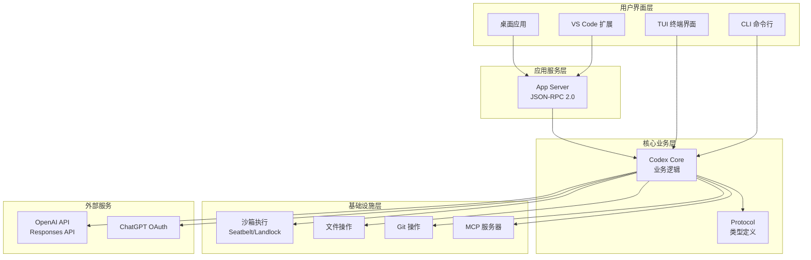
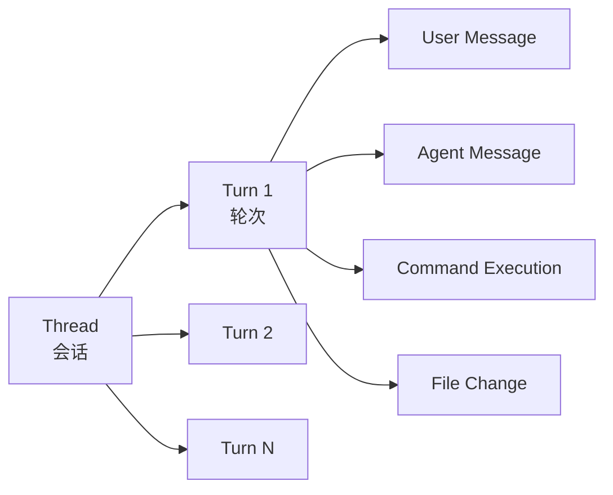
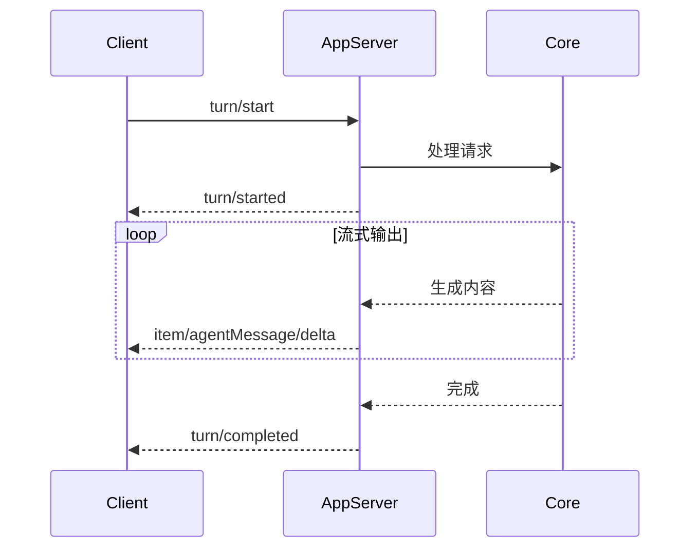
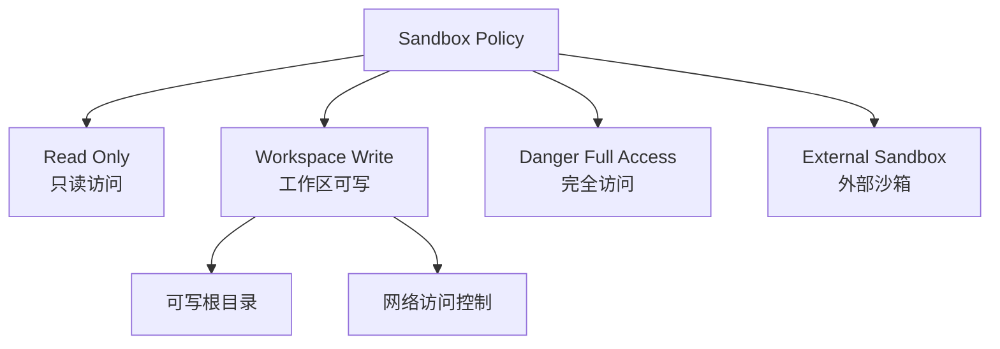
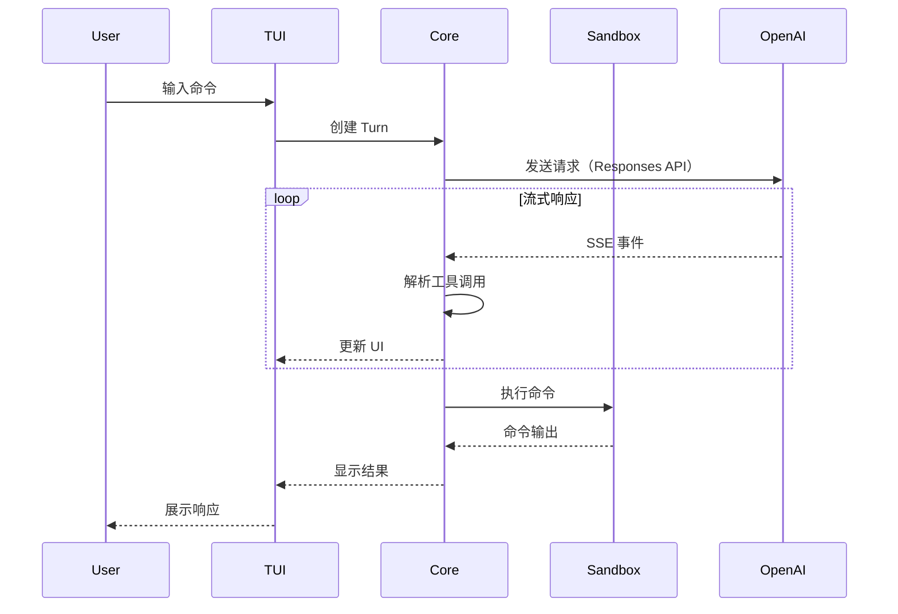
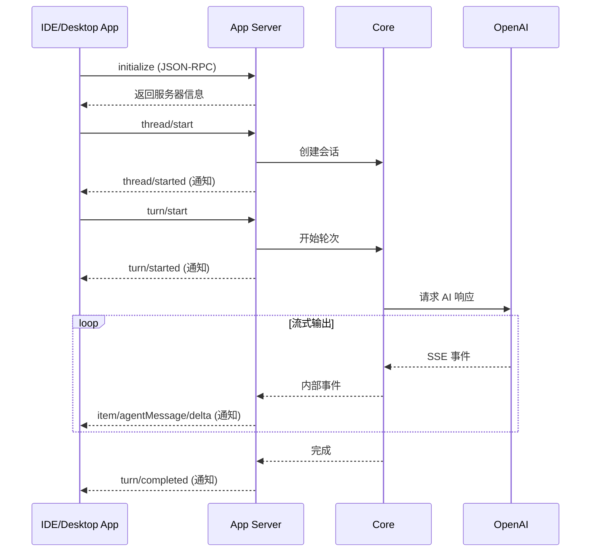
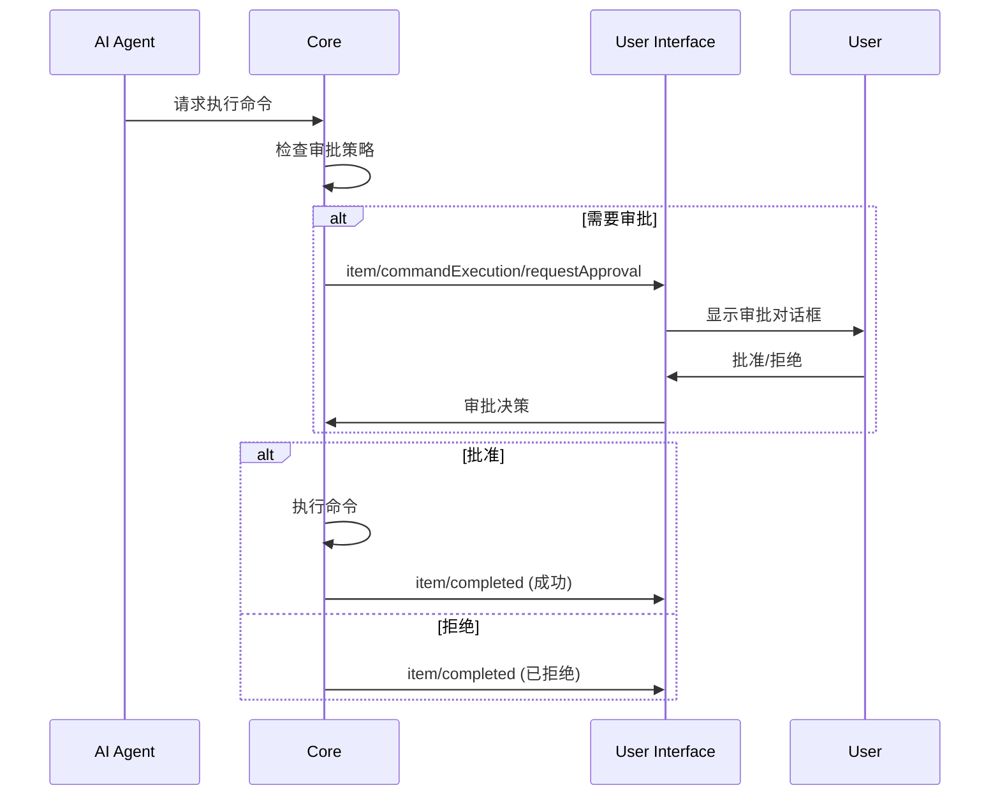
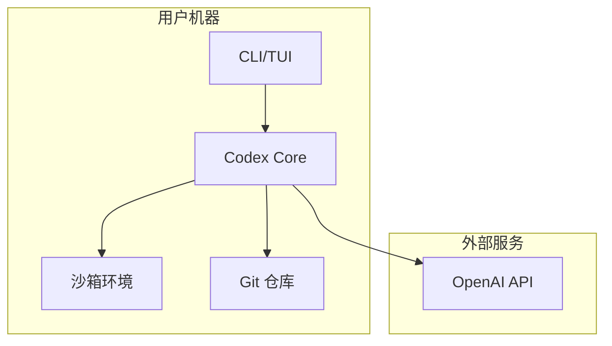
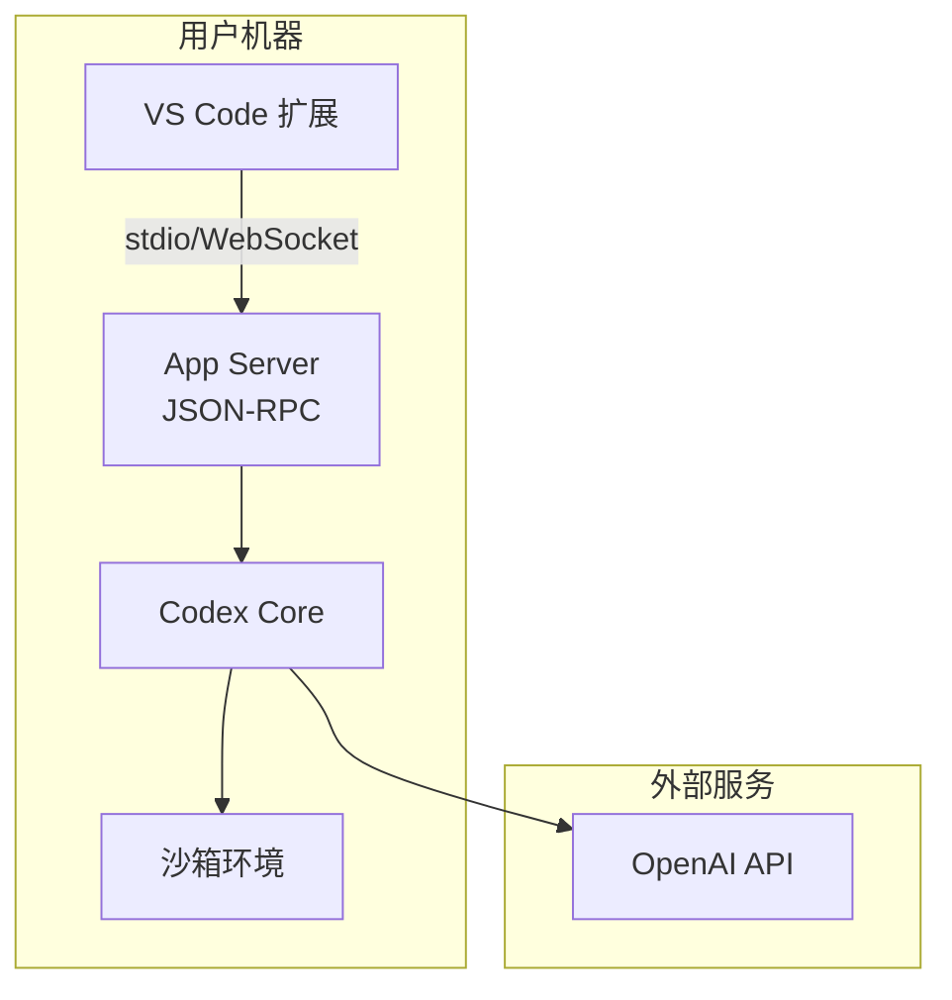

# Codex 架构分析文档

> 本文档基于 OpenAI Codex 代码库分析生成
> 分析日期：2026-02-22
> 代码库版本：venders/codex

## 目录

1. [项目概述](#项目概述)
2. [整体架构](#整体架构)
3. [核心组件](#核心组件)
4. [技术栈](#技术栈)
5. [数据流与通信](#数据流与通信)
6. [安全模型](#安全模型)
7. [扩展机制](#扩展机制)
8. [部署架构](#部署架构)

---

## 项目概述

### 什么是 Codex

Codex 是 OpenAI 开发的一个**本地运行的 AI 编码助手**，它结合了 ChatGPT 级别的推理能力和实际执行代码、操作文件的能力。Codex 的核心特点：

- **本地优先**：在用户本地机器上运行，保护代码隐私
- **多界面支持**：CLI、TUI、VS Code 扩展、桌面应用
- **沙箱执行**：所有命令在受控沙箱环境中执行
- **版本控制集成**：与 Git 深度集成，支持 PR 创建和代码审查
- **多模态**：支持文本和图像输入

### 项目结构

```
codex/
├── codex-cli/          # TypeScript 实现的 CLI（遗留版本）
├── codex-rs/           # Rust 实现的核心系统（主要版本）
│   ├── core/           # 核心业务逻辑
│   ├── tui/            # 终端用户界面
│   ├── cli/            # 命令行接口
│   ├── app-server/     # 应用服务器（支持 IDE 集成）
│   ├── protocol/       # 通信协议定义
│   └── ...             # 其他模块
├── docs/               # 文档
└── .github/            # CI/CD 配置
```

---

## 整体架构

### 架构层次

Codex 采用**分层架构**，从底层到上层分为：



### 架构特点

1. **多前端统一后端**：不同的用户界面（CLI、TUI、IDE 扩展）共享同一个核心业务逻辑
2. **协议驱动**：通过 JSON-RPC 2.0 协议实现前后端解耦
3. **沙箱隔离**：所有代码执行都在受控沙箱中进行
4. **插件化设计**：通过 Skills 和 MCP 服务器支持扩展

---

## 核心组件

### 1. Codex Core (`codex-rs/core`)

**职责**：实现 Codex 的核心业务逻辑

**主要功能**：
- 会话管理（Thread/Turn/Item）
- AI 模型交互（通过 Responses API）
- 命令执行与沙箱控制
- 文件操作与 Git 集成
- 审批流程管理

**关键概念**：



- **Thread（会话）**：用户与 Codex 的完整对话
- **Turn（轮次）**：一次交互，通常从用户消息开始，到 Agent 响应结束
- **Item（项目）**：Turn 中的具体元素（用户消息、Agent 消息、命令执行、文件修改等）

### 2. App Server (`codex-rs/app-server`)

**职责**：为 IDE 和桌面应用提供 JSON-RPC 2.0 接口

**通信方式**：
- **stdio**（默认）：通过标准输入/输出进行 JSONL 通信
- **WebSocket**（实验性）：通过 WebSocket 进行实时通信

**核心 API**：

| API 方法 | 功能 | 示例 |
|---------|------|------|
| `initialize` | 初始化连接 | 客户端标识、能力协商 |
| `thread/start` | 创建新会话 | 开始新对话 |
| `thread/resume` | 恢复会话 | 继续已有对话 |
| `turn/start` | 开始新轮次 | 发送用户输入 |
| `turn/interrupt` | 中断执行 | 取消当前操作 |
| `command/exec` | 执行命令 | 运行单个命令 |
| `skills/list` | 列出技能 | 获取可用 Skills |
| `app/list` | 列出应用 | 获取可用 Connectors |

**事件通知**：



### 3. TUI (`codex-rs/tui`)

**职责**：提供终端用户界面

**技术栈**：
- **ratatui**：终端 UI 框架
- **crossterm**：跨平台终端控制

**界面组件**：
- Chat 视图：显示对话历史
- Composer：用户输入区域
- Status Bar：状态栏
- Approval Dialog：审批对话框
- Plan Mode：计划模式界面

### 4. Protocol (`codex-rs/protocol`)

**职责**：定义内部和外部通信协议的类型

**类型分类**：
- **内部类型**：`codex-core` 与 `codex-tui` 之间的通信
- **外部类型**：`codex app-server` 的 JSON-RPC API

**关键类型**：
- `Thread`、`Turn`、`Item`
- `ThreadStatus`、`TurnStatus`
- `CommandExecution`、`FileChange`
- `ApprovalRequest`、`ApprovalResponse`

### 5. 沙箱系统

**职责**：提供安全的代码执行环境

**平台实现**：

| 平台 | 技术 | 特点 |
|------|------|------|
| **macOS** | Seatbelt (`sandbox-exec`) | 系统级沙箱，完全阻止网络访问 |
| **Linux** | Landlock + Seccomp | 文件系统隔离 + 系统调用过滤 |
| **Windows** | Windows Sandbox | 轻量级虚拟化环境 |

**沙箱策略**：



**沙箱特性**：
- 文件系统隔离：限制读写范围
- 网络隔离：默认禁用网络访问
- 进程隔离：限制子进程创建
- 资源限制：CPU、内存、时间限制

### 6. 其他关键组件

#### Backend Client (`codex-rs/backend-client`)
- 与 OpenAI Responses API 通信
- 处理 SSE（Server-Sent Events）流式响应
- 管理 API 密钥和 ChatGPT OAuth 令牌

#### Skills (`codex-rs/skills`)
- 技能发现和加载
- 技能配置管理
- 支持用户级和项目级技能

#### MCP Server (`codex-rs/mcp-server`)
- Model Context Protocol 服务器集成
- 支持外部工具和资源
- OAuth 认证流程

#### Config (`codex-rs/config`)
- 配置文件解析（TOML 格式）
- 配置分层：系统级、用户级、项目级
- 配置验证和 JSON Schema 生成

---

## 技术栈

### 编程语言

| 语言 | 用途 | 占比 |
|------|------|------|
| **Rust** | 核心系统、CLI、TUI、App Server | 主要 |
| **TypeScript** | 遗留 CLI 实现 | 次要 |

### 核心依赖

#### Rust 生态

```toml
# 异步运行时
tokio = "1"              # 异步运行时
async-trait = "0.1"      # 异步 trait

# 序列化
serde = "1"              # 序列化框架
serde_json = "1"         # JSON 支持
toml = "0.9"             # TOML 配置

# HTTP 客户端
reqwest = "0.12"         # HTTP 客户端
eventsource-stream = "0.2" # SSE 流处理

# TUI
ratatui = "0.29"         # 终端 UI 框架
crossterm = "0.28"       # 终端控制

# 沙箱
landlock = "0.4"         # Linux 沙箱
seccompiler = "0.5"      # Seccomp 过滤器

# 其他
clap = "4"               # CLI 参数解析
anyhow = "1"             # 错误处理
tracing = "0.1"          # 日志追踪
```

#### TypeScript 生态

```json
{
  "openai": "^4.0.0",      // OpenAI SDK
  "commander": "^11.0.0",  // CLI 框架
  "chalk": "^5.0.0",       // 终端颜色
  "dotenv": "^16.0.0"      // 环境变量
}
```

### 构建工具

- **Cargo**：Rust 包管理和构建
- **Bazel**：跨语言构建系统（可选）
- **pnpm**：Node.js 包管理（TypeScript CLI）
- **Just**：命令运行器（类似 Make）

---

## 数据流与通信

### 1. CLI/TUI 模式数据流



### 2. App Server 模式数据流



### 3. 审批流程



### 4. 协议格式

#### JSON-RPC 请求示例

```json
{
  "method": "turn/start",
  "id": 1,
  "params": {
    "threadId": "thr_123",
    "input": [
      {
        "type": "text",
        "text": "创建一个 TODO 应用"
      }
    ],
    "model": "gpt-4",
    "approvalPolicy": "unlessTrusted"
  }
}
```

#### JSON-RPC 响应示例

```json
{
  "id": 1,
  "result": {
    "turn": {
      "id": "turn_456",
      "status": "inProgress",
      "items": [],
      "error": null
    }
  }
}
```

#### 通知示例

```json
{
  "method": "item/agentMessage/delta",
  "params": {
    "threadId": "thr_123",
    "turnId": "turn_456",
    "itemId": "msg_789",
    "delta": "让我来帮你创建一个 TODO 应用..."
  }
}
```


---

## 安全模型

### 审批策略

Codex 提供三种审批模式，用户可以根据信任级别选择：

| 模式 | 说明 | 自动执行 | 需要审批 |
|------|------|----------|----------|
| **Suggest**<br/>（默认） | 建议模式 | 读取文件 | 所有写操作、所有命令 |
| **Auto Edit** | 自动编辑 | 读取文件、应用补丁 | 所有命令 |
| **Full Auto** | 完全自动 | 读写文件、执行命令（沙箱内） | 无 |

### 沙箱策略详解

#### macOS Seatbelt

```scheme
;; Seatbelt 配置示例
(version 1)
(deny default)

;; 允许读取
(allow file-read* (subpath "/Users/username/project"))

;; 允许写入（工作区）
(allow file-write*
  (subpath "/Users/username/project")
  (regex #"^/Users/username/project/(?!\.git).*"))

;; 禁止网络
(deny network*)
```

**特性**：
- 完全阻止网络访问（包括 localhost）
- 保护 `.git` 目录只读
- 保护 `.codex` 配置目录只读
- 允许临时文件访问

#### Linux Landlock

```rust
// Landlock 规则示例
let ruleset = Ruleset::new()
    .handle_access(AccessFs::ReadFile)?
    .handle_access(AccessFs::WriteFile)?
    .create()?;

// 添加可读路径
ruleset.add_rule(PathBeneath::new("/home/user/project", AccessFs::ReadFile))?;

// 添加可写路径
ruleset.add_rule(PathBeneath::new("/home/user/project", AccessFs::WriteFile))?;

// 应用规则
ruleset.restrict_self()?;
```

**特性**：
- 文件系统访问控制
- 结合 Seccomp 过滤系统调用
- 支持细粒度权限控制

### 信任机制

#### 可信命令

某些命令被标记为"可信"，在 `Auto Edit` 和 `Full Auto` 模式下自动执行：

```rust
// 可信命令示例
const TRUSTED_COMMANDS: &[&str] = &[
    "ls", "cat", "grep", "find",
    "git status", "git diff", "git log",
    "npm test", "cargo test", "pytest"
];
```

#### 危险操作检测

Codex 会检测潜在危险操作并强制要求审批：

- 删除文件（`rm -rf`）
- 修改系统文件
- 网络请求（在启用网络的情况下）
- 安装软件包
- 修改 Git 历史（`git push --force`）

### 数据隐私

- **本地优先**：所有代码在本地执行，不上传到云端
- **API 通信**：仅发送必要的上下文给 OpenAI API
- **零数据保留（ZDR）**：支持 OpenAI 的 ZDR 策略
- **敏感信息过滤**：自动过滤 API 密钥、密码等敏感信息

---

## 扩展机制

### 1. Skills（技能）

Skills 是 Codex 的插件系统，允许用户定义自定义工作流。

#### Skill 结构

```
~/.codex/skills/
└── my-skill/
    ├── SKILL.md          # 技能定义（必需）
    ├── icon.svg          # 小图标（可选）
    ├── icon-large.svg    # 大图标（可选）
    └── config.toml       # 配置（可选）
```

#### SKILL.md 格式

```markdown
---
name: my-skill
displayName: My Custom Skill
shortDescription: A custom skill for specific tasks
enabled: true
---

# My Custom Skill

This skill helps with...

## Usage

Invoke with: $my-skill [task description]

## Instructions

When this skill is invoked:
1. First, analyze the task
2. Then, execute the following steps...
```

#### Skill 作用域

| 作用域 | 位置 | 优先级 |
|--------|------|--------|
| **System** | Codex 内置 | 最低 |
| **User** | `~/.codex/skills/` | 中 |
| **Project** | `<project>/.codex/skills/` | 最高 |

#### Skill 调用

```bash
# CLI 调用
codex "$my-skill 创建一个新的 API 端点"
```

### 2. MCP（Model Context Protocol）

MCP 允许 Codex 连接外部工具和服务。

#### MCP 服务器配置

```toml
# ~/.codex/config.toml
[[mcp_server]]
name = "github"
command = "npx"
args = ["-y", "@modelcontextprotocol/server-github"]
env = { GITHUB_TOKEN = "${GITHUB_TOKEN}" }
```

#### MCP 功能

- **Tools**：外部工具调用
- **Resources**：访问外部资源（文件、数据库等）
- **Prompts**：预定义提示模板
- **OAuth**：支持 OAuth 认证流程

### 3. Apps（Connectors）

Apps 是 ChatGPT 连接器，允许 Codex 访问第三方服务。

---

## 部署架构

### 1. 本地部署（CLI/TUI）



**特点**：
- 完全本地运行
- 仅与 OpenAI API 通信
- 适合个人开发者

### 2. IDE 集成部署



**特点**：
- IDE 作为前端
- App Server 作为中间层
- 支持多客户端连接

---

## 关键设计模式

### 1. 事件驱动架构

Codex 使用事件驱动模式处理异步操作。

### 2. 策略模式

沙箱策略使用策略模式。

### 3. 构建器模式

配置使用构建器模式。

### 4. 适配器模式

不同 AI 提供商使用适配器模式。

---

## 性能优化

### 1. 流式处理

- **SSE 流式响应**：实时显示 AI 生成内容
- **增量更新**：仅传输变化的部分
- **背压控制**：防止客户端过载

### 2. 缓存机制

- Skills 缓存
- 配置缓存

### 3. 并发控制

- **Tokio 异步运行时**：高效处理并发
- **Channel 通信**：线程间通信
- **有界队列**：防止内存溢出

---

## 测试策略

### 1. 单元测试

使用 Rust 标准测试框架。

### 2. 集成测试

使用 MockServer 模拟外部服务。

### 3. 快照测试

使用 `insta` 进行 UI 快照测试。

### 4. 端到端测试

使用 `assert_cmd` 测试 CLI。

---

## 监控与可观测性

### 1. 日志

使用 `tracing` 框架记录日志。

### 2. 追踪

使用 `#[tracing::instrument]` 自动追踪函数调用。

### 3. 指标

- 请求延迟
- 成功/失败率
- 沙箱执行时间
- API 调用次数

### 4. 错误报告

结构化错误信息，便于诊断。

---

## 未来展望

### 计划中的功能

1. **协作模式**：多个 Agent 协同工作
2. **远程 Skills**：从云端下载和共享 Skills
3. **更多 IDE 集成**：JetBrains、Neovim 等
4. **增强的审查功能**：更智能的代码审查
5. **本地模型支持**：完全离线运行

### 技术债务

1. TypeScript CLI 迁移到 Rust
2. WebSocket 传输稳定化
3. Windows 沙箱改进
4. 性能优化（启动时间、内存使用）

---

## 总结

Codex 是一个设计精良的 AI 编码助手，具有以下特点：

### 优势

✅ **安全第一**：多层沙箱保护，细粒度权限控制
✅ **灵活扩展**：Skills、MCP、Apps 多种扩展方式
✅ **多界面支持**：CLI、TUI、IDE、桌面应用
✅ **本地优先**：保护代码隐私
✅ **企业就绪**：MDM、SSO、审计日志

### 架构亮点

🎯 **分层清晰**：UI、应用层、业务层、基础设施层分离
🎯 **协议驱动**：JSON-RPC 2.0 实现前后端解耦
🎯 **事件驱动**：流式处理，实时反馈
🎯 **插件化**：高度可扩展

### 技术选型

🦀 **Rust**：性能、安全、并发
📡 **JSON-RPC 2.0**：标准化通信协议
🔒 **平台原生沙箱**：Seatbelt、Landlock、Windows Sandbox
🎨 **Ratatui**：现代终端 UI

---

## 参考资源

- [Codex 官方文档](https://developers.openai.com/codex)
- [GitHub 仓库](https://github.com/openai/codex)
- [MCP 协议](https://modelcontextprotocol.io/)
- [Responses API](https://platform.openai.com/docs/api-reference/responses)

---

**文档版本**：1.0
**最后更新**：2026-02-22
**作者**：Claude (Anthropic)
