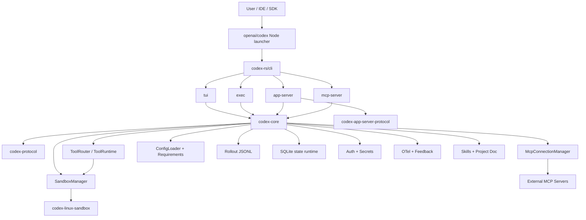
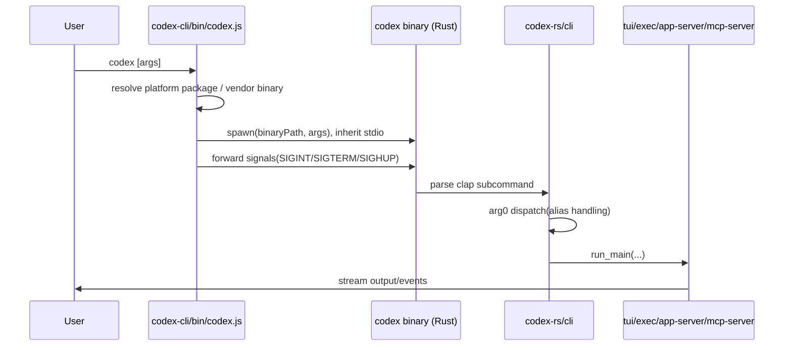
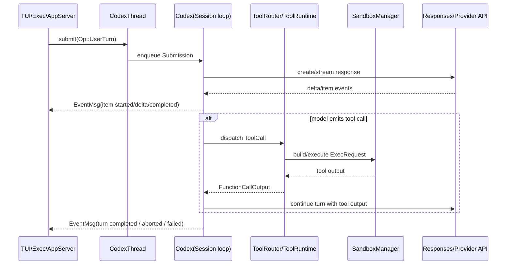
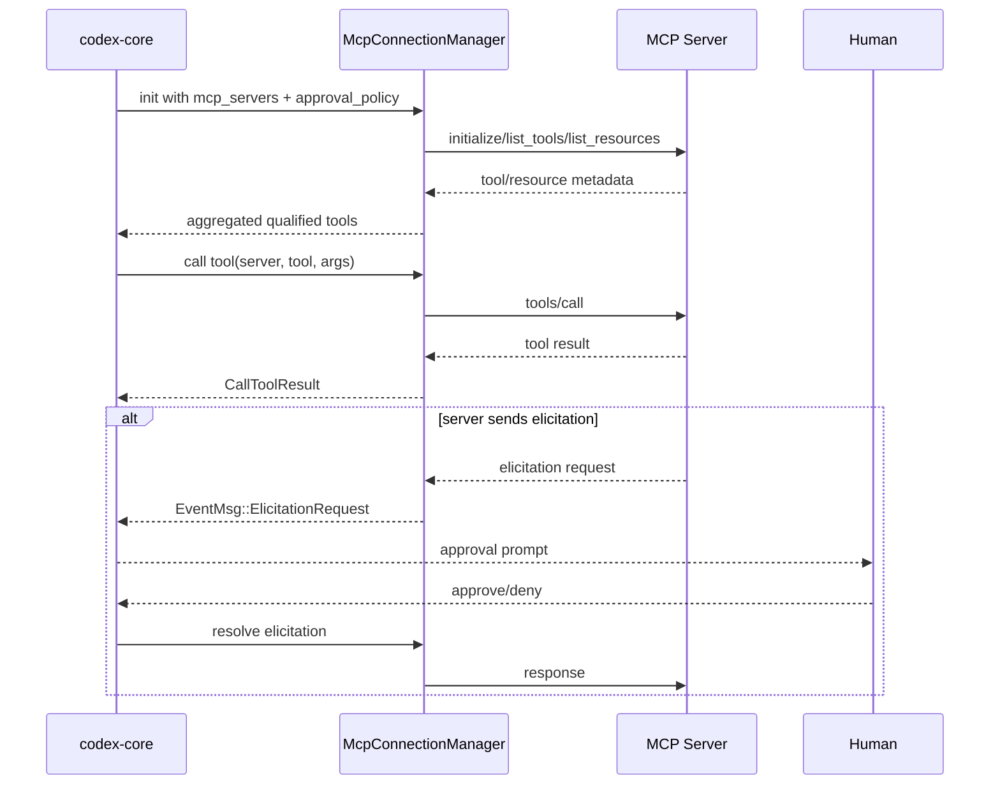
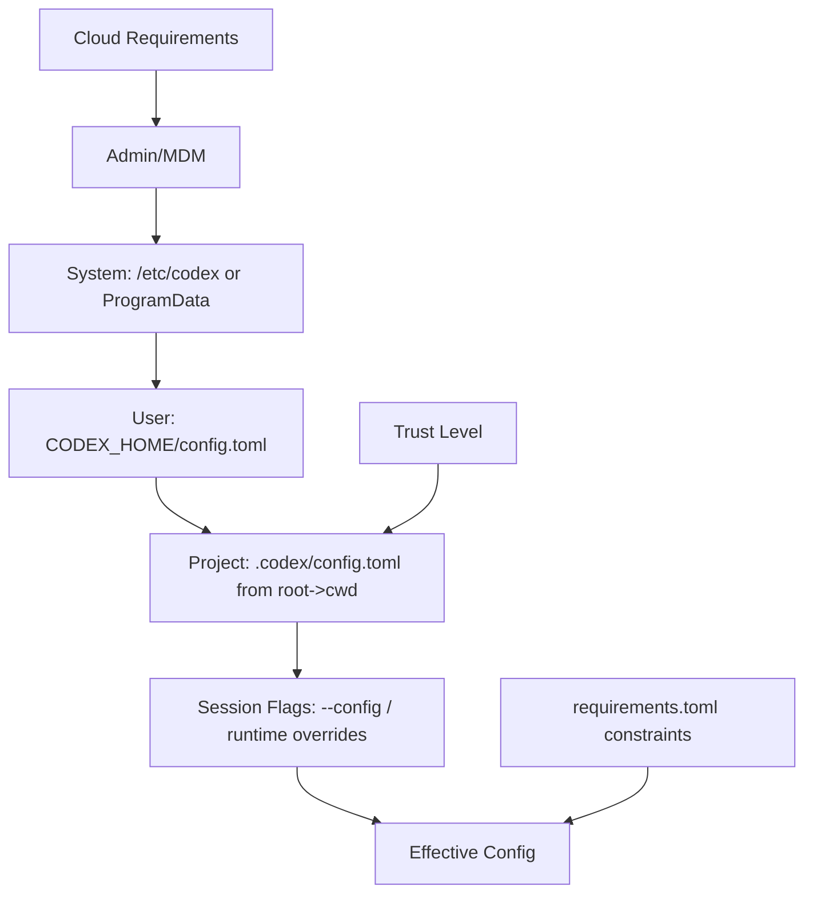

# Codex 架构分析（by Codex）

## 1. 分析范围与方法

本文基于 `./venders/codex` 仓库源码进行静态架构分析，重点覆盖：

- 启动链路（Node 包装器 -> Rust CLI 控制面）
- 核心运行时（线程、会话、事件队列）
- 协议层（内部协议 / app-server JSON-RPC 协议）
- 工具执行与沙箱安全模型
- MCP 子系统
- 配置加载、约束与信任模型
- 会话持久化与 SQLite 索引
- 认证、密钥存储、可观测性
- 扩展机制（Skills / AGENTS / SDK）

分析证据来自以下源码目录：

- `venders/codex/codex-cli`
- `venders/codex/codex-rs/*`（尤其 `cli`、`core`、`protocol`、`app-server`、`app-server-protocol`、`exec`、`execpolicy`、`linux-sandbox`、`state`）
- `venders/codex/sdk/typescript`
- `venders/codex/shell-tool-mcp`

## 2. 仓库与构建形态（Monorepo）

Codex 是一个多语言单仓：

- 前端/分发侧：Node 包（`codex-cli`、`shell-tool-mcp`、TS SDK）
- 核心执行侧：Rust workspace（`codex-rs`）

`codex-rs/Cargo.toml` 明确了大量 crate 的分层组织（`core`、`protocol`、`cli`、`tui`、`exec`、`app-server`、`mcp-server`、`state`、`execpolicy`、`linux-sandbox` 等），体现出“控制面 + 协议 + 安全执行 + 适配器”的架构拆分。

### 2.1 关键模块职责

- `codex-cli`：跨平台二进制分发与启动包装（Node 启动器）。
- `codex-rs/cli`：统一命令入口与子命令调度。
- `codex-rs/core`：核心会话引擎、工具路由、MCP、配置、持久化、策略。
- `codex-rs/protocol`：内部 Op/Event 协议模型（提交队列/事件队列）。
- `codex-rs/app-server`：面向 IDE/富客户端的 JSON-RPC 服务层。
- `codex-rs/app-server-protocol`：app-server API 契约（v1/v2、TS 导出、experimental gating）。
- `codex-rs/execpolicy`：命令规则引擎（allow/prompt/forbidden）。
- `codex-rs/linux-sandbox`：Linux 沙箱执行器（seccomp/no_new_privs/bwrap）。
- `codex-rs/state`：SQLite 状态索引引擎。

## 3. 总体架构视图

## 4. 启动链路与入口分发

## 4.1 Node 启动器（分发层）

`codex-cli/bin/codex.js` 的职责是“可移植分发适配器”而非业务核心：

- 根据 `process.platform + arch` 解析 target triple。
- 优先解析可选平台包（如 `@openai/codex-linux-x64`）。
- 回退到本地 `vendor/<triple>/codex/<binary>`。
- 拼装 PATH（注入 `vendor/<triple>/path`）。
- 前台启动原生二进制并转发 `SIGINT/SIGTERM/SIGHUP`。

这意味着 Node 层只做“定位 + 启动 + 信号转发”，核心行为在 Rust。

## 4.2 Rust CLI 多入口分发（控制面）

`codex-rs/cli/src/main.rs` 把 `codex` 作为多功能入口，支持：

- `exec` / `review`（非交互）
- `mcp` / `mcp-server`
- `app-server`
- `sandbox` / `execpolicy`
- `apply` / `resume` / `fork`
- cloud/task/feature 调试子命令等

此外借助 `codex-rs/arg0/src/lib.rs` 的 arg0 dispatch：

- 同一个可执行通过别名模拟多命令（如 `codex-linux-sandbox`、`apply_patch`）。
- 启动时创建临时 PATH 条目，注入 symlink/bat，降低多二进制分发复杂度。

## 4.3 启动序列图

## 5. 核心运行时（codex-core）

## 5.1 核心抽象：Submission Queue / Event Queue

`codex-rs/protocol/src/protocol.rs` 与 `core/src/codex.rs` 共同定义了核心交互模型：

- 输入：`Submission { id, op }`，其中 `op: Op`（如 `UserTurn`、`Interrupt`、`ExecApproval`、`RefreshMcpServers` 等）。
- 输出：`EventMsg` 流（turn/item delta、approval 请求、完成状态、错误等）。
- `Codex` 结构内部持有 `tx_sub` / `rx_event`，形成异步双队列通信。

这是一个非常清晰的“事件驱动会话引擎”设计：UI/服务层只是适配器，业务状态机在 core。

## 5.2 线程模型：ThreadManager + CodexThread

`core/src/thread_manager.rs`、`core/src/codex_thread.rs`：

- `ThreadManager` 维护内存线程表（`ThreadId -> CodexThread`）。
- 负责 `start/resume/fork/remove` 与线程创建广播通知。
- `CodexThread` 封装线程级 API：`submit`、`next_event`、`steer_input`、`config_snapshot`。

设计要点：

- app-server/exec/tui 可复用同一线程生命周期机制。
- 线程与会话持久化（rollout）绑定，但运行时对象与存储解耦。

## 5.3 一次 Turn 的生命周期

## 6. 协议层：内部协议与 app-server 协议

## 6.1 内部协议（codex-protocol）

`codex-rs/protocol/src/protocol.rs` 定义了跨 crate 共用的核心类型：

- `Op`（输入操作全集）
- `EventMsg`（输出事件全集）
- turn/item/message/tool/sandbox/approval 等语义对象

特点：

- 内部协议是强类型 Rust 模型，同时支持序列化。
- 明确把“状态变化”表达为事件流，而非同步 RPC 响应。

## 6.2 外部服务协议（app-server-protocol）

`codex-rs/app-server-protocol` 在内部协议之上定义外部 JSON-RPC API：

- `v1`/`v2` 并行演进（`src/protocol/v2.rs`）。
- 面向客户端的字段命名（camelCase）和类型适配。
- 支持 TS schema/export（`generate-ts` / `generate-json-schema`）。
- experimental API 通过能力位与宏注解进行 gating（`experimental_api.rs`）。

`codex-rs/app-server/README.md` 进一步说明了生命周期：

- `initialize` / `initialized` 握手
- thread/start/resume/fork
- turn/start -> 订阅通知流 -> turn/completed

结论：Codex 内部是事件驱动引擎，对外通过 JSON-RPC 暴露“命令 + 通知”语义，协议边界清晰。

## 7. 工具执行与沙箱安全模型

## 7.1 ToolRouter 与并行工具调用

`core/src/tools/router.rs`、`core/src/tools/parallel.rs`：

- `ToolRouter::from_config(...)` 根据 config + MCP + dynamic tools 构建注册表。
- 支持 Function/Custom/MCP/LocalShell 等调用类型。
- `ToolCallRuntime` 基于读写锁实现“可并行工具并发 + 不可并行工具串行”。

这类设计兼顾了吞吐（并行工具）与一致性（串行边界）。

## 7.2 沙箱抽象与平台实现

`core/src/sandboxing/mod.rs` 提供平台无关接口：

- `CommandSpec -> ExecRequest` 转换
- 选择 sandbox 类型（None/MacosSeatbelt/LinuxSeccomp/WindowsRestrictedToken）
- 注入网络限制环境变量

Linux 分支：

- `codex-rs/linux-sandbox/src/lib.rs` 说明组合策略：`no_new_privs + seccomp + bubblewrap`。
- 通过 `codex-linux-sandbox` 可执行完成隔离执行。

## 7.3 规则引擎与升级路径

`codex-rs/execpolicy`（`policy.rs`）提供命令匹配与决策：

- 规则决策：`allow` / `prompt` / `forbidden`
- 支持 prefix rule 与多命令聚合评估

`codex-rs/exec-server/README.md` 补充了更强约束链路：

- patched bash 拦截 `execve`
- `codex-execve-wrapper` 把决策提升到 MCP server
- 按规则选择 run/escalate/deny

这使“shell 语义不确定性”（alias/function/PATH）可以下降到 execve 级别控制。

## 8. MCP 子系统

`core/src/mcp_connection_manager.rs` + `core/src/mcp/mod.rs` 构成 MCP 管理平面：

- 每个 MCP server 一个 `RmcpClient`，统一生命周期管理。
- 聚合工具/资源/模板，并将工具名规范化到可被模型接受的格式。
- 处理 OAuth 状态、elicitation 请求与响应。
- 支持 `codex/sandbox-state` 能力下发（与 shell-tool-mcp 联动）。
- 对 codex apps 工具有缓存机制（用户维度 cache key）。

### 8.1 MCP 交互图

## 9. 配置、策略与企业约束

## 9.1 多层配置加载

`core/src/config_loader/mod.rs` 定义了配置与约束叠加顺序。核心思想：

- 配置层（config.toml）与约束层（requirements.toml）分离。
- 约束“前层优先、后层不可覆盖前层限制”。
- 项目层 `.codex/config.toml` 有 trust-gated 行为。

### 9.2 配置优先级图

## 9.3 信任模型

从 `core/src/config/mod.rs` 与 `config_loader/mod.rs` 可见：

- 会根据 cwd/repo root 解析项目信任上下文。
- untrusted 项目会影响默认 approval/sandbox 行为。
- project config 可被标记为 disabled（app-server 会返回 warning）。

## 9.4 MCP 与策略约束协同

- MCP server 配置受 requirements allowlist 过滤（`constrain_mcp_servers`）。
- exec policy 与审批策略会共同影响工具是否可执行。

## 10. 状态持久化与索引

## 10.1 Canonical 日志：rollout JSONL

`core/src/rollout/mod.rs` 指出会话持久化目录：

- `sessions/`
- `archived_sessions/`

Rollout 是历史回放与 resume/fork 的事实来源。

## 10.2 SQLite 加速层（可选）

`core/src/state_db.rs` + `state/src/lib.rs`：

- 特性开关启用时初始化 `StateRuntime`。
- 支持 backfill（将历史 rollout 索引到 SQLite）。
- 查询失败时保留回退策略，并做路径一致性检查/修复。

可理解为：

- JSONL = Source of Truth
- SQLite = 索引与查询加速层

## 11. 认证、密钥与安全存储

## 11.1 认证模式

`core/src/auth.rs`：

- `ApiKey`
- `Chatgpt`（含 token refresh）
- `ChatgptAuthTokens`（外部 token 模式）

并有 refresh token 生命周期与失败分类处理。

## 11.2 凭据与密钥

- `secrets/src/lib.rs`：`SecretsManager` 与 scope（global/environment）管理。
- `keyring-store/src/lib.rs`：默认 keyring 存储抽象。

这使“认证凭据”和“工具用 secrets”分层管理，降低耦合。

## 12. 可观测性与反馈

## 12.1 OTel

`otel/src/lib.rs` 提供 `OtelManager`：

- 指标（counter/histogram/duration/timer）
- 带 metadata tags 的统一埋点
- runtime metrics snapshot/reset

## 12.2 反馈通道

`feedback/src/lib.rs`：

- 内存 ring buffer 捕获高保真日志
- metadata tags 聚合
- 可生成日志快照并上传反馈（含额外附件）

这为“线上问题回收”提供了标准化管道。

## 13. 扩展机制（Skills / AGENTS / SDK）

## 13.1 Skills

- `codex-rs/skills/src/lib.rs`：内置 system skills 通过 `include_dir` 嵌入并安装到 `CODEX_HOME/skills/.system`。
- `core/src/skills/*`：运行时加载、注入、依赖解析、权限处理。

## 13.2 项目指令（AGENTS.md）

`core/src/project_doc.rs`：

- 按 git root -> cwd 链路收集 `AGENTS.md`（及 fallback 文件名）。
- 与用户指令、skills section 合并为最终 instructions。

这也是 Codex 在不同项目上下文中“行为定制”的核心入口。

## 13.3 TypeScript SDK

`sdk/typescript/README.md` 与 `src/index.ts` 表明：

- SDK 本质是对 `codex` CLI 的进程封装。
- 通过 stdin/stdout JSONL 事件流驱动线程与 turn。

因此 SDK 不重写核心逻辑，而是复用 CLI/核心协议，降低语义漂移风险。

## 14. 部署与分发模型

- `codex-cli`：NPM 包负责平台分发、拉起原生二进制。
- `codex-rs`：核心能力集中在 Rust binary/crates。
- `shell-tool-mcp`：独立 NPM 包，封装 `codex-exec-mcp-server` + `codex-execve-wrapper` + patched bash。

这是一种“Node 负责交付，Rust 负责执行”的工程化分层。

## 15. 架构权衡与演进建议

## 15.1 现有优势

- 清晰分层：分发、控制面、核心引擎、协议、工具执行、安全隔离各司其职。
- 事件驱动统一：TUI/Exec/AppServer 共享 `Op/EventMsg` 语义。
- 安全策略完整：配置约束、trust、execpolicy、沙箱、MCP elicitation 多层防护。
- 扩展能力强：skills、MCP、dynamic tools、SDK 并存且边界清楚。

## 15.2 复杂度来源

- 入口多态（arg0 + 多子命令 + 多 transport）提高了学习门槛。
- 配置/约束/信任三套机制叠加，排障复杂。
- 工具执行路径存在多分支（local shell、MCP shell、external sandbox、policy fallback）。

## 15.3 建议（面向后续演进）

1. 增加“统一时序可观测”文档与 tracing 约定，把关键事件（turn/tool/approval/mcp）串成统一追踪视图。
2. 对 config layer + trust + requirements 的最终决策提供更直观 explain 输出（尤其是 why-disabled/why-overridden）。
3. 将 tool call pipeline（router -> runtime -> sandbox -> approval）提炼成稳定可测试的阶段接口，降低新工具接入成本。
4. 把 app-server v1/v2 差异与稳定性策略做成机器可读兼容矩阵，方便 SDK/插件自动选择能力。

## 16. 关键源码索引（证据路径）

- 启动与分发
  - `venders/codex/codex-cli/bin/codex.js`
  - `venders/codex/codex-rs/cli/src/main.rs`
  - `venders/codex/codex-rs/arg0/src/lib.rs`
- 核心运行时
  - `venders/codex/codex-rs/core/src/lib.rs`
  - `venders/codex/codex-rs/core/src/codex.rs`
  - `venders/codex/codex-rs/core/src/codex_thread.rs`
  - `venders/codex/codex-rs/core/src/thread_manager.rs`
- 协议
  - `venders/codex/codex-rs/protocol/src/protocol.rs`
  - `venders/codex/codex-rs/app-server-protocol/src/lib.rs`
  - `venders/codex/codex-rs/app-server-protocol/src/protocol/v2.rs`
  - `venders/codex/codex-rs/app-server-protocol/src/experimental_api.rs`
- app-server / mcp-server
  - `venders/codex/codex-rs/app-server/README.md`
  - `venders/codex/codex-rs/app-server/src/lib.rs`
  - `venders/codex/codex-rs/app-server/src/main.rs`
  - `venders/codex/codex-rs/mcp-server/src/lib.rs`
- 工具与沙箱
  - `venders/codex/codex-rs/core/src/tools/mod.rs`
  - `venders/codex/codex-rs/core/src/tools/router.rs`
  - `venders/codex/codex-rs/core/src/tools/parallel.rs`
  - `venders/codex/codex-rs/core/src/sandboxing/mod.rs`
  - `venders/codex/codex-rs/linux-sandbox/src/lib.rs`
  - `venders/codex/codex-rs/exec-server/README.md`
  - `venders/codex/codex-rs/execpolicy/src/lib.rs`
  - `venders/codex/codex-rs/execpolicy/src/policy.rs`
- MCP
  - `venders/codex/codex-rs/core/src/mcp/mod.rs`
  - `venders/codex/codex-rs/core/src/mcp_connection_manager.rs`
- 配置与策略
  - `venders/codex/codex-rs/core/src/config/mod.rs`
  - `venders/codex/codex-rs/core/src/config_loader/mod.rs`
  - `venders/codex/codex-rs/config/src/lib.rs`
- 持久化
  - `venders/codex/codex-rs/core/src/rollout/mod.rs`
  - `venders/codex/codex-rs/core/src/state_db.rs`
  - `venders/codex/codex-rs/state/src/lib.rs`
- 认证与可观测
  - `venders/codex/codex-rs/core/src/auth.rs`
  - `venders/codex/codex-rs/login/src/lib.rs`
  - `venders/codex/codex-rs/secrets/src/lib.rs`
  - `venders/codex/codex-rs/keyring-store/src/lib.rs`
  - `venders/codex/codex-rs/otel/src/lib.rs`
  - `venders/codex/codex-rs/feedback/src/lib.rs`
- 扩展与 SDK
  - `venders/codex/codex-rs/core/src/project_doc.rs`
  - `venders/codex/codex-rs/core/src/skills/mod.rs`
  - `venders/codex/codex-rs/skills/src/lib.rs`
  - `venders/codex/sdk/typescript/README.md`
  - `venders/codex/sdk/typescript/src/index.ts`
  - `venders/codex/shell-tool-mcp/README.md`
  - `venders/codex/shell-tool-mcp/src/index.ts`
