# Codex 架构分析文档

> 作者：Hiyo Claude
> 日期：2026-02-22
> 版本：1.0
> 分析对象：OpenAI Codex CLI (Rust 实现)

## 目录

- [1. 项目概述](#1-项目概述)
- [2. 整体架构](#2-整体架构)
- [3. 核心组件详解](#3-核心组件详解)
- [4. 数据流与交互模式](#4-数据流与交互模式)
- [5. 安全机制](#5-安全机制)
- [6. 协议与通信](#6-协议与通信)
- [7. 关键设计模式](#7-关键设计模式)
- [8. 技术栈](#8-技术栈)
- [9. 目录结构](#9-目录结构)
- [10. 总结与评价](#10-总结与评价)

---

## 1. 项目概述

### 1.1 项目定位

Codex 是 OpenAI 开发的本地运行的 AI 编码助手，采用 Rust 实现核心功能，提供命令行界面（CLI）、终端用户界面（TUI）和 IDE 集成能力。它是一个完整的 AI Agent 系统，能够理解用户意图、执行代码操作、与外部工具交互，并在安全沙箱中运行命令。

### 1.2 核心特性

- **多前端支持**：CLI、TUI、IDE 插件（VS Code、Cursor、Windsurf）
- **安全沙箱**：平台特定的沙箱机制（macOS Seatbelt、Linux Landlock/seccomp、Windows 受限令牌）
- **会话持久化**：支持会话保存、恢复和回溯
- **多 Agent 架构**：支持子 Agent 生成和协作
- **MCP 集成**：支持 Model Context Protocol 外部工具
- **双模式认证**：API Key 和 ChatGPT OAuth 两种认证方式

### 1.3 技术亮点

- 使用 Rust 实现高性能和内存安全
- 异步 I/O（Tokio）处理并发操作
- 流式 AI 响应处理
- 分层配置系统
- 完善的错误处理和日志追踪

---

## 2. 整体架构

### 2.1 系统架构图

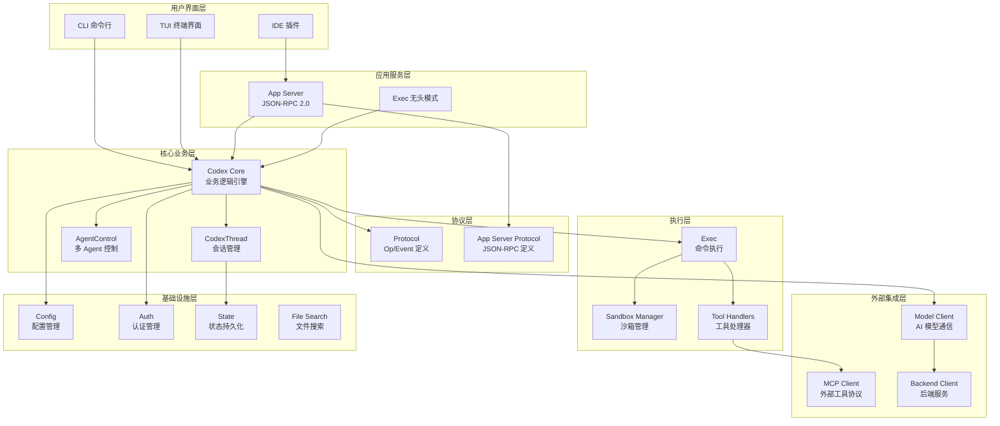

### 2.2 分层架构说明

Codex 采用经典的分层架构，从上到下分为：

1. **用户界面层**：提供多种交互方式（CLI、TUI、IDE）
2. **应用服务层**：处理不同场景的应用逻辑（交互式、无头模式）
3. **核心业务层**：实现 AI Agent 的核心逻辑和会话管理
4. **协议层**：定义标准化的通信协议和数据结构
5. **执行层**：负责实际的命令执行和工具调用
6. **外部集成层**：与 AI 模型、外部工具和后端服务通信
7. **基础设施层**：提供配置、认证、状态管理等基础能力

---

## 3. 核心组件详解

### 3.1 Codex Core（核心引擎）

**位置**：`codex-rs/core/`

**职责**：

- Agent 生命周期管理
- Turn（对话轮次）执行
- 工具调用分发
- 上下文构建
- 事件流处理

**关键文件**：

- `src/codex.rs`：主 Agent 循环，事件处理，工具分发
- `src/codex_thread.rs`：线程生命周期和消息路由
- `src/client.rs`：模型 API 通信和流式处理
- `src/exec.rs`：命令执行与沙箱集成
- `src/config/mod.rs`：配置加载和验证

**核心数据结构**：

```rust
pub struct Codex {
    thread: CodexThread,
    agent_control: AgentControl,
    model_client: ModelClient,
    sandbox_manager: SandboxManager,
    config: Config,
    // ...
}
```

### 3.2 CodexThread（会话管理）

**职责**：

- 管理单个对话线程
- 处理用户输入（Op）和 Agent 输出（Event）
- 维护会话状态
- 支持会话持久化和恢复

**通信模式**：

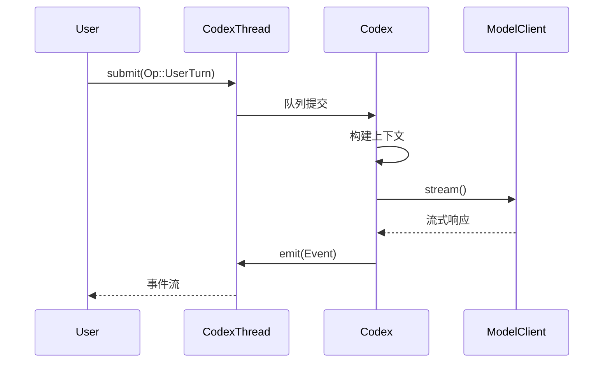

### 3.3 AgentControl（多 Agent 控制）

**职责**：

- 子 Agent 生成和管理
- Agent 间通信
- 生成深度限制（防止无限递归）
- Agent 昵称管理

**架构模式**：

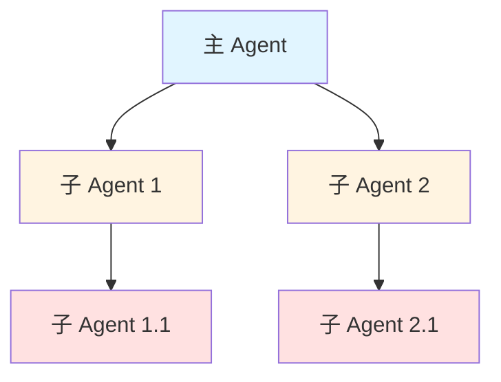

### 3.4 App Server（应用服务器）

**位置**：`codex-rs/app-server/`

**职责**：

- 为 IDE 插件提供 JSON-RPC 2.0 接口
- 管理多个 Thread/Turn/Item
- 支持 stdio 和 WebSocket 通信
- 动态工具支持

**API 示例**：

```json
// 请求：创建新线程
{
  "jsonrpc": "2.0",
  "id": 1,
  "method": "v2/threads/create",
  "params": {
    "name": "My Coding Session"
  }
}

// 响应
{
  "jsonrpc": "2.0",
  "id": 1,
  "result": {
    "thread_id": "thread_abc123"
  }
}
```

### 3.5 TUI（终端用户界面）

**位置**：`codex-rs/tui/`

**技术栈**：Ratatui（终端 UI 框架）

**功能特性**：

- 全屏终端界面
- 实时流式输出渲染
- 交互式审批界面
- 文件搜索面板
- 会话回溯支持

**界面布局**：

```
┌─────────────────────────────────────────┐
│ Codex - Session: my-project             │
├─────────────────────────────────────────┤
│                                         │
│  [对话历史区域]                          │
│  User: 帮我创建一个 TODO 应用            │
│  Assistant: 我将创建一个简单的 TODO...   │
│  [工具调用输出]                          │
│                                         │
├─────────────────────────────────────────┤
│ > 输入你的消息...                        │
└─────────────────────────────────────────┘
```

### 3.6 Exec（命令执行）

**位置**：`codex-rs/exec/`

**职责**：

- 无头模式执行
- 事件处理和格式化输出
- 支持 JSONL 和人类可读格式
- 输出模式验证

**使用场景**：

```bash
# 自动化脚本
codex exec "运行所有测试并生成报告" --approval-mode full-auto

# CI/CD 集成
codex exec "检查代码质量" --output-format jsonl
```

### 3.7 Sandbox Manager（沙箱管理器）

**位置**：`codex-rs/core/src/sandboxing/`

**沙箱策略**：

| 策略 | 文件系统 | 网络 | 适用场景 |
|------|---------|------|---------|
| ReadOnly | 只读 | 禁用 | 默认模式，最安全 |
| WorkspaceWrite | 工作区可写 | 禁用 | 代码修改场景 |
| DangerFullAccess | 完全访问 | 允许 | 容器内运行 |
| ExternalSandbox | 自定义 | 自定义 | 特殊需求 |

**平台实现**：

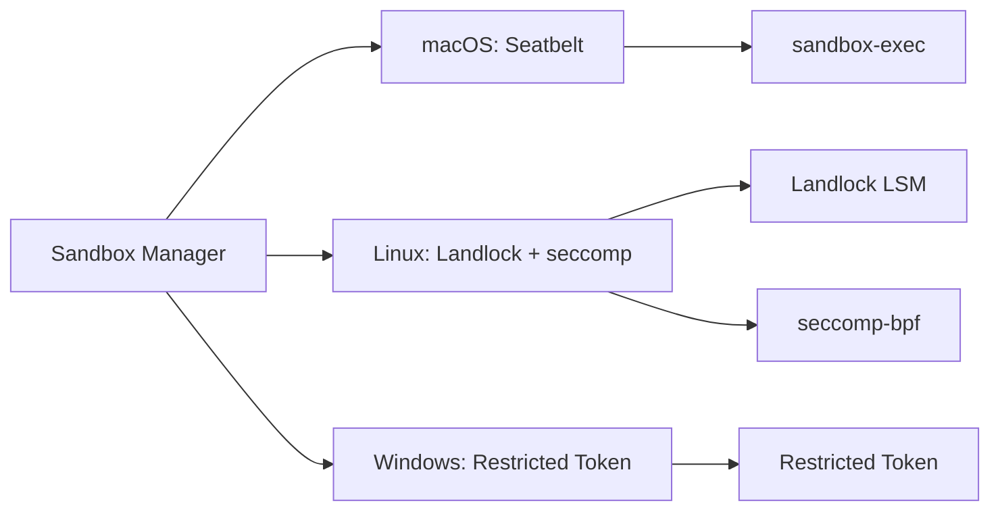

---

## 4. 数据流与交互模式

### 4.1 完整执行流程

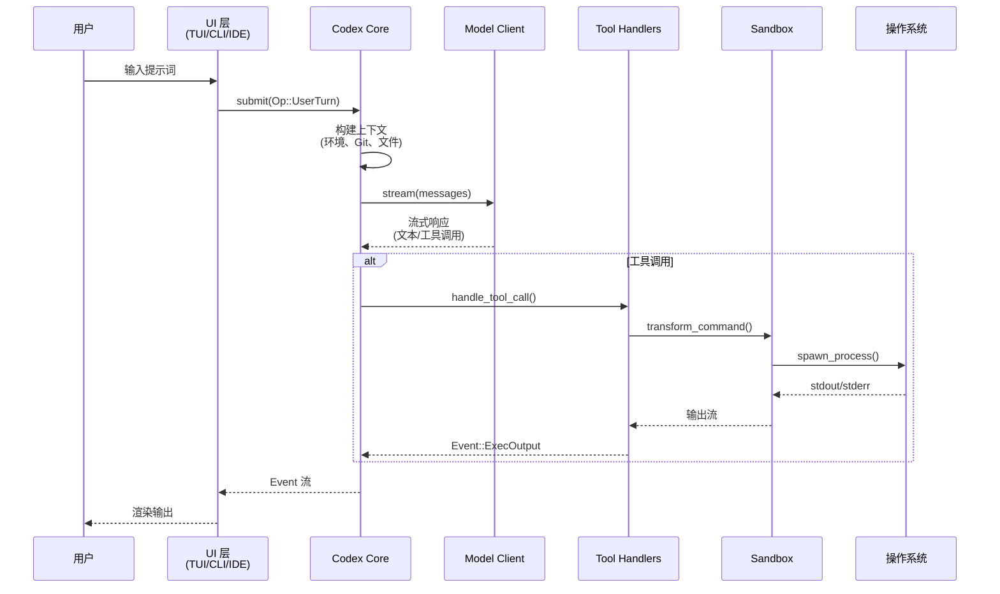

### 4.2 Op/Event 模式

Codex 使用 **Submission Queue (SQ) / Event Queue (EQ)** 模式进行通信：

**Op（操作）**：用户发起的操作

```rust
pub enum Op {
    UserTurn { items: Vec<UserTurnItem> },
    Interrupt,
    CleanBackgroundTerminals,
    // ...
}
```

**Event（事件）**：Agent 产生的事件

```rust
pub enum Event {
    TurnStarted { turn_id: String },
    ItemCompleted { item: ResponseItem },
    ExecCommandOutput { delta: String },
    TurnCompleted,
    // ...
}
```

### 4.3 工具调用流程

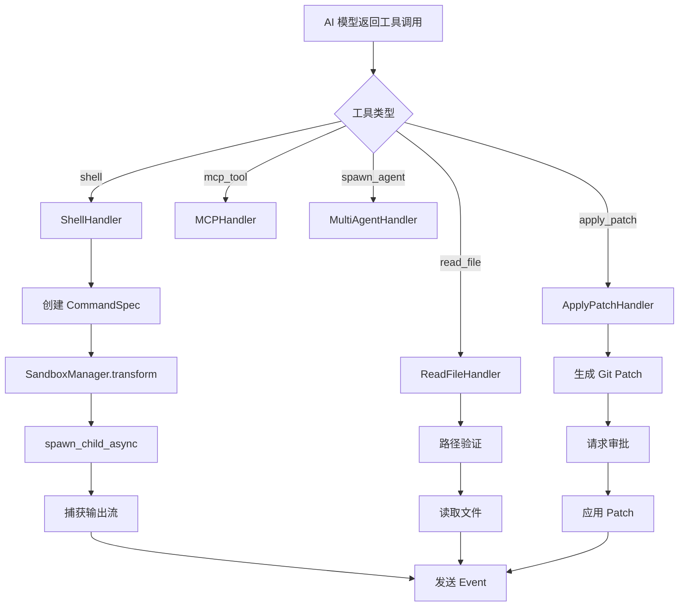

### 4.4 会话持久化

**存储位置**：`~/.codex/sessions/`

**格式**：JSONL（每行一个 JSON 对象）

**数据结构**：

```rust
pub struct RolloutItem {
    pub turn_id: String,
    pub timestamp: DateTime<Utc>,
    pub op: Op,
    pub events: Vec<Event>,
}
```

**恢复流程**：

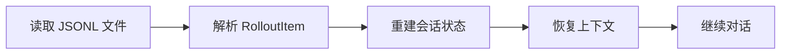

---

## 5. 安全机制

### 5.1 多层安全架构

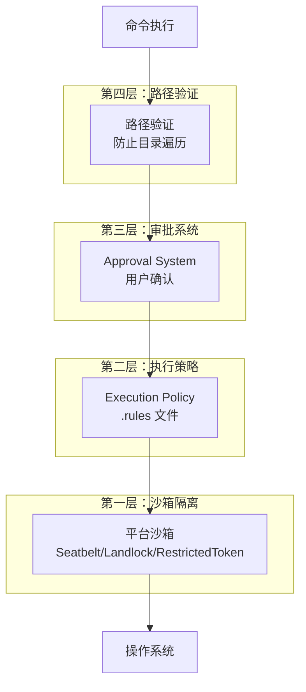

### 5.2 沙箱实现细节

#### macOS Seatbelt

```bash
# 生成的沙箱配置示例
sandbox-exec -p '
(version 1)
(deny default)
(allow file-read* (subpath "/workspace"))
(deny file-write*)
(deny network*)
' -- /bin/bash -c "your command"
```

#### Linux Landlock + seccomp

```rust
// Landlock 文件系统限制
let ruleset = Ruleset::new()
    .handle_access(AccessFs::ReadFile)?
    .handle_access(AccessFs::ReadDir)?
    .create()?;

// seccomp 系统调用过滤
let filter = SeccompFilter::new()
    .allow_syscall("read")
    .allow_syscall("write")
    .deny_syscall("socket")
    .build()?;
```

#### Windows Restricted Token

```rust
// 创建受限令牌
let restricted_token = create_restricted_token(
    &current_token,
    DISABLE_MAX_PRIVILEGE,
    &sids_to_disable,
    &privileges_to_delete,
)?;
```

### 5.3 执行策略（Execution Policy）

**配置文件**：`.rules`

**语法示例**：

```toml
# 允许的命令
[allow]
commands = ["git", "npm", "cargo", "python"]

# 拒绝的命令
[deny]
commands = ["rm -rf", "dd", "mkfs"]

# 需要审批的命令
[require_approval]
commands = ["curl", "wget", "ssh"]
```

**验证流程**：

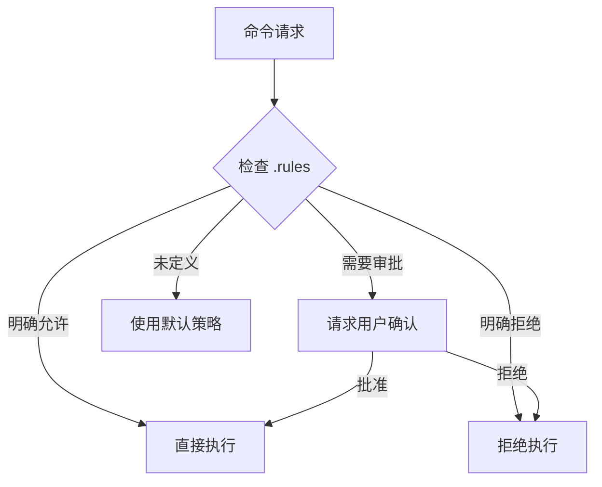

### 5.4 审批系统

**审批类型**：

```rust
pub enum AskForApproval {
    Exec { command: String },
    ApplyPatch { patch: String },
    Network { url: String },
}
```

**审批模式**：

- **Interactive**：每次都询问用户
- **Semi-Auto**：危险操作询问，安全操作自动批准
- **Full-Auto**：全部自动批准（仅用于可信环境）

---

## 6. 协议与通信

### 6.1 Protocol 层

**位置**：`codex-rs/protocol/`

**核心定义**：

```rust
// 用户操作
pub enum Op {
    UserTurn { items: Vec<UserTurnItem> },
    Interrupt,
    // ...
}

// Agent 事件
pub enum Event {
    TurnStarted { turn_id: String },
    ItemCompleted { item: ResponseItem },
    // ...
}

// 提交结构
pub struct Submission {
    pub id: SubmissionId,
    pub op: Op,
}
```

### 6.2 App Server Protocol

**位置**：`codex-rs/app-server-protocol/`

**JSON-RPC 2.0 方法**：

| 方法 | 功能 | 参数 |
|------|------|------|
| `v2/threads/create` | 创建新线程 | `{ name?: string }` |
| `v2/threads/list` | 列出所有线程 | `{ cursor?, limit? }` |
| `v2/turns/create` | 创建新轮次 | `{ thread_id, items }` |
| `v2/turns/interrupt` | 中断当前轮次 | `{ turn_id }` |
| `v2/config/get` | 获取配置 | `{ keys }` |

**通知（Notification）**：

```rust
pub enum ServerNotification {
    AgentMessageDelta { delta: String },
    TurnCompleted { turn_id: String },
    AccountUpdated { account: Account },
    // ...
}
```

### 6.3 MCP（Model Context Protocol）

**位置**：`codex-rs/mcp-server/`、`codex-rs/rmcp-client/`

**功能**：

- 连接外部 MCP 服务器
- 工具发现和调用
- 资源访问
- 提示词模板

**集成流程**：

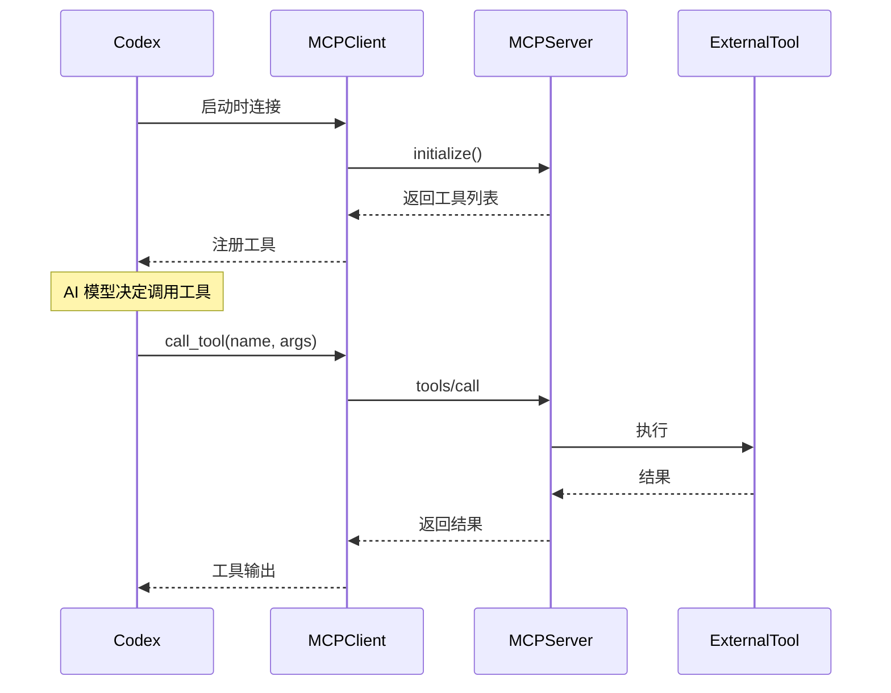

---

## 7. 关键设计模式

### 7.1 异步编程模式

**技术栈**：Tokio

**模式应用**：

```rust
// 异步任务生成
tokio::spawn(async move {
    // 异步操作
});

// 通道通信
let (tx, rx) = mpsc::channel(100);

// 取消令牌
let cancel_token = CancellationToken::new();
```

### 7.2 配置分层模式

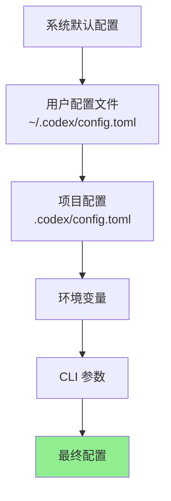

**实现**：

```rust
pub struct ConfigLayerStack {
    layers: Vec<ConfigLayer>,
}

pub enum ConfigLayer {
    System,
    User,
    Project,
    Environment,
    CommandLine,
}
```

### 7.3 事件驱动架构

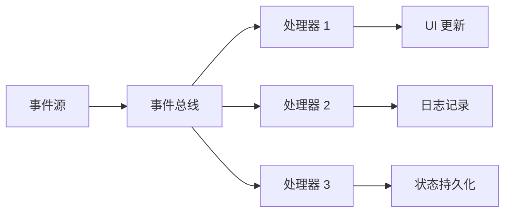

### 7.4 插件化工具系统

```rust
pub trait ToolHandler {
    fn name(&self) -> &str;
    fn handle(&self, args: ToolArgs) -> Result<ToolResult>;
}

// 工具注册
let mut tool_registry = ToolRegistry::new();
tool_registry.register(Box::new(ShellHandler));
tool_registry.register(Box::new(ReadFileHandler));
tool_registry.register(Box::new(ApplyPatchHandler));
```

---

## 8. 技术栈

### 8.1 核心依赖

| 依赖 | 版本 | 用途 |
|------|------|------|
| tokio | 1.x | 异步运行时 |
| serde | 1.x | 序列化/反序列化 |
| anyhow | 1.x | 错误处理 |
| tracing | 0.1 | 日志和追踪 |
| clap | 4.x | CLI 参数解析 |
| ratatui | 0.29 | 终端 UI |
| reqwest | 0.12 | HTTP 客户端 |
| tokio-tungstenite | 0.x | WebSocket |

### 8.2 平台特定依赖

**macOS**：
- `core-foundation`：系统框架绑定
- `keyring`（apple-native）：钥匙串访问

**Linux**：
- `landlock`：文件系统沙箱
- `seccompiler`：系统调用过滤
- `keyring`（linux-native-async-persistent）：密钥存储

**Windows**：
- `windows-sys`：Windows API 绑定
- `keyring`（windows-native）：凭据管理器

### 8.3 构建工具

- **Bazel**：主构建系统
- **Cargo**：Rust 包管理
- **Just**：任务运行器
- **pnpm**：Node.js 包管理（CLI 包装）

---

## 9. 目录结构

```
codex/
├── codex-cli/                    # TypeScript CLI 包装（已废弃）
│   ├── bin/codex.js             # 入口脚本
│   └── package.json
│
├── codex-rs/                     # Rust 核心实现
│   ├── core/                    # 核心业务逻辑
│   │   ├── src/
│   │   │   ├── codex.rs        # 主 Agent 循环
│   │   │   ├── codex_thread.rs # 会话管理
│   │   │   ├── client.rs       # 模型客户端
│   │   │   ├── exec.rs         # 命令执行
│   │   │   ├── sandboxing/     # 沙箱实现
│   │   │   ├── tools/          # 工具处理器
│   │   │   ├── config/         # 配置系统
│   │   │   └── auth.rs         # 认证
│   │   └── Cargo.toml
│   │
│   ├── cli/                     # CLI 入口
│   │   ├── src/main.rs
│   │   └── Cargo.toml
│   │
│   ├── tui/                     # 终端 UI
│   │   ├── src/
│   │   │   ├── app.rs          # 应用状态
│   │   │   ├── ui/             # UI 组件
│   │   │   └── events.rs       # 事件处理
│   │   └── Cargo.toml
│   │
│   ├── app-server/              # IDE 集成服务器
│   │   ├── src/
│   │   │   ├── lib.rs          # JSON-RPC 服务器
│   │   │   └── handlers/       # 方法处理器
│   │   └── Cargo.toml
│   │
│   ├── app-server-protocol/     # JSON-RPC 协议定义
│   │   ├── src/
│   │   │   └── v2/             # v2 API
│   │   └── schema/json/        # JSON Schema
│   │
│   ├── protocol/                # 核心协议
│   │   ├── src/protocol.rs     # Op/Event 定义
│   │   └── Cargo.toml
│   │
│   ├── exec/                    # 无头执行
│   │   └── src/lib.rs
│   │
│   ├── mcp-server/              # MCP 服务器
│   ├── rmcp-client/             # MCP 客户端
│   ├── backend-client/          # 后端 API 客户端
│   ├── login/                   # 认证流程
│   ├── file-search/             # 文件搜索
│   ├── skills/                  # 技能系统
│   ├── state/                   # 状态管理
│   ├── config/                  # 配置类型
│   ├── hooks/                   # 钩子系统
│   ├── secrets/                 # 密钥管理
│   ├── execpolicy/              # 执行策略
│   ├── linux-sandbox/           # Linux 沙箱
│   ├── windows-sandbox-rs/      # Windows 沙箱
│   ├── network-proxy/           # 网络代理
│   ├── otel/                    # OpenTelemetry
│   │
│   └── utils/                   # 工具库
│       ├── absolute-path/
│       ├── git/
│       ├── cache/
│       ├── pty/
│       └── ...
│
├── sdk/                         # SDK（如果有）
├── shell-tool-mcp/              # Shell 工具 MCP 服务器
├── docs/                        # 文档
├── scripts/                     # 构建脚本
├── MODULE.bazel                 # Bazel 模块定义
├── Cargo.toml                   # Workspace 配置
└── README.md
```

---

## 10. 总结与评价

### 10.1 架构优势

1. **模块化设计**：清晰的模块边界，职责分离明确
2. **安全优先**：多层安全机制，平台特定沙箱实现
3. **可扩展性**：插件化工具系统，MCP 协议支持
4. **性能优异**：Rust 实现，异步 I/O，流式处理
5. **多前端支持**：统一核心，多种交互方式
6. **会话管理**：完善的持久化和恢复机制

### 10.2 技术亮点

1. **Op/Event 模式**：清晰的通信协议，易于扩展和调试
2. **分层配置**：灵活的配置系统，支持多层覆盖
3. **流式处理**：实时响应，用户体验好
4. **多 Agent 架构**：支持复杂任务分解和协作
5. **平台适配**：针对不同平台的优化实现

### 10.3 可改进之处

1. **文档完善度**：部分模块缺少详细的 API 文档
2. **测试覆盖**：可以增加更多集成测试和端到端测试
3. **错误处理**：部分错误信息可以更友好
4. **性能监控**：可以增加更多性能指标和监控
5. **国际化**：目前主要支持英文，可以考虑多语言支持

### 10.4 适用场景

**适合**：
- 本地开发环境的 AI 辅助
- 需要高安全性的代码操作
- 自动化脚本和 CI/CD 集成
- IDE 集成的 AI 功能

**不适合**：
- 需要云端协作的场景
- 对网络延迟敏感的实时应用
- 资源受限的嵌入式设备

### 10.5 学习价值

Codex 项目展示了如何构建一个生产级的 AI Agent 系统，涵盖了：

- Rust 异步编程最佳实践
- 安全沙箱实现
- 协议设计和通信模式
- 多前端架构
- 配置管理和状态持久化
- 工具系统和插件化设计

对于想要学习 AI Agent 开发、Rust 系统编程或终端应用开发的开发者来说，这是一个非常好的参考项目。

---

## 附录

### A. 关键文件索引

| 文件路径 | 功能描述 |
|---------|---------|
| `codex-rs/core/src/codex.rs` | 主 Agent 循环和事件处理 |
| `codex-rs/core/src/codex_thread.rs` | 会话生命周期管理 |
| `codex-rs/core/src/client.rs` | AI 模型通信 |
| `codex-rs/core/src/exec.rs` | 命令执行 |
| `codex-rs/core/src/sandboxing/mod.rs` | 沙箱管理 |
| `codex-rs/protocol/src/protocol.rs` | Op/Event 定义 |
| `codex-rs/app-server/src/lib.rs` | JSON-RPC 服务器 |
| `codex-rs/tui/src/app.rs` | TUI 状态机 |
| `codex-rs/cli/src/main.rs` | CLI 入口 |

### B. 配置示例

```toml
# ~/.codex/config.toml

[auth]
mode = "chatgpt"  # 或 "api_key"

[model]
name = "gpt-4"
temperature = 0.7

[sandbox]
default_policy = "workspace_write"

[approval]
mode = "interactive"  # 或 "semi_auto", "full_auto"

[mcp]
servers = [
    { name = "filesystem", command = "mcp-server-filesystem" },
    { name = "git", command = "mcp-server-git" }
]
```

### C. 常用命令

```bash
# 启动交互式会话
codex

# 执行单次任务
codex "创建一个 TODO 应用"

# 无头模式
codex exec "运行测试" --approval-mode full-auto

# 恢复会话
codex --session my-session

# 查看配置
codex config show

# 登录
codex login

# 启动桌面应用
codex app
```

---

**文档结束**