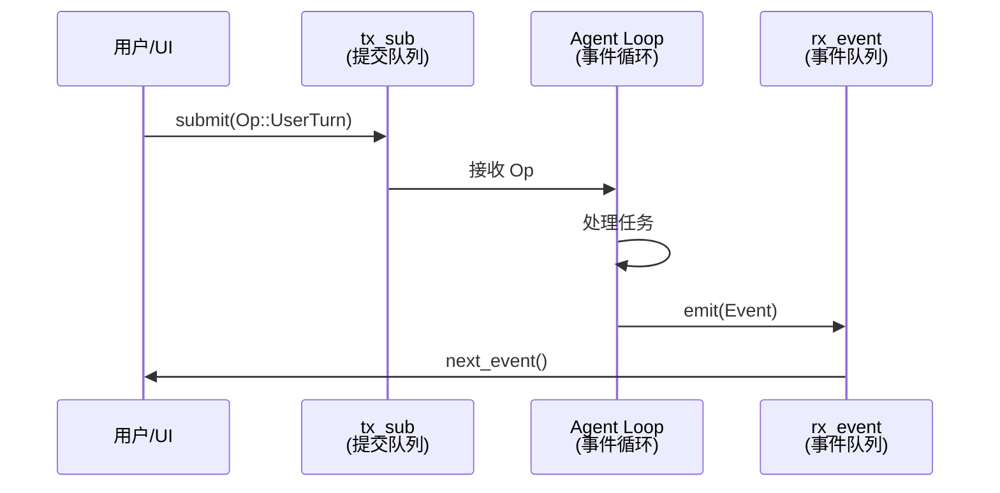
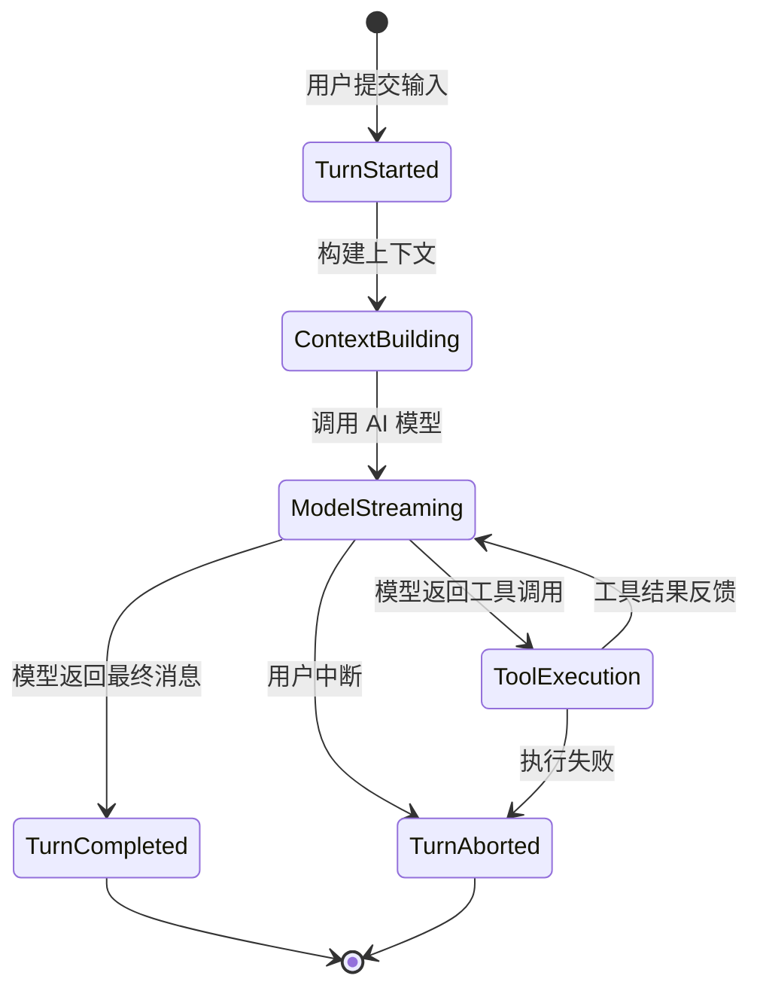
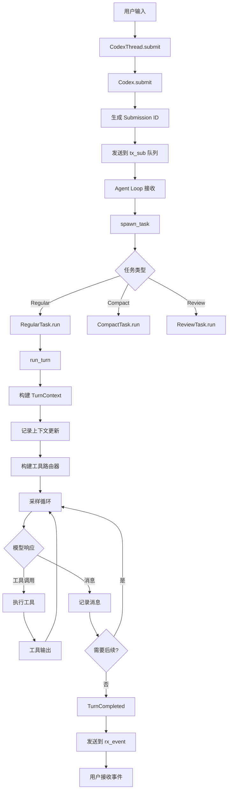
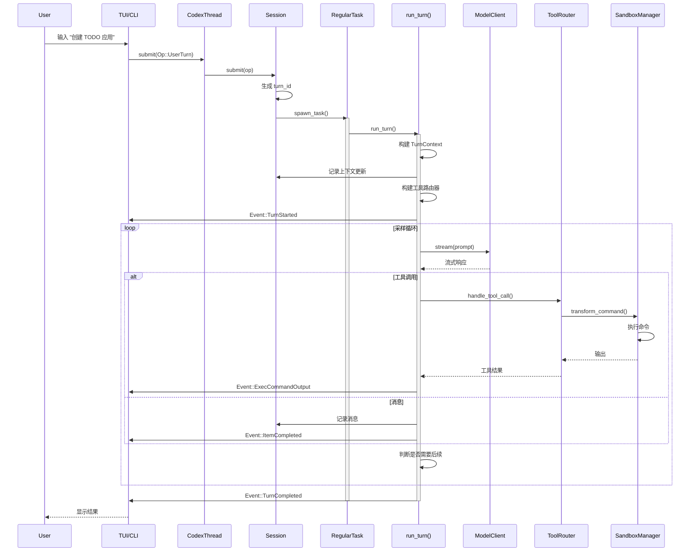
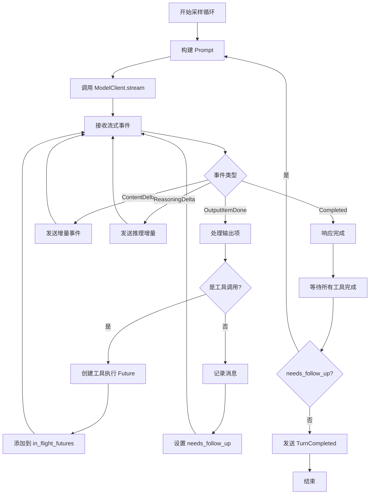
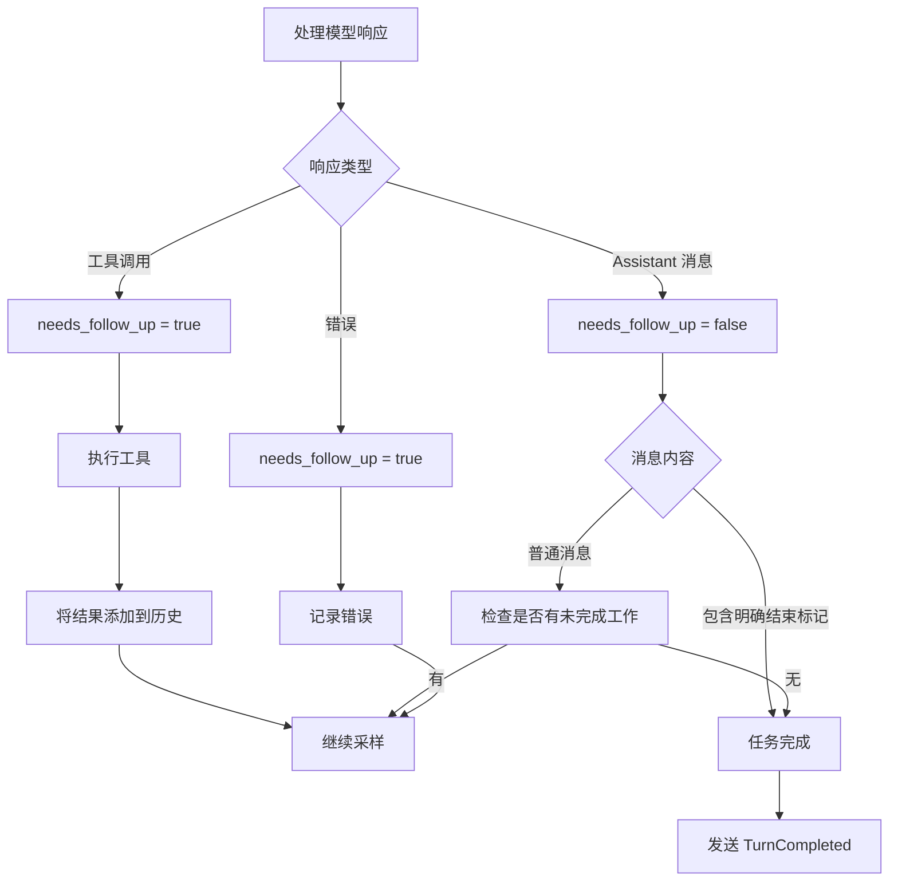
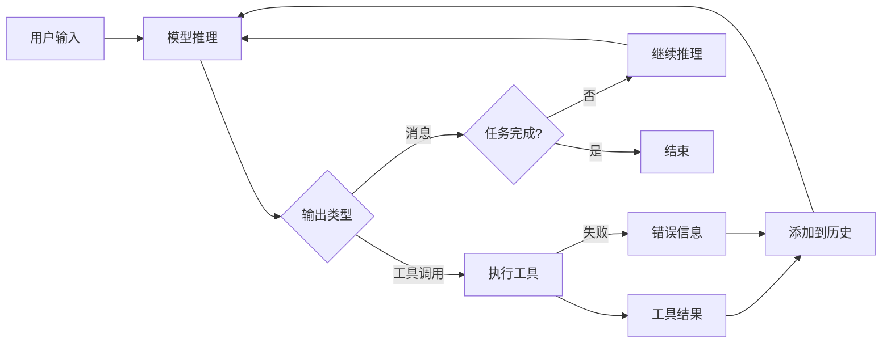
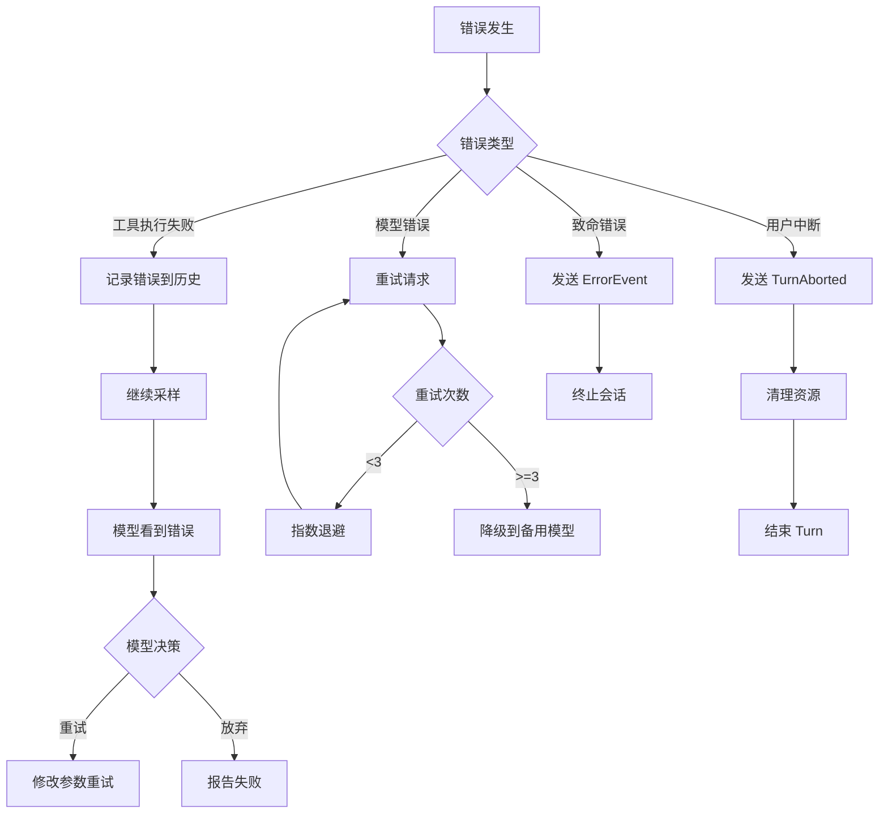

# Codex 事件循环与任务处理机制深度解析

> 作者：Hiyo Claude
> 日期：2026-02-22
> 版本：1.0
> 分析对象：OpenAI Codex CLI 事件循环核心机制

## 目录

- [1. 概述](#1-概述)
- [2. 核心概念](#2-核心概念)
- [3. 完整执行流程](#3-完整执行流程)
- [4. Turn 执行详解](#4-turn-执行详解)
- [5. 采样循环机制](#5-采样循环机制)
- [6. 工具调用与执行](#6-工具调用与执行)
- [7. 任务完成判断](#7-任务完成判断)
- [8. 状态管理与持久化](#8-状态管理与持久化)
- [9. 错误处理与恢复](#9-错误处理与恢复)
- [10. 总结](#10-总结)

---

## 1. 概述

Codex 的事件循环是一个复杂的异步状态机，负责协调用户输入、AI 模型推理、工具执行和结果反馈的整个生命周期。本文档将深入剖析从用户发起任务到任务完成的完整过程。

### 1.1 核心问题

本文档将回答以下关键问题：

1. 用户提交任务后，Codex 如何处理？
2. Codex 如何与 AI 模型交互？
3. 工具调用如何被执行和管理？
4. Codex 如何判断任务是否完成？
5. 如何实现自我迭代和持续改进？

### 1.2 关键文件索引

| 文件 | 功能 |
|------|------|
| `core/src/codex.rs:4474` | `run_turn()` - Turn 执行主函数 |
| `core/src/codex.rs:5600+` | 采样循环 - 处理模型响应流 |
| `core/src/stream_events_utils.rs:46` | `handle_output_item_done()` - 处理输出项 |
| `core/src/tasks/regular.rs:86` | `RegularTask::run()` - 常规任务执行 |
| `core/src/client.rs` | `ModelClient` - 模型通信客户端 |
| `core/src/tools/orchestrator.rs` | 工具编排器 |

---

## 2. 核心概念

### 2.1 Op/Event 模式

Codex 使用 **提交队列（Submission Queue）** 和 **事件队列（Event Queue）** 模式：

```rust
// 用户操作（输入）
pub enum Op {
    UserTurn { items: Vec<UserTurnItem> },  // 用户发起新轮次
    Interrupt,                               // 中断当前任务
    CleanBackgroundTerminals,                // 清理后台终端
    // ...
}

// Agent 事件（输出）
pub enum Event {
    TurnStarted { turn_id: String },        // 轮次开始
    ItemCompleted { item: ResponseItem },    // 项目完成
    ExecCommandOutput { delta: String },     // 命令输出增量
    TurnCompleted,                           // 轮次完成
    // ...
}
```

**通信流程**：



### 2.2 Turn（轮次）

**Turn** 是 Codex 中的基本执行单元，代表一次完整的用户-AI 交互周期。

**Turn 的生命周期**：



### 2.3 SessionTask

所有任务都实现 `SessionTask` trait：

```rust
#[async_trait]
pub trait SessionTask: Send + Sync {
    fn kind(&self) -> TaskKind;

    async fn run(
        self: Arc<Self>,
        session: Arc<SessionTaskContext>,
        ctx: Arc<TurnContext>,
        input: Vec<UserInput>,
        cancellation_token: CancellationToken,
    ) -> Option<String>;
}
```

**任务类型**：

- **RegularTask**: 常规对话任务
- **CompactTask**: 上下文压缩任务
- **ReviewTask**: 代码审查任务
- **UserShellCommandTask**: 用户 Shell 命令任务
- **UndoTask**: 撤销任务

---

## 3. 完整执行流程

### 3.1 从用户输入到任务完成



### 3.2 详细时序图



---

## 4. Turn 执行详解

### 4.1 run_turn 函数

**位置**: `core/src/codex.rs:4474`

```rust
pub(crate) async fn run_turn(
    sess: Arc<Session>,
    turn_context: Arc<TurnContext>,
    input: Vec<UserInput>,
    prewarmed_client_session: Option<ModelClientSession>,
    cancellation_token: CancellationToken,
) -> Option<String>
```

**执行步骤**：

1. **发送 TurnStarted 事件**
2. **预采样压缩**（如果需要）
3. **记录上下文更新**
4. **加载技能和连接器**
5. **构建工具路由器**
6. **记录用户输入到历史**
7. **进入采样循环**
8. **处理模型响应**
9. **执行工具调用**
10. **判断是否需要继续**
11. **发送 TurnCompleted 事件**

### 4.2 TurnContext 构建

```rust
pub struct TurnContext {
    pub sub_id: String,                    // Turn ID
    pub model: String,                     // 模型名称
    pub model_info: ModelInfo,             // 模型信息
    pub provider: ModelProviderInfo,       // 提供商信息
    pub cwd: PathBuf,                      // 工作目录
    pub approval_policy: AskForApproval,   // 审批策略
    pub sandbox_policy: SandboxPolicy,     // 沙箱策略
    pub tools_config: ToolsConfig,         // 工具配置
    pub collaboration_mode: CollaborationMode, // 协作模式
    // ...
}
```

**上下文包含**：

- 环境信息（工作目录、Shell 环境）
- Git 信息（分支、状态、最近提交）
- 文件系统快照
- 可用工具列表
- 审批和沙箱策略
- 模型配置

### 4.3 上下文更新记录

```rust
sess.record_context_updates_and_set_reference_context_item(
    turn_context.as_ref(),
    previous_model.as_deref(),
).await;
```

**更新内容**：

- 工作目录变化
- Git 状态变化
- 文件系统变化
- 环境变量变化

---

## 5. 采样循环机制

### 5.1 采样循环概述

采样循环是 Codex 的核心，负责与 AI 模型交互并处理响应。

**核心逻辑**（位置：`core/src/codex.rs:5600+`）：

```rust
loop {
    // 1. 构建 Prompt
    let prompt = build_prompt(&sess, &turn_context, &history).await;

    // 2. 调用模型流式 API
    let mut stream = model_client.stream(prompt).await?;

    // 3. 处理流式响应
    while let Some(event) = stream.next().await {
        match event {
            ResponseEvent::OutputItemDone(item) => {
                // 处理完成的输出项
                let result = handle_output_item_done(&mut ctx, item).await?;

                if let Some(tool_future) = result.tool_future {
                    // 执行工具调用
                    in_flight_futures.push(tool_future);
                }

                needs_follow_up |= result.needs_follow_up;
            }
            ResponseEvent::ContentDelta(delta) => {
                // 流式输出增量
                emit_content_delta(&sess, &turn_context, delta).await;
            }
            // ...
        }
    }

    // 4. 等待所有工具执行完成
    while let Some(tool_result) = in_flight_futures.next().await {
        history.push(tool_result?);
    }

    // 5. 判断是否需要继续采样
    if !needs_follow_up {
        break; // 任务完成
    }

    // 6. 继续下一轮采样
}
```

### 5.2 采样循环流程图



### 5.3 ResponseEvent 类型

```rust
pub enum ResponseEvent {
    Created,                          // 响应创建
    OutputItemDone(ResponseItem),     // 输出项完成
    ContentDelta { delta: String },   // 内容增量
    ReasoningDelta { delta: String }, // 推理增量
    Completed,                        // 响应完成
    // ...
}
```

---

## 6. 工具调用与执行

### 6.1 工具调用识别

**位置**: `core/src/stream_events_utils.rs:46`

```rust
pub(crate) async fn handle_output_item_done(
    ctx: &mut HandleOutputCtx,
    item: ResponseItem,
    previously_active_item: Option<TurnItem>,
) -> Result<OutputItemResult>
```

**处理逻辑**：

```rust
match ToolRouter::build_tool_call(ctx.sess.as_ref(), item.clone()).await {
    // 情况 1: 模型发出工具调用
    Ok(Some(call)) => {
        // 记录工具调用
        ctx.sess.record_conversation_items(&ctx.turn_context, &[item]).await;

        // 创建工具执行 Future
        let tool_future = ctx.tool_runtime
            .clone()
            .handle_tool_call(call, cancellation_token);

        output.needs_follow_up = true;  // 需要后续采样
        output.tool_future = Some(tool_future);
    }

    // 情况 2: 普通消息（无工具调用）
    Ok(None) => {
        // 发送 ItemCompleted 事件
        ctx.sess.emit_turn_item_completed(&ctx.turn_context, turn_item).await;

        // 记录到历史
        ctx.sess.record_conversation_items(&ctx.turn_context, &[item]).await;

        output.last_agent_message = extract_message(&item);
    }

    // 情况 3: 错误
    Err(err) => {
        // 将错误反馈到历史中
        let error_response = create_error_response(err);
        ctx.sess.record_conversation_items(&ctx.turn_context, &[error_response]).await;

        output.needs_follow_up = true;  // 让模型看到错误并重试
    }
}
```

### 6.2 工具执行流程

```mermaid
sequenceDiagram
    participant Loop as 采样循环
    participant Router as ToolRouter
    participant Runtime as ToolCallRuntime
    participant Handler as ToolHandler
    participant Sandbox as SandboxManager
    participant OS as 操作系统

    Loop->>Router: build_tool_call(item)
    Router->>Router: 解析工具名称和参数
    Router-->>Loop: ToolCall

    Loop->>Runtime: handle_tool_call(call)
    activate Runtime

    Runtime->>Handler: handle(payload)
    activate Handler

    alt Shell 工具
        Handler->>Handler: 创建 CommandSpec
        Handler->>Sandbox: transform(command)
        Sandbox->>Sandbox: 应用沙箱策略
        Sandbox->>OS: spawn_process()
        OS-->>Sandbox: stdout/stderr
        Sandbox-->>Handler: 输出流
    else 文件操作
        Handler->>Handler: 验证路径
        Handler->>OS: 读取/写入文件
        OS-->>Handler: 结果
    else MCP 工具
        Handler->>Handler: 调用 MCP 服务器
        Handler-->>Handler: MCP 响应
    end

    Handler-->>Runtime: ToolOutput
    deactivate Handler

    Runtime->>Runtime: 格式化输出
    Runtime-->>Loop: ResponseInputItem
    deactivate Runtime

    Loop->>Loop: 添加到历史
    Loop->>Loop: 继续采样
```

### 6.3 并行工具执行

Codex 支持并行执行多个工具调用：

```rust
let mut in_flight_futures = FuturesOrdered::new();

// 收集所有工具调用
for tool_call in tool_calls {
    let future = tool_runtime.handle_tool_call(tool_call, cancel_token);
    in_flight_futures.push(future);
}

// 并行等待所有工具完成
while let Some(result) = in_flight_futures.next().await {
    let tool_output = result?;
    history.push(tool_output);
}
```

---

## 7. 任务完成判断

### 7.1 完成条件

Codex 通过以下条件判断任务是否完成：

```rust
struct SamplingRequestResult {
    needs_follow_up: bool,        // 是否需要后续采样
    last_agent_message: Option<String>, // 最后的 Agent 消息
}
```

**判断逻辑**：



### 7.2 完成判断代码

```rust
// 在 handle_output_item_done 中
match ToolRouter::build_tool_call(sess, item).await {
    Ok(Some(call)) => {
        // 有工具调用 -> 需要后续
        output.needs_follow_up = true;
        output.tool_future = Some(execute_tool(call));
    }
    Ok(None) => {
        // 无工具调用 -> 检查消息
        if is_final_message(&item) {
            output.needs_follow_up = false;  // 任务完成
        } else {
            output.needs_follow_up = false;  // 默认完成
        }
        output.last_agent_message = extract_message(&item);
    }
    Err(err) => {
        // 错误 -> 需要后续（让模型看到错误）
        output.needs_follow_up = true;
    }
}

// 在采样循环中
if !needs_follow_up && in_flight_futures.is_empty() {
    // 所有工具执行完成且不需要后续 -> 任务完成
    break;
}
```

### 7.3 自我迭代机制

Codex 通过以下机制实现自我迭代：

1. **工具结果反馈**：工具执行结果被添加到对话历史中
2. **错误重试**：如果工具执行失败，错误信息反馈给模型
3. **上下文更新**：每次采样前更新环境上下文
4. **自动压缩**：当上下文过长时自动压缩历史

**迭代流程**：



**示例场景**：

```
用户: "创建一个 TODO 应用"

Turn 1:
  模型: 调用 shell("mkdir todo-app")
  工具: 执行成功
  -> 继续

Turn 1 (续):
  模型: 调用 write_file("todo-app/index.html", ...)
  工具: 写入成功
  -> 继续

Turn 1 (续):
  模型: 调用 write_file("todo-app/app.js", ...)
  工具: 写入成功
  -> 继续

Turn 1 (续):
  模型: "我已经创建了一个简单的 TODO 应用..."
  -> 任务完成
```

---

## 8. 状态管理与持久化

### 8.1 会话状态

```rust
pub struct SessionState {
    history: Vec<ResponseItem>,           // 对话历史
    reference_context_item: Option<TurnContextItem>, // 参考上下文
    active_turn: Option<ActiveTurn>,      // 当前活跃 Turn
    mcp_tool_selection: Option<Vec<String>>, // MCP 工具选择
    // ...
}
```

### 8.2 Rollout 持久化

**存储格式**：JSONL（每行一个 JSON 对象）

```rust
pub struct RolloutItem {
    pub turn_id: String,
    pub timestamp: DateTime<Utc>,
    pub op: Op,
    pub events: Vec<Event>,
}
```

**持久化时机**：

- Turn 开始时
- 每个事件发生时
- Turn 完成时

### 8.3 状态恢复

```rust
// 从 Rollout 文件恢复会话
pub async fn resume_from_rollout(path: &Path) -> Result<Session> {
    let items = read_rollout_file(path)?;

    let mut history = Vec::new();
    for item in items {
        match item {
            RolloutItem::EventMsg(EventMsg::UserMessage(msg)) => {
                history.push(user_message_to_response_item(msg));
            }
            RolloutItem::EventMsg(EventMsg::ItemCompleted(item)) => {
                history.push(item.item);
            }
            // ...
        }
    }

    Session::new_with_history(config, history).await
}
```

---

## 9. 错误处理与恢复

### 9.1 错误类型

```rust
pub enum CodexErr {
    Stream(String, Option<Box<dyn Error>>),  // 流错误
    TurnAborted,                              // Turn 中止
    ToolExecutionFailed(String),              // 工具执行失败
    ModelError(String),                       // 模型错误
    // ...
}
```

### 9.2 错误处理策略



### 9.3 重试机制

```rust
async fn stream_with_retry(
    client: &ModelClient,
    prompt: Prompt,
    max_retries: usize,
) -> Result<ResponseStream> {
    let mut attempt = 0;

    loop {
        match client.stream(prompt.clone()).await {
            Ok(stream) => return Ok(stream),
            Err(err) if attempt < max_retries => {
                attempt += 1;
                let backoff = Duration::from_secs(2_u64.pow(attempt as u32));
                tokio::time::sleep(backoff).await;
            }
            Err(err) => return Err(err),
        }
    }
}
```

---

## 10. 总结

### 10.1 核心机制总结

1. **Op/Event 模式**：清晰的输入输出分离
2. **Turn 生命周期**：完整的任务执行单元
3. **采样循环**：持续与模型交互直到任务完成
4. **工具执行**：安全的沙箱化工具调用
5. **自我迭代**：通过工具结果反馈实现持续改进

### 10.2 任务完成判断

Codex 通过以下方式判断任务是否完成：

- **无工具调用**：模型返回纯消息且 `needs_follow_up = false`
- **所有工具完成**：`in_flight_futures` 为空
- **明确结束标记**：模型消息中包含任务完成的明确表述

### 10.3 自我迭代机制

Codex 的自我迭代通过以下循环实现：

```
用户输入 -> 模型推理 -> 工具调用 -> 工具结果 -> 添加到历史 -> 模型推理 -> ...
```

每次迭代中：
- 模型看到之前的所有操作和结果
- 可以根据结果调整策略
- 可以重试失败的操作
- 可以分解复杂任务为多个步骤

### 10.4 关键设计优势

1. **异步并发**：工具可以并行执行
2. **流式处理**：实时反馈，用户体验好
3. **状态持久化**：支持会话恢复和回溯
4. **错误恢复**：优雅的错误处理和重试机制
5. **安全隔离**：沙箱化工具执行

### 10.5 性能优化

- **预热连接**：提前建立 WebSocket 连接
- **上下文压缩**：自动压缩过长的历史
- **并行工具执行**：减少总执行时间
- **增量输出**：流式传输减少延迟

---

**文档结束**
