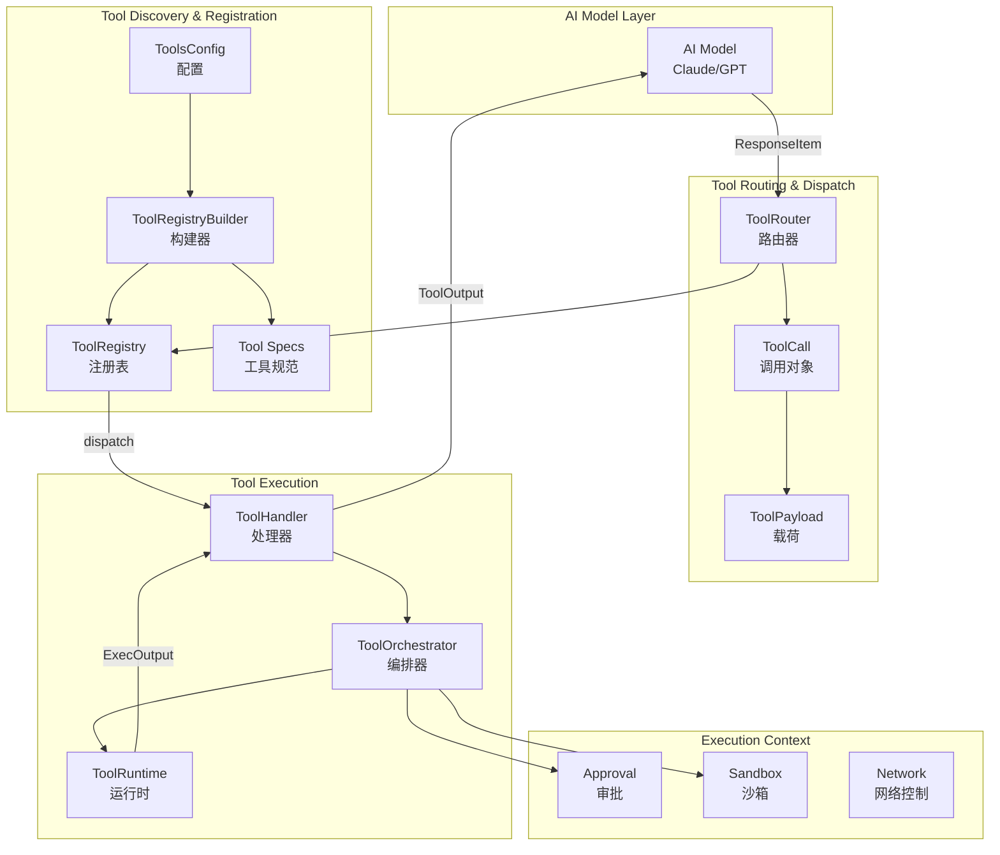
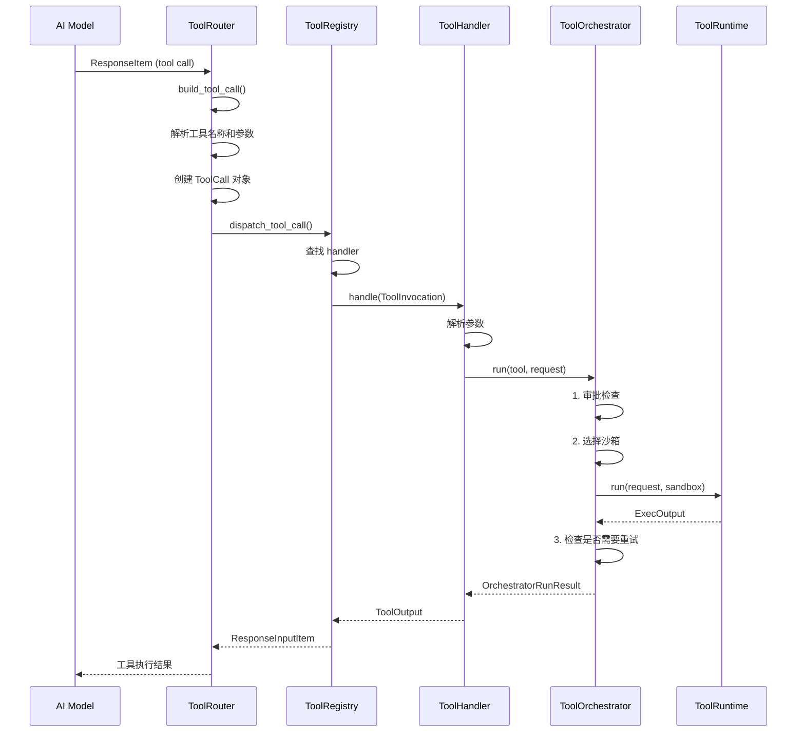
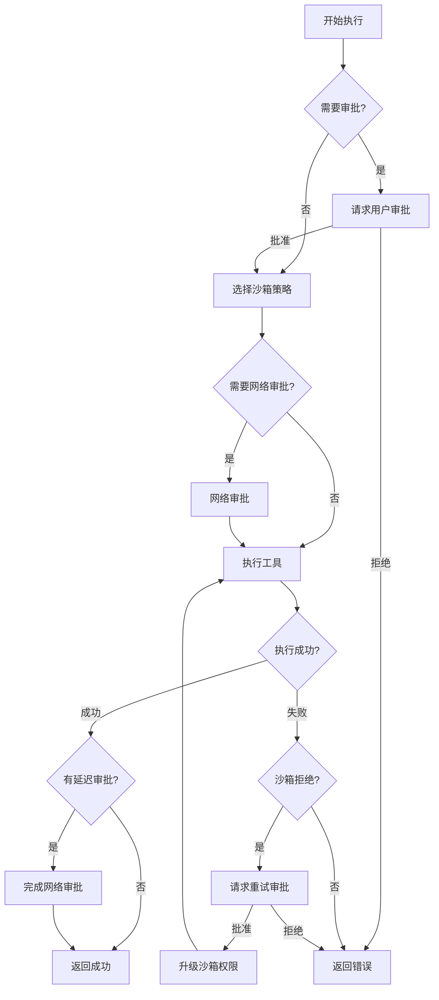
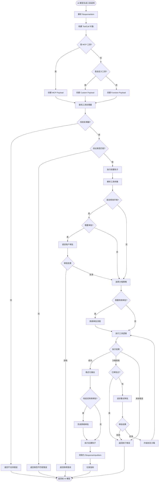
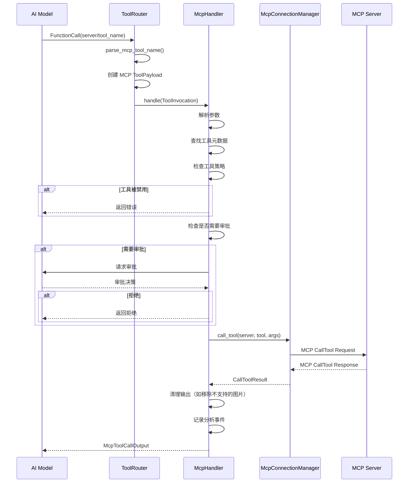
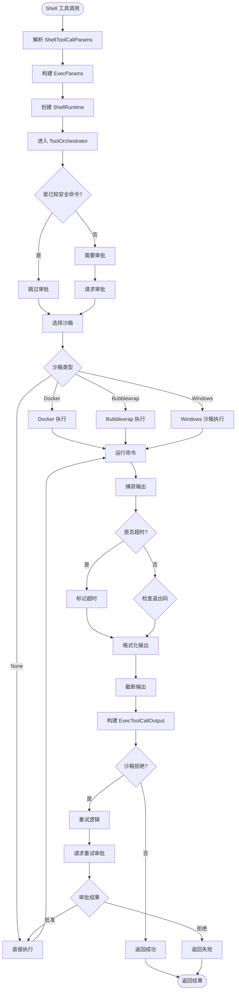

# Codex 工具调用机制详解

> 作者: Hiyo Claude
> 日期: 2026-02-22
> 基于: Codex Rust 代码库分析

## 目录

1. [概述](#概述)
2. [工具系统架构](#工具系统架构)
3. [工具发现与注册](#工具发现与注册)
4. [工具调用流程](#工具调用流程)
5. [工具执行与编排](#工具执行与编排)
6. [工具结果处理](#工具结果处理)
7. [关键数据结构](#关键数据结构)
8. [流程图](#流程图)

---

## 概述

Codex 是一个基于 Rust 实现的 AI 代码助手系统，其核心功能之一是通过工具调用（Tool Calling）机制让 AI 模型能够执行各种操作，如运行 shell 命令、读写文件、调用 MCP 服务等。

本文档深入分析 Codex 的工具调用机制，包括：
- 工具如何被发现和注册
- AI 模型如何选择和调用工具
- 工具如何被执行
- 执行结果如何被处理和返回

### 核心模块

工具调用机制主要涉及以下模块：

- **`tools/spec.rs`**: 工具规范定义和构建
- **`tools/registry.rs`**: 工具注册表和分发
- **`tools/router.rs`**: 工具路由和调用构建
- **`tools/orchestrator.rs`**: 工具执行编排（审批、沙箱、重试）
- **`tools/handlers/`**: 各种具体工具的处理器实现
- **`mcp_tool_call.rs`**: MCP 工具调用处理

---

## 工具系统架构

### 整体架构图



### 三层架构

1. **规范层（Specification Layer）**
   - 定义工具的接口规范（JSON Schema）
   - 配置哪些工具可用
   - 构建工具注册表

2. **路由层（Routing Layer）**
   - 解析 AI 模型的工具调用请求
   - 路由到对应的工具处理器
   - 处理不同类型的工具调用（Function、MCP、Custom）

3. **执行层（Execution Layer）**
   - 执行工具逻辑
   - 处理审批、沙箱、网络控制
   - 返回执行结果

---

## 工具发现与注册

### 工具配置（ToolsConfig）

工具系统通过 `ToolsConfig` 配置哪些工具可用：

```rust
pub(crate) struct ToolsConfig {
    pub shell_type: ConfigShellToolType,           // Shell 工具类型
    pub allow_login_shell: bool,                   // 是否允许登录 shell
    pub apply_patch_tool_type: Option<ApplyPatchToolType>, // 补丁工具类型
    pub web_search_mode: Option<WebSearchMode>,    // Web 搜索模式
    pub agent_roles: BTreeMap<String, AgentRoleConfig>, // Agent 角色
    pub search_tool: bool,                         // 是否启用搜索工具
    pub js_repl_enabled: bool,                     // 是否启用 JS REPL
    pub collab_tools: bool,                        // 是否启用协作工具
    pub collaboration_modes_tools: bool,           // 是否启用协作模式工具
    pub experimental_supported_tools: Vec<String>, // 实验性工具列表
}
```

配置根据以下因素决定：
- **模型信息（ModelInfo）**: 不同模型支持不同的工具
- **功能开关（Features）**: 通过 feature flags 控制
- **用户配置**: 用户自定义的配置选项

### 工具规范构建（build_specs）

`build_specs` 函数是工具注册的核心入口，位于 `tools/spec.rs:1426`：

```rust
pub(crate) fn build_specs(
    config: &ToolsConfig,
    mcp_tools: Option<HashMap<String, rmcp::model::Tool>>,
    app_tools: Option<HashMap<String, ToolInfo>>,
    dynamic_tools: &[DynamicToolSpec],
) -> ToolRegistryBuilder
```

该函数执行以下步骤：

1. **创建构建器**: `ToolRegistryBuilder::new()`
2. **注册内置工具**: 根据配置注册各种工具
3. **注册 MCP 工具**: 如果有 MCP 连接，注册 MCP 工具
4. **注册动态工具**: 注册运行时动态添加的工具
5. **返回构建器**: 包含所有工具规范和处理器

### 内置工具注册示例

```rust
// Shell 工具注册
match &config.shell_type {
    ConfigShellToolType::Default => {
        builder.push_spec_with_parallel_support(create_shell_tool(), true);
    }
    ConfigShellToolType::UnifiedExec => {
        builder.push_spec_with_parallel_support(
            create_exec_command_tool(config.allow_login_shell),
            true,
        );
        builder.push_spec(create_write_stdin_tool());
        builder.register_handler("exec_command", unified_exec_handler.clone());
        builder.register_handler("write_stdin", unified_exec_handler);
    }
    // ... 其他类型
}

// 文件操作工具
builder.push_spec_with_parallel_support(create_read_file_tool(), true);
builder.push_spec_with_parallel_support(create_list_dir_tool(), true);
builder.push_spec_with_parallel_support(create_grep_files_tool(), true);

// 注册处理器
builder.register_handler("read_file", Arc::new(ReadFileHandler));
builder.register_handler("list_dir", Arc::new(ListDirHandler));
builder.register_handler("grep_files", Arc::new(GrepFilesHandler));
```

### 工具规范类型（ToolSpec）

Codex 支持多种工具规范类型：

```rust
pub enum ToolSpec {
    // 标准 JSON 函数工具（OpenAI 格式）
    Function(ResponsesApiTool),

    // 本地 Shell 工具（特殊类型）
    LocalShell {},

    // Web 搜索工具
    WebSearch { mode: WebSearchMode },

    // 自由格式工具（非结构化输入）
    Freeform(FreeformTool),
}
```

每种工具规范包含：
- **name**: 工具名称（唯一标识符）
- **description**: 工具描述（供 AI 模型理解）
- **parameters**: JSON Schema 定义的参数结构
- **strict**: 是否严格模式（要求参数完全匹配）

### 工具注册表（ToolRegistry）

`ToolRegistry` 维护工具名称到处理器的映射：

```rust
pub struct ToolRegistry {
    handlers: HashMap<String, Arc<dyn ToolHandler>>,
}

impl ToolRegistry {
    pub fn handler(&self, name: &str) -> Option<Arc<dyn ToolHandler>> {
        self.handlers.get(name).map(Arc::clone)
    }
}
```

### MCP 工具注册

MCP（Model Context Protocol）工具通过外部服务器提供：

```rust
// MCP 工具转换为 OpenAI 格式
if let Some(mcp_tools) = mcp_tools {
    for (full_name, mcp_tool) in mcp_tools {
        let openai_tool = mcp_tool_to_openai_tool(full_name.clone(), mcp_tool)?;
        builder.push_spec(ToolSpec::Function(openai_tool));
        builder.register_handler(&full_name, mcp_handler.clone());
    }
}
```

MCP 工具名称格式：`server_name/tool_name`

### 动态工具注册

动态工具可以在运行时添加：

```rust
for dynamic_tool in dynamic_tools {
    let spec = ToolSpec::Function(ResponsesApiTool {
        name: dynamic_tool.name.clone(),
        description: dynamic_tool.description.clone(),
        strict: false,
        parameters: dynamic_tool.input_schema.clone(),
    });
    builder.push_spec(spec);
    builder.register_handler(&dynamic_tool.name, dynamic_tool_handler.clone());
}
```

---

## 工具调用流程

### 流程概览



### 步骤 1: 构建工具调用（build_tool_call）

位于 `tools/router.rs:71`，将 AI 模型的响应转换为 `ToolCall` 对象：

```rust
pub async fn build_tool_call(
    session: &Session,
    item: ResponseItem,
) -> Result<Option<ToolCall>, FunctionCallError> {
    match item {
        // 标准函数调用
        ResponseItem::FunctionCall { name, arguments, call_id, .. } => {
            // 检查是否是 MCP 工具
            if let Some((server, tool)) = session.parse_mcp_tool_name(&name).await {
                Ok(Some(ToolCall {
                    tool_name: name,
                    call_id,
                    payload: ToolPayload::Mcp {
                        server,
                        tool,
                        raw_arguments: arguments,
                    },
                }))
            } else {
                // 普通函数工具
                Ok(Some(ToolCall {
                    tool_name: name,
                    call_id,
                    payload: ToolPayload::Function { arguments },
                }))
            }
        }

        // 自定义工具调用
        ResponseItem::CustomToolCall { name, input, call_id, .. } => {
            Ok(Some(ToolCall {
                tool_name: name,
                call_id,
                payload: ToolPayload::Custom { input },
            }))
        }

        // 本地 Shell 调用
        ResponseItem::LocalShellCall { id, call_id, action, .. } => {
            let call_id = call_id.or(id)
                .ok_or(FunctionCallError::MissingLocalShellCallId)?;

            match action {
                LocalShellAction::Exec(exec) => {
                    Ok(Some(ToolCall {
                        tool_name: "local_shell".to_string(),
                        call_id,
                        payload: ToolPayload::LocalShell {
                            params: ShellToolCallParams { /* ... */ }
                        },
                    }))
                }
            }
        }

        _ => Ok(None),
    }
}
```

### 步骤 2: 分发工具调用（dispatch_tool_call）

位于 `tools/router.rs:143`，将工具调用路由到对应的处理器：

```rust
pub async fn dispatch_tool_call(
    &self,
    session: Arc<Session>,
    turn: Arc<TurnContext>,
    tracker: SharedTurnDiffTracker,
    call: ToolCall,
    source: ToolCallSource,
) -> Result<ResponseInputItem, FunctionCallError> {
    let ToolCall { tool_name, call_id, payload } = call;

    // 创建工具调用上下文
    let invocation = ToolInvocation {
        session,
        turn,
        tracker,
        call_id,
        tool_name: tool_name.clone(),
        payload,
    };

    // 分发到注册表
    self.registry.dispatch(invocation).await
}
```

### 步骤 3: 注册表分发（Registry::dispatch）

位于 `tools/registry.rs:79`，查找处理器并执行：

```rust
pub async fn dispatch(
    &self,
    invocation: ToolInvocation,
) -> Result<ResponseInputItem, FunctionCallError> {
    let tool_name = invocation.tool_name.clone();
    let call_id = invocation.call_id.clone();

    // 查找处理器
    let handler = match self.handler(tool_name.as_ref()) {
        Some(handler) => handler,
        None => {
            let message = unsupported_tool_call_message(&invocation.payload, &tool_name);
            return Err(FunctionCallError::RespondToModel(message));
        }
    };

    // 验证处理器类型匹配
    if !handler.matches_kind(&invocation.payload) {
        return Err(FunctionCallError::RespondToModel(
            format!("tool {tool_name} does not support this payload type")
        ));
    }

    // 执行前钩子（hooks）
    run_before_tool_use_hooks(&invocation).await?;

    // 执行工具
    let start = Instant::now();
    let dispatch = handler.handle(invocation.clone()).await;
    let duration = start.elapsed();

    // 处理执行结果
    let output = match dispatch {
        Ok(output) => output,
        Err(err) => {
            // 记录错误并返回
            return Err(err);
        }
    };

    // 执行后钩子
    run_after_tool_use_hooks(&invocation, &output, duration).await;

    // 转换为响应格式
    Ok(output.into_response(&call_id, &invocation.payload))
}
```

### 步骤 4: 工具处理器执行（ToolHandler::handle）

每个工具都有自己的处理器实现 `ToolHandler` trait：

```rust
#[async_trait]
pub trait ToolHandler: Send + Sync {
    // 工具类型（Function 或 MCP）
    fn kind(&self) -> ToolKind;

    // 是否匹配载荷类型
    fn matches_kind(&self, payload: &ToolPayload) -> bool;

    // 是否会修改环境（用于审批决策）
    async fn is_mutating(&self, invocation: &ToolInvocation) -> bool {
        false
    }

    // 执行工具逻辑
    async fn handle(&self, invocation: ToolInvocation)
        -> Result<ToolOutput, FunctionCallError>;
}
```

#### Shell 工具处理器示例

位于 `tools/handlers/shell.rs:133`：

```rust
#[async_trait]
impl ToolHandler for ShellHandler {
    fn kind(&self) -> ToolKind {
        ToolKind::Function
    }

    async fn is_mutating(&self, invocation: &ToolInvocation) -> bool {
        match &invocation.payload {
            ToolPayload::Function { arguments } => {
                serde_json::from_str::<ShellToolCallParams>(arguments)
                    .map(|params| !is_known_safe_command(&params.command))
                    .unwrap_or(true)
            }
            _ => true,
        }
    }

    async fn handle(&self, invocation: ToolInvocation)
        -> Result<ToolOutput, FunctionCallError> {
        // 1. 解析参数
        let params: ShellToolCallParams = parse_arguments(&arguments)?;

        // 2. 构建执行参数
        let exec_params = Self::to_exec_params(&params, &turn, session.conversation_id);

        // 3. 通过编排器执行
        Self::run_exec_like(RunExecLikeArgs {
            tool_name,
            exec_params,
            session,
            turn,
            tracker,
            call_id,
            freeform: false,
        }).await
    }
}
```

---

## 工具执行与编排

### 工具编排器（ToolOrchestrator）

`ToolOrchestrator` 负责协调工具执行的各个方面，位于 `tools/orchestrator.rs:32`：

```rust
pub(crate) struct ToolOrchestrator {
    sandbox: SandboxManager,
}

impl ToolOrchestrator {
    pub async fn run<Rq, Out, T>(
        &mut self,
        tool: &mut T,
        req: &Rq,
        tool_ctx: &ToolCtx<'_>,
        turn_ctx: &TurnContext,
        approval_policy: AskForApproval,
    ) -> Result<OrchestratorRunResult<Out>, ToolError>
    where
        T: ToolRuntime<Rq, Out>,
    {
        // 1. 审批检查
        // 2. 选择沙箱策略
        // 3. 执行工具
        // 4. 处理沙箱拒绝并重试
        // 5. 网络审批
    }
}
```

### 执行流程详解



### 1. 审批检查

```rust
// 确定是否需要审批
let requirement = tool.exec_approval_requirement(req).unwrap_or_else(|| {
    default_exec_approval_requirement(approval_policy, &turn_ctx.sandbox_policy)
});

match requirement {
    ExecApprovalRequirement::Skip { .. } => {
        // 无需审批，直接执行
        otel.tool_decision(tool_name, call_id, &ReviewDecision::Approved, otel_cfg);
    }
    ExecApprovalRequirement::Forbidden { reason } => {
        // 禁止执行
        return Err(ToolError::Rejected(reason));
    }
    ExecApprovalRequirement::NeedsApproval { reason, .. } => {
        // 需要用户审批
        let approval_ctx = ApprovalCtx {
            session: tool_ctx.session,
            turn: turn_ctx,
            call_id: &tool_ctx.call_id,
            retry_reason: reason,
            network_approval_context: None,
        };

        let decision = tool.request_approval(&approval_ctx).await?;
        match decision {
            ReviewDecision::Approved => {
                already_approved = true;
            }
            ReviewDecision::Rejected => {
                return Err(ToolError::Rejected("user rejected".to_string()));
            }
        }
    }
}
```

### 2. 沙箱选择

```rust
// 选择沙箱类型
let sandbox_type = self.sandbox.select_sandbox(
    &turn_ctx.sandbox_policy,
    turn_ctx.windows_sandbox_level,
    use_linux_sandbox_bwrap,
);

let attempt = SandboxAttempt {
    sandbox: sandbox_type,
    policy: &turn_ctx.sandbox_policy,
    enforce_managed_network: has_managed_network_requirements,
    manager: &self.sandbox,
    sandbox_cwd: &turn_ctx.cwd,
    codex_linux_sandbox_exe: turn_ctx.codex_linux_sandbox_exe.as_deref(),
    use_linux_sandbox_bwrap,
    windows_sandbox_level: turn_ctx.windows_sandbox_level,
};
```

沙箱类型包括：
- **None**: 无沙箱（完全权限）
- **Docker**: Docker 容器沙箱
- **Bubblewrap**: Linux bubblewrap 沙箱
- **WindowsSandbox**: Windows 沙箱

### 3. 执行工具

```rust
// 开始网络审批（如果需要）
let network_approval = begin_network_approval(
    tool_ctx.session,
    &tool_ctx.turn.sub_id,
    &tool_ctx.call_id,
    has_managed_network_requirements,
    tool.network_approval_spec(req, tool_ctx),
).await;

// 执行工具
let run_result = tool.run(req, &attempt, &attempt_tool_ctx).await;
```

### 4. 处理沙箱拒绝并重试

```rust
match first_result {
    Ok(output) => {
        // 成功，返回结果
        return Ok(OrchestratorRunResult {
            output,
            deferred_network_approval: first_deferred_network_approval,
        });
    }
    Err(ToolError::SandboxDenied(output)) => {
        // 沙箱拒绝，尝试请求升级权限
        if already_approved {
            return Err(ToolError::SandboxDenied(output));
        }

        let denial_reason = build_denial_reason_from_output(&output);
        let approval_ctx = ApprovalCtx {
            session: tool_ctx.session,
            turn: turn_ctx,
            call_id: &tool_ctx.call_id,
            retry_reason: denial_reason,
            network_approval_context: None,
        };

        let decision = tool.request_approval(&approval_ctx).await?;
        match decision {
            ReviewDecision::Approved => {
                // 用户批准，使用无沙箱重试
                let escalated_attempt = SandboxAttempt {
                    sandbox: SandboxType::None,
                    // ... 其他参数
                };

                let (retry_result, retry_deferred) = Self::run_attempt(
                    tool, req, tool_ctx, &escalated_attempt,
                    has_managed_network_requirements
                ).await;

                return retry_result.map(|output| OrchestratorRunResult {
                    output,
                    deferred_network_approval: retry_deferred,
                });
            }
            ReviewDecision::Rejected => {
                return Err(ToolError::SandboxDenied(output));
            }
        }
    }
    Err(err) => return Err(err),
}
```

### 5. 网络审批

网络审批分为两种模式：

**立即模式（Immediate）**: 在工具执行前完成审批
```rust
NetworkApprovalMode::Immediate => {
    let finalize_result =
        finish_immediate_network_approval(tool_ctx.session, network_approval).await;
    if let Err(err) = finalize_result {
        return (Err(err), None);
    }
    (run_result, None)
}
```

**延迟模式（Deferred）**: 在工具执行成功后完成审批
```rust
NetworkApprovalMode::Deferred => {
    let deferred = network_approval.into_deferred();
    if run_result.is_err() {
        finish_deferred_network_approval(tool_ctx.session, deferred).await;
        return (run_result, None);
    }
    (run_result, deferred)
}
```

---

## 工具结果处理

### ToolOutput 结构

工具执行结果封装在 `ToolOutput` 中：

```rust
pub enum ToolOutput {
    // 函数工具输出
    Function {
        body: FunctionCallOutputBody,
        success: Option<bool>,
    },

    // MCP 工具输出
    Mcp {
        result: Result<CallToolResult, String>,
    },
}
```

### 输出转换

`ToolOutput` 需要转换为 `ResponseInputItem` 返回给 AI 模型：

```rust
impl ToolOutput {
    pub fn into_response(self, call_id: &str, payload: &ToolPayload)
        -> ResponseInputItem {
        match self {
            ToolOutput::Function { body, success } => {
                // 自定义工具使用字符串输出
                if matches!(payload, ToolPayload::Custom { .. }) {
                    return ResponseInputItem::CustomToolCallOutput {
                        call_id: call_id.to_string(),
                        output: body.to_text().unwrap_or_default(),
                    };
                }

                // 函数工具保留结构化输出
                ResponseInputItem::FunctionCallOutput {
                    call_id: call_id.to_string(),
                    output: FunctionCallOutputPayload { body, success },
                }
            }

            // MCP 工具直接返回结果
            ToolOutput::Mcp { result } => {
                ResponseInputItem::McpToolCallOutput {
                    call_id: call_id.to_string(),
                    result,
                }
            }
        }
    }
}
```

### FunctionCallOutputBody 类型

输出内容可以是多种格式：

```rust
pub enum FunctionCallOutputBody {
    // 纯文本输出
    Text(String),

    // 结构化内容（支持文本、图片等）
    Content(Vec<FunctionCallOutputContentItem>),
}

pub enum FunctionCallOutputContentItem {
    // 文本内容
    InputText { text: String },

    // 图片内容
    InputImage { source: ImageSource },

    // 其他内容类型...
}
```

### 输出截断

为了避免输出过大，Codex 会对输出进行截断：

```rust
pub fn format_exec_output_for_model_structured(
    exec_output: &ExecToolCallOutput,
    truncation_policy: TruncationPolicy,
) -> String {
    let formatted_output = format_exec_output_str(exec_output, truncation_policy);

    let payload = ExecOutput {
        output: &formatted_output,
        metadata: ExecMetadata {
            exit_code: exec_output.exit_code,
            duration_seconds: (exec_output.duration.as_secs_f32() * 10.0).round() / 10.0,
        },
    };

    serde_json::to_string(&payload).expect("serialize ExecOutput")
}
```

### 成功判断

工具调用是否成功通过以下方式判断：

```rust
impl ToolOutput {
    pub fn success_for_logging(&self) -> bool {
        match self {
            ToolOutput::Function { success, .. } => {
                success.unwrap_or(true)  // 默认为成功
            }
            ToolOutput::Mcp { result } => {
                result.is_ok()
            }
        }
    }
}
```

对于 Shell 命令：
- **退出码 0**: 成功
- **退出码非 0**: 失败（但仍返回输出）
- **超时**: 失败，并在输出中标注

---

## 关键数据结构

### ToolInvocation

工具调用的完整上下文：

```rust
pub struct ToolInvocation {
    pub session: Arc<Session>,              // 会话对象
    pub turn: Arc<TurnContext>,             // 回合上下文
    pub tracker: SharedTurnDiffTracker,     // 变更跟踪器
    pub call_id: String,                    // 调用 ID
    pub tool_name: String,                  // 工具名称
    pub payload: ToolPayload,               // 调用载荷
}
```

### ToolPayload

工具调用的参数载荷：

```rust
pub enum ToolPayload {
    // 函数工具：JSON 参数
    Function {
        arguments: String,
    },

    // 自定义工具：自由格式输入
    Custom {
        input: String,
    },

    // 本地 Shell：结构化参数
    LocalShell {
        params: ShellToolCallParams,
    },

    // MCP 工具：服务器、工具名、参数
    Mcp {
        server: String,
        tool: String,
        raw_arguments: String,
    },
}
```

### ToolCtx

工具执行上下文（简化版）：

```rust
pub struct ToolCtx<'a> {
    pub session: &'a Session,
    pub turn: &'a TurnContext,
    pub call_id: String,
    pub tool_name: String,
}
```

### SandboxAttempt

沙箱执行尝试的配置：

```rust
pub struct SandboxAttempt<'a> {
    pub sandbox: SandboxType,                    // 沙箱类型
    pub policy: &'a SandboxPolicy,               // 沙箱策略
    pub enforce_managed_network: bool,           // 是否强制网络管理
    pub manager: &'a SandboxManager,             // 沙箱管理器
    pub sandbox_cwd: &'a Path,                   // 沙箱工作目录
    pub codex_linux_sandbox_exe: Option<&'a Path>, // Linux 沙箱可执行文件
    pub use_linux_sandbox_bwrap: bool,           // 是否使用 bubblewrap
    pub windows_sandbox_level: WindowsSandboxLevel, // Windows 沙箱级别
}
```

### TurnContext

回合上下文包含执行环境信息：

```rust
pub struct TurnContext {
    pub sub_id: String,                          // 子 ID
    pub cwd: PathBuf,                            // 当前工作目录
    pub sandbox_policy: SandboxPolicy,           // 沙箱策略
    pub network: NetworkPolicy,                  // 网络策略
    pub shell_environment_policy: ShellEnvironmentPolicy, // Shell 环境策略
    pub windows_sandbox_level: WindowsSandboxLevel, // Windows 沙箱级别
    pub features: Features,                      // 功能开关
    pub config: Arc<Config>,                     // 配置
    pub model_info: ModelInfo,                   // 模型信息
    pub otel_manager: OtelManager,               // 遥测管理器
    // ... 更多字段
}
```

---

## 流程图

### 完整工具调用流程



### MCP 工具调用流程



### Shell 工具执行流程



---

## 具体工具实现示例

### 1. Shell 工具（shell/shell_command）

**工具规范**:
```rust
fn create_shell_command_tool(allow_login_shell: bool) -> ToolSpec {
    let properties = BTreeMap::from([
        ("command", JsonSchema::String {
            description: Some("Shell command to execute.".to_string()),
        }),
        ("workdir", JsonSchema::String {
            description: Some("Working directory to run the command in".to_string()),
        }),
        ("timeout_ms", JsonSchema::Number {
            description: Some("Timeout for the command in milliseconds".to_string()),
        }),
        // ... 审批参数
    ]);

    ToolSpec::Function(ResponsesApiTool {
        name: "shell_command".to_string(),
        description: "Runs a shell command and returns its output.".to_string(),
        strict: false,
        parameters: JsonSchema::Object {
            properties,
            required: Some(vec!["command".to_string()]),
            additional_properties: Some(false.into()),
        },
    })
}
```

**处理器实现**:
```rust
impl ShellCommandHandler {
    fn to_exec_params(
        params: &ShellCommandToolCallParams,
        session: &Session,
        turn_context: &TurnContext,
        thread_id: ThreadId,
        allow_login_shell: bool,
    ) -> Result<ExecParams, FunctionCallError> {
        let shell = session.user_shell();
        let use_login_shell = Self::resolve_use_login_shell(params.login, allow_login_shell)?;
        let command = Self::base_command(shell.as_ref(), &params.command, use_login_shell);

        Ok(ExecParams {
            command,
            cwd: turn_context.resolve_path(params.workdir.clone()),
            expiration: params.timeout_ms.into(),
            env: create_env(&turn_context.shell_environment_policy, Some(thread_id)),
            network: turn_context.network.clone(),
            sandbox_permissions: params.sandbox_permissions.unwrap_or_default(),
            windows_sandbox_level: turn_context.windows_sandbox_level,
            justification: params.justification.clone(),
            arg0: None,
        })
    }
}
```

### 2. 文件读取工具（read_file）

**工具规范**:
```rust
fn create_read_file_tool() -> ToolSpec {
    let properties = BTreeMap::from([
        ("file_path", JsonSchema::String {
            description: Some("Absolute path to the file".to_string()),
        }),
        ("offset", JsonSchema::Number {
            description: Some("Line number to start reading from".to_string()),
        }),
        ("limit", JsonSchema::Number {
            description: Some("Maximum number of lines to return".to_string()),
        }),
        // ... 缩进模式参数
    ]);

    ToolSpec::Function(ResponsesApiTool {
        name: "read_file".to_string(),
        description: "Reads a file from the filesystem.".to_string(),
        strict: false,
        parameters: JsonSchema::Object {
            properties,
            required: Some(vec!["file_path".to_string()]),
            additional_properties: Some(false.into()),
        },
    })
}
```

**处理器实现**:
```rust
#[async_trait]
impl ToolHandler for ReadFileHandler {
    fn kind(&self) -> ToolKind {
        ToolKind::Function
    }

    async fn is_mutating(&self, _invocation: &ToolInvocation) -> bool {
        false  // 读取文件不修改环境
    }

    async fn handle(&self, invocation: ToolInvocation)
        -> Result<ToolOutput, FunctionCallError> {
        let params: ReadFileParams = parse_arguments(&invocation.payload.arguments())?;

        // 解析文件路径
        let file_path = invocation.turn.resolve_path(Some(params.file_path));

        // 读取文件内容
        let content = tokio::fs::read_to_string(&file_path).await
            .map_err(|e| FunctionCallError::RespondToModel(
                format!("Failed to read file: {}", e)
            ))?;

        // 应用偏移和限制
        let lines: Vec<&str> = content.lines().collect();
        let offset = params.offset.unwrap_or(0);
        let limit = params.limit.unwrap_or(lines.len());
        let selected_lines = &lines[offset..std::cmp::min(offset + limit, lines.len())];

        // 格式化输出（带行号）
        let output = selected_lines.iter()
            .enumerate()
            .map(|(i, line)| format!("{:5}→{}", offset + i + 1, line))
            .collect::<Vec<_>>()
            .join("\n");

        Ok(ToolOutput::Function {
            body: FunctionCallOutputBody::Text(output),
            success: Some(true),
        })
    }
}
```

### 3. MCP 工具

**MCP 工具转换**:
```rust
fn mcp_tool_to_openai_tool(
    full_name: String,
    mcp_tool: rmcp::model::Tool,
) -> Result<ResponsesApiTool, String> {
    // 将 MCP 工具的 JSON Schema 转换为 OpenAI 格式
    let parameters = convert_mcp_schema_to_openai(mcp_tool.input_schema)?;

    Ok(ResponsesApiTool {
        name: full_name,  // 格式: "server_name/tool_name"
        description: mcp_tool.description.unwrap_or_default(),
        strict: false,
        parameters,
    })
}
```

**MCP 工具调用**:
```rust
pub(crate) async fn handle_mcp_tool_call(
    sess: Arc<Session>,
    turn_context: &TurnContext,
    call_id: String,
    server: String,
    tool_name: String,
    arguments: String,
) -> ResponseInputItem {
    // 1. 解析参数
    let arguments_value = if arguments.trim().is_empty() {
        None
    } else {
        match serde_json::from_str::<serde_json::Value>(&arguments) {
            Ok(value) => Some(value),
            Err(e) => {
                return ResponseInputItem::FunctionCallOutput {
                    call_id,
                    output: FunctionCallOutputPayload {
                        body: FunctionCallOutputBody::Text(format!("err: {e}")),
                        success: Some(false),
                    },
                };
            }
        }
    };

    // 2. 查找工具元数据
    let metadata = lookup_mcp_tool_metadata(sess.as_ref(), &server, &tool_name).await;

    // 3. 检查工具策略
    let app_tool_policy = if server == CODEX_APPS_MCP_SERVER_NAME {
        connectors::app_tool_policy(
            &turn_context.config,
            metadata.as_ref().and_then(|m| m.connector_id.as_deref()),
            &tool_name,
            metadata.as_ref().and_then(|m| m.tool_title.as_deref()),
            metadata.as_ref().and_then(|m| m.annotations.as_ref()),
        )
    } else {
        connectors::AppToolPolicy::default()
    };

    if !app_tool_policy.enabled {
        let result = Err("MCP tool call blocked by app configuration".to_string());
        return ResponseInputItem::McpToolCallOutput { call_id, result };
    }

    // 4. 请求审批（如果需要）
    if let Some(decision) = maybe_request_mcp_tool_approval(
        sess.as_ref(),
        turn_context,
        &call_id,
        &server,
        &tool_name,
        metadata.as_ref(),
        app_tool_policy.approval,
    ).await {
        match decision {
            McpToolApprovalDecision::Reject => {
                let result = Err("User rejected MCP tool call".to_string());
                return ResponseInputItem::McpToolCallOutput { call_id, result };
            }
            _ => {}
        }
    }

    // 5. 调用 MCP 服务器
    let start = Instant::now();
    let result = sess
        .call_tool(&server, &tool_name, arguments_value.clone())
        .await
        .map_err(|e| format!("tool call error: {e:?}"));

    // 6. 清理结果（如移除不支持的图片）
    let result = sanitize_mcp_tool_result_for_model(
        turn_context.model_info.input_modalities.contains(&InputModality::Image),
        result,
    );

    // 7. 记录事件
    let duration = start.elapsed();
    turn_context.otel_manager.mcp_tool_call(&server, &tool_name, duration, result.is_ok());

    ResponseInputItem::McpToolCallOutput { call_id, result }
}
```

### 4. 动态工具

动态工具允许在运行时添加新工具：

```rust
pub struct DynamicToolHandler;

#[async_trait]
impl ToolHandler for DynamicToolHandler {
    fn kind(&self) -> ToolKind {
        ToolKind::Function
    }

    async fn handle(&self, invocation: ToolInvocation)
        -> Result<ToolOutput, FunctionCallError> {
        // 从会话中查找动态工具定义
        let dynamic_tools = invocation.session.dynamic_tools().await;
        let tool_def = dynamic_tools.get(&invocation.tool_name)
            .ok_or_else(|| FunctionCallError::RespondToModel(
                format!("Dynamic tool {} not found", invocation.tool_name)
            ))?;

        // 解析参数
        let arguments: serde_json::Value = serde_json::from_str(
            &invocation.payload.arguments()
        )?;

        // 验证参数符合 schema
        validate_against_schema(&arguments, &tool_def.input_schema)?;

        // 执行工具逻辑（通常是调用外部服务）
        let result = execute_dynamic_tool(tool_def, arguments).await?;

        Ok(ToolOutput::Function {
            body: FunctionCallOutputBody::Text(result),
            success: Some(true),
        })
    }
}
```

---

## 工具选择机制

### AI 模型如何选择工具

AI 模型根据以下信息选择工具：

1. **工具列表**: 系统提供的所有可用工具规范
2. **工具描述**: 每个工具的功能描述
3. **参数 Schema**: 工具接受的参数结构
4. **上下文**: 用户的请求和对话历史

**工具规范示例**（发送给 AI 模型）:
```json
{
  "type": "function",
  "function": {
    "name": "shell_command",
    "description": "Runs a shell command and returns its output.",
    "parameters": {
      "type": "object",
      "properties": {
        "command": {
          "type": "string",
          "description": "The shell script to execute"
        },
        "workdir": {
          "type": "string",
          "description": "The working directory to execute the command in"
        },
        "timeout_ms": {
          "type": "number",
          "description": "The timeout for the command in milliseconds"
        }
      },
      "required": ["command"],
      "additionalProperties": false
    }
  }
}
```

### 工具选择策略

AI 模型使用以下策略选择工具：

1. **任务匹配**: 根据用户请求选择最合适的工具
2. **参数可用性**: 确保有足够信息填充必需参数
3. **工具组合**: 可能需要多个工具调用完成复杂任务
4. **并行执行**: 支持并行的工具可以同时调用

**并行工具调用示例**:
```rust
// 检查工具是否支持并行
pub fn tool_supports_parallel(&self, tool_name: &str) -> bool {
    self.specs
        .iter()
        .filter(|config| config.supports_parallel_tool_calls)
        .any(|config| config.spec.name() == tool_name)
}
```

支持并行的工具（如 `read_file`、`grep_files`）可以在同一个响应中被多次调用。

---

## 错误处理与重试

### 错误类型

```rust
#[derive(Debug, Error, PartialEq)]
pub enum FunctionCallError {
    // 返回给模型的错误（模型可以看到并重试）
    #[error("{0}")]
    RespondToModel(String),

    // 缺少必需的 call_id
    #[error("LocalShellCall without call_id or id")]
    MissingLocalShellCallId,

    // 致命错误（中止执行）
    #[error("Fatal error: {0}")]
    Fatal(String),
}
```

### 工具执行错误

```rust
pub enum ToolError {
    // 用户拒绝执行
    Rejected(String),

    // 沙箱拒绝（可能重试）
    SandboxDenied(ExecToolCallOutput),

    // 网络审批失败
    NetworkApprovalFailed(String),

    // 其他执行错误
    Execution(String),
}
```

### 重试机制

Codex 在以下情况会自动重试：

1. **沙箱拒绝**: 如果命令在沙箱中被拒绝，请求用户审批后在无沙箱环境重试
2. **网络错误**: 某些网络错误可能触发重试
3. **超时**: 可以调整超时参数重试

**沙箱拒绝重试流程**:
```rust
match first_result {
    Err(ToolError::SandboxDenied(output)) => {
        if !already_approved {
            // 请求用户审批
            let decision = tool.request_approval(&approval_ctx).await?;
            if decision == ReviewDecision::Approved {
                // 使用无沙箱重试
                let escalated_attempt = SandboxAttempt {
                    sandbox: SandboxType::None,
                    // ...
                };
                return Self::run_attempt(tool, req, tool_ctx, &escalated_attempt).await;
            }
        }
        Err(ToolError::SandboxDenied(output))
    }
    // ...
}
```

---

## 钩子系统（Hooks）

Codex 支持在工具执行前后运行自定义钩子：

### 前置钩子（Before Tool Use）

```rust
async fn run_before_tool_use_hooks(
    invocation: &ToolInvocation,
) -> Result<(), FunctionCallError> {
    let hook_input = HookToolInput::from_invocation(invocation);

    let hook_outcomes = invocation
        .session
        .hooks()
        .run_hooks(HookEvent::BeforeToolUse {
            tool_name: invocation.tool_name.clone(),
            call_id: invocation.call_id.clone(),
            input: hook_input,
        })
        .await;

    for hook_outcome in hook_outcomes {
        match hook_outcome.result {
            HookResult::Success => {}
            HookResult::FailedContinue(error) => {
                warn!("before_tool_use hook failed; continuing: {}", error);
            }
            HookResult::FailedAbort(error) => {
                return Err(FunctionCallError::Fatal(format!(
                    "before_tool_use hook '{}' failed and aborted: {}",
                    hook_outcome.hook_name, error
                )));
            }
        }
    }

    Ok(())
}
```

### 后置钩子（After Tool Use）

```rust
async fn run_after_tool_use_hooks(
    invocation: &ToolInvocation,
    output: &ToolOutput,
    duration: Duration,
) {
    let hook_outcomes = invocation
        .session
        .hooks()
        .run_hooks(HookEvent::AfterToolUse(HookEventAfterToolUse {
            tool_name: invocation.tool_name.clone(),
            call_id: invocation.call_id.clone(),
            duration_ms: duration.as_millis() as u64,
            success: output.success_for_logging(),
            output_preview: output.log_preview(),
        }))
        .await;

    for hook_outcome in hook_outcomes {
        match hook_outcome.result {
            HookResult::Success => {}
            HookResult::FailedContinue(error) => {
                warn!("after_tool_use hook failed; continuing: {}", error);
            }
            HookResult::FailedAbort(error) => {
                warn!("after_tool_use hook failed; operation already completed: {}", error);
            }
        }
    }
}
```

钩子可以用于：
- **日志记录**: 记录所有工具调用
- **审计**: 跟踪敏感操作
- **自定义验证**: 在执行前验证参数
- **结果处理**: 在返回前处理输出

---

## 安全与权限控制

### 沙箱策略（SandboxPolicy）

Codex 使用多层沙箱策略保护系统安全：

```rust
pub enum SandboxPolicy {
    // 始终使用沙箱
    AlwaysOn,

    // 默认使用沙箱，但允许用户批准后绕过
    Default,

    // 始终禁用沙箱
    AlwaysOff,
}
```

### 沙箱类型

```rust
pub enum SandboxType {
    // 无沙箱（完全权限）
    None,

    // Docker 容器沙箱
    Docker,

    // Linux Bubblewrap 沙箱
    Bubblewrap,

    // Windows 沙箱
    WindowsSandbox,
}
```

### 沙箱选择逻辑

```rust
impl SandboxManager {
    pub fn select_sandbox(
        &self,
        policy: &SandboxPolicy,
        windows_level: WindowsSandboxLevel,
        use_bwrap: bool,
    ) -> SandboxType {
        match policy {
            SandboxPolicy::AlwaysOff => SandboxType::None,
            SandboxPolicy::AlwaysOn | SandboxPolicy::Default => {
                if cfg!(target_os = "linux") && use_bwrap {
                    SandboxType::Bubblewrap
                } else if cfg!(target_os = "windows") {
                    match windows_level {
                        WindowsSandboxLevel::Full => SandboxType::WindowsSandbox,
                        WindowsSandboxLevel::None => SandboxType::None,
                    }
                } else {
                    SandboxType::Docker
                }
            }
        }
    }
}
```

### 审批需求（ExecApprovalRequirement）

```rust
pub enum ExecApprovalRequirement {
    // 跳过审批
    Skip {
        reason: String,
    },

    // 禁止执行
    Forbidden {
        reason: String,
    },

    // 需要用户审批
    NeedsApproval {
        reason: String,
        network_approval_context: Option<NetworkApprovalContext>,
    },
}
```

### 已知安全命令

某些命令被认为是安全的，无需审批：

```rust
pub fn is_known_safe_command(command: &[String]) -> bool {
    if command.is_empty() {
        return false;
    }

    let cmd = &command[0];
    matches!(
        cmd.as_str(),
        "ls" | "pwd" | "echo" | "cat" | "head" | "tail" |
        "grep" | "find" | "wc" | "sort" | "uniq" |
        "git" | "node" | "python" | "python3" |
        // ... 更多安全命令
    )
}
```

### 网络策略（NetworkPolicy）

```rust
pub struct NetworkPolicy {
    // 是否允许网络访问
    pub allow_network: bool,

    // 需要审批的域名列表
    pub approval_required_domains: Vec<String>,

    // 自动批准的域名列表
    pub auto_approved_domains: Vec<String>,
}
```

### 权限升级流程

```mermaid
stateDiagram-v2
    [*] --> CheckCommand: 工具调用
    CheckCommand --> IsSafe{已知安全命令?}

    IsSafe --> NoApproval: 是
    IsSafe --> CheckPolicy: 否

    CheckPolicy --> PolicyCheck{沙箱策略}
    PolicyCheck --> NoApproval: AlwaysOff
    PolicyCheck --> UseSandbox: AlwaysOn/Default

    NoApproval --> ExecuteDirect: 直接执行
    UseSandbox --> ExecuteSandbox: 沙箱执行

    ExecuteSandbox --> SandboxResult{执行结果}
    SandboxResult --> Success: 成功
    SandboxResult --> SandboxDenied: 沙箱拒绝

    SandboxDenied --> RequestEscalation: 请求权限升级
    RequestEscalation --> UserDecision{用户决策}

    UserDecision --> ExecuteDirect: 批准
    UserDecision --> Failed: 拒绝

    ExecuteDirect --> DirectResult{执行结果}
    DirectResult --> Success: 成功
    DirectResult --> Failed: 失败

    Success --> [*]
    Failed --> [*]
```

---

## 性能优化

### 并行工具调用

支持并行的工具可以同时执行多个调用：

```rust
// 标记工具支持并行
builder.push_spec_with_parallel_support(create_read_file_tool(), true);
builder.push_spec_with_parallel_support(create_grep_files_tool(), true);
```

**并行执行示例**:
```json
// AI 模型可以在一个响应中调用多个工具
{
  "tool_calls": [
    {
      "id": "call_1",
      "function": {
        "name": "read_file",
        "arguments": "{\"file_path\": \"/path/to/file1.rs\"}"
      }
    },
    {
      "id": "call_2",
      "function": {
        "name": "read_file",
        "arguments": "{\"file_path\": \"/path/to/file2.rs\"}"
      }
    },
    {
      "id": "call_3",
      "function": {
        "name": "grep_files",
        "arguments": "{\"pattern\": \"TODO\"}"
      }
    }
  ]
}
```

### 输出截断

为避免输出过大影响性能，Codex 会智能截断输出：

```rust
pub enum TruncationPolicy {
    // 不截断
    None,

    // 按字节截断
    Bytes { max_bytes: usize },

    // 按行数截断
    Lines { max_lines: usize },

    // 按 token 数截断
    Tokens { max_tokens: usize },
}

pub fn truncate_text(content: &str, policy: TruncationPolicy) -> String {
    match policy {
        TruncationPolicy::None => content.to_string(),
        TruncationPolicy::Bytes { max_bytes } => {
            if content.len() <= max_bytes {
                content.to_string()
            } else {
                let truncated = take_bytes_at_char_boundary(content, max_bytes);
                format!("{}\n[... output truncated ...]", truncated)
            }
        }
        TruncationPolicy::Lines { max_lines } => {
            let lines: Vec<&str> = content.lines().collect();
            if lines.len() <= max_lines {
                content.to_string()
            } else {
                let selected = &lines[..max_lines];
                format!("{}\n[... {} more lines ...]",
                    selected.join("\n"),
                    lines.len() - max_lines)
            }
        }
        // ...
    }
}
```

### 缓存机制

某些工具结果可以被缓存以提高性能：

- **文件内容缓存**: 短时间内重复读取同一文件
- **MCP 工具列表缓存**: 避免频繁查询 MCP 服务器
- **审批决策缓存**: 记住用户的审批决策

---

## 监控与遥测

### OpenTelemetry 集成

Codex 使用 OpenTelemetry 记录工具调用指标：

```rust
pub struct OtelManager {
    // ... 字段
}

impl OtelManager {
    // 记录工具调用结果
    pub fn tool_result_with_tags(
        &self,
        tool_name: &str,
        call_id: &str,
        payload: &str,
        duration: Duration,
        success: bool,
        output_preview: &str,
        tags: &[(&str, &str)],
        mcp_server: Option<&str>,
        mcp_server_origin: Option<&str>,
    ) {
        // 记录指标
        self.counter("codex.tool.call", 1, &[
            ("tool_name", tool_name),
            ("success", if success { "true" } else { "false" }),
            // ... 更多标签
        ]);

        self.histogram("codex.tool.duration", duration.as_millis() as f64, &[
            ("tool_name", tool_name),
        ]);

        // 记录日志
        info!(
            tool_name = %tool_name,
            call_id = %call_id,
            duration_ms = duration.as_millis(),
            success = success,
            "Tool call completed"
        );
    }

    // 记录 MCP 工具调用
    pub fn mcp_tool_call(
        &self,
        server: &str,
        tool_name: &str,
        duration: Duration,
        success: bool,
    ) {
        self.counter("codex.mcp.call", 1, &[
            ("server", server),
            ("tool", tool_name),
            ("status", if success { "ok" } else { "error" }),
        ]);
    }
}
```

### 记录的指标

- **codex.tool.call**: 工具调用次数
- **codex.tool.duration**: 工具执行时长
- **codex.tool.approval**: 审批请求次数
- **codex.tool.sandbox_denial**: 沙箱拒绝次数
- **codex.mcp.call**: MCP 工具调用次数
- **codex.network.approval**: 网络审批次数

### 日志记录

```rust
// 工具调用开始
debug!(
    tool_name = %invocation.tool_name,
    call_id = %invocation.call_id,
    payload = %invocation.payload.log_payload(),
    "Starting tool execution"
);

// 工具调用完成
info!(
    tool_name = %invocation.tool_name,
    call_id = %invocation.call_id,
    duration_ms = duration.as_millis(),
    success = output.success_for_logging(),
    output_preview = %output.log_preview(),
    "Tool execution completed"
);

// 工具调用失败
error!(
    tool_name = %invocation.tool_name,
    call_id = %invocation.call_id,
    error = %err,
    "Tool execution failed"
);
```

---

## 扩展性设计

### 添加新工具

添加新工具需要以下步骤：

1. **定义工具规范**:
```rust
fn create_my_tool() -> ToolSpec {
    let properties = BTreeMap::from([
        ("param1", JsonSchema::String {
            description: Some("Parameter 1 description".to_string()),
        }),
        // ... 更多参数
    ]);

    ToolSpec::Function(ResponsesApiTool {
        name: "my_tool".to_string(),
        description: "My tool description".to_string(),
        strict: false,
        parameters: JsonSchema::Object {
            properties,
            required: Some(vec!["param1".to_string()]),
            additional_properties: Some(false.into()),
        },
    })
}
```

2. **实现工具处理器**:
```rust
pub struct MyToolHandler;

#[async_trait]
impl ToolHandler for MyToolHandler {
    fn kind(&self) -> ToolKind {
        ToolKind::Function
    }

    async fn is_mutating(&self, _invocation: &ToolInvocation) -> bool {
        true  // 或 false，取决于工具是否修改环境
    }

    async fn handle(&self, invocation: ToolInvocation)
        -> Result<ToolOutput, FunctionCallError> {
        // 1. 解析参数
        let params: MyToolParams = parse_arguments(&invocation.payload.arguments())?;

        // 2. 执行工具逻辑
        let result = execute_my_tool(params).await?;

        // 3. 返回结果
        Ok(ToolOutput::Function {
            body: FunctionCallOutputBody::Text(result),
            success: Some(true),
        })
    }
}
```

3. **注册工具**:
```rust
// 在 build_specs 函数中
builder.push_spec(create_my_tool());
builder.register_handler("my_tool", Arc::new(MyToolHandler));
```

### 添加 MCP 服务器

添加 MCP 服务器只需配置：

```json
{
  "mcp": {
    "servers": {
      "my_server": {
        "command": "node",
        "args": ["/path/to/server.js"],
        "env": {
          "API_KEY": "..."
        }
      }
    }
  }
}
```

Codex 会自动：
1. 连接到 MCP 服务器
2. 查询可用工具列表
3. 转换为 OpenAI 格式
4. 注册到工具注册表

### 动态工具 API

通过 API 动态添加工具：

```rust
// 添加动态工具
session.add_dynamic_tool(DynamicToolSpec {
    name: "custom_tool".to_string(),
    description: "Custom tool description".to_string(),
    input_schema: json!({
        "type": "object",
        "properties": {
            "input": {
                "type": "string",
                "description": "Input parameter"
            }
        },
        "required": ["input"]
    }),
}).await?;

// 移除动态工具
session.remove_dynamic_tool("custom_tool").await?;
```

---

## 总结

### 工具调用流程总结

1. **工具发现**: 通过 `build_specs` 构建工具注册表
2. **工具选择**: AI 模型根据工具规范选择合适的工具
3. **调用构建**: `ToolRouter::build_tool_call` 解析模型响应
4. **调用分发**: `ToolRegistry::dispatch` 路由到处理器
5. **执行编排**: `ToolOrchestrator` 处理审批、沙箱、重试
6. **工具执行**: `ToolHandler::handle` 执行具体逻辑
7. **结果处理**: 格式化输出并返回给模型

### 关键设计原则

1. **安全第一**: 多层沙箱保护，用户审批机制
2. **可扩展性**: 易于添加新工具，支持 MCP 和动态工具
3. **性能优化**: 并行执行，智能截断，缓存机制
4. **可观测性**: 完整的日志和指标记录
5. **错误处理**: 清晰的错误类型，自动重试机制

### 架构优势

- **模块化**: 清晰的层次结构，职责分离
- **类型安全**: Rust 类型系统保证正确性
- **异步执行**: 高效的并发处理
- **灵活配置**: 支持多种工具类型和策略
- **易于测试**: 每个组件都可以独立测试

### 未来扩展方向

1. **更多工具类型**: 支持更多编程语言和框架
2. **智能缓存**: 更智能的结果缓存策略
3. **工具组合**: 自动组合多个工具完成复杂任务
4. **权限细粒度控制**: 更精细的权限管理
5. **分布式执行**: 支持在多台机器上执行工具

---

## 参考资料

### 核心文件

- `codex-rs/core/src/tools/spec.rs`: 工具规范定义
- `codex-rs/core/src/tools/registry.rs`: 工具注册表
- `codex-rs/core/src/tools/router.rs`: 工具路由
- `codex-rs/core/src/tools/orchestrator.rs`: 工具编排
- `codex-rs/core/src/tools/handlers/`: 工具处理器实现
- `codex-rs/core/src/mcp_tool_call.rs`: MCP 工具调用

### 相关概念

- **MCP (Model Context Protocol)**: 标准化的 AI 工具协议
- **OpenAI Function Calling**: OpenAI 的函数调用规范
- **JSON Schema**: 参数验证标准
- **OpenTelemetry**: 可观测性标准

### 工具类型对比

| 特性 | 内置工具 | MCP 工具 | 动态工具 |
|------|---------|---------|---------|
| 定义方式 | 代码硬编码 | MCP 服务器提供 | 运行时 API |
| 性能 | 最快 | 中等（需要 IPC） | 中等 |
| 灵活性 | 低 | 高 | 最高 |
| 安全性 | 最高 | 中等 | 需要验证 |
| 适用场景 | 核心功能 | 第三方集成 | 临时工具 |

---

## 附录

### A. 完整工具调用示例

**用户请求**: "读取 README.md 文件的前 10 行"

**AI 模型响应**:
```json
{
  "tool_calls": [
    {
      "id": "call_abc123",
      "type": "function",
      "function": {
        "name": "read_file",
        "arguments": "{\"file_path\":\"README.md\",\"offset\":0,\"limit\":10}"
      }
    }
  ]
}
```

**Codex 处理流程**:
1. `ToolRouter::build_tool_call` 解析为 `ToolCall`
2. `ToolRegistry::dispatch` 查找 `ReadFileHandler`
3. `ReadFileHandler::handle` 执行读取
4. 返回 `ToolOutput::Function` 包含文件内容
5. 转换为 `ResponseInputItem::FunctionCallOutput`
6. 返回给 AI 模型

**返回给模型**:
```json
{
  "call_id": "call_abc123",
  "output": {
    "body": {
      "type": "text",
      "text": "    1→# My Project\n    2→\n    3→This is a sample project.\n..."
    },
    "success": true
  }
}
```

### B. 工具规范完整示例

```rust
// Shell 命令工具完整规范
ToolSpec::Function(ResponsesApiTool {
    name: "shell_command".to_string(),
    description: "Runs a shell command and returns its output.".to_string(),
    strict: false,
    parameters: JsonSchema::Object {
        properties: BTreeMap::from([
            ("command".to_string(), JsonSchema::String {
                description: Some("The shell script to execute".to_string()),
            }),
            ("workdir".to_string(), JsonSchema::String {
                description: Some("The working directory".to_string()),
            }),
            ("timeout_ms".to_string(), JsonSchema::Number {
                description: Some("Timeout in milliseconds".to_string()),
            }),
            ("sandbox_permissions".to_string(), JsonSchema::String {
                description: Some("Sandbox permissions".to_string()),
            }),
            ("justification".to_string(), JsonSchema::String {
                description: Some("Justification for escalated permissions".to_string()),
            }),
            ("prefix_rule".to_string(), JsonSchema::Array {
                items: Box::new(JsonSchema::String { description: None }),
                description: Some("Command prefix pattern".to_string()),
            }),
        ]),
        required: Some(vec!["command".to_string()]),
        additional_properties: Some(false.into()),
    },
})
```

### C. 术语表

- **Tool**: 工具，AI 模型可以调用的功能
- **Tool Spec**: 工具规范，定义工具的接口
- **Tool Handler**: 工具处理器，实现工具的逻辑
- **Tool Registry**: 工具注册表，管理所有工具
- **Tool Router**: 工具路由器，分发工具调用
- **Tool Orchestrator**: 工具编排器，协调执行流程
- **MCP**: Model Context Protocol，模型上下文协议
- **Sandbox**: 沙箱，隔离执行环境
- **Approval**: 审批，用户授权机制
- **Hook**: 钩子，在特定时机执行的回调

---

**文档结束**

> 本文档基于 Codex Rust 代码库（截至 2026-02-22）分析编写。
> 如有疑问或需要更新，请参考最新的源代码。
