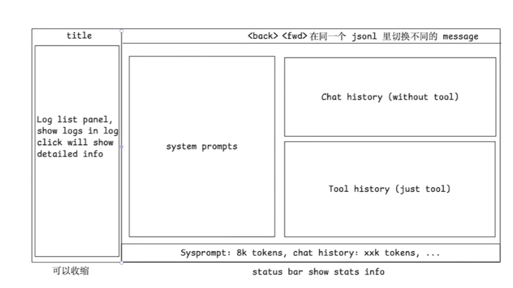

查看./vendors/opencode 源码，帮我了解如何最方便地获得 opencode 每次向 llm 发送的包含完整内容的输入输出，最好是有 hook / plugin什么的，避免我直接修改源码。先不要撰写，告诉我方案

使用方案1，注意一次完整的对话(用户输入，agent多轮工具调用，最后得到完整结果)的内容放在同一个 jsonl 里，新的内容 append 进去，不同的对话使用不同的 jsonl。请捕获每个 turn 的到 llm 的完整输入，和完整输出。脚本放在 ./plugins/log-conversation.ts 中。确保代码的正确性，然后部署。输出内容放在./logs下。

读取当前./logs 下的文件，每行都是一个json,分析其 schema,帮我构建一个前端可视化 app，用户打开一个jsonl文件，你可以将其很好地分门别类在一个页面中展示不同turn下的输出，注意使用 scrollbar来控制区域长度，文字内容使用 markdown renderer 来渲染。design token使用./visualizer/styles/design-token.css,global css 使用./visualizer/styles/global.css。构建一个react app，放在visualizer 下。根据这些需求，先撰写一个design doc放在'./specs 下，然后完整实现。

